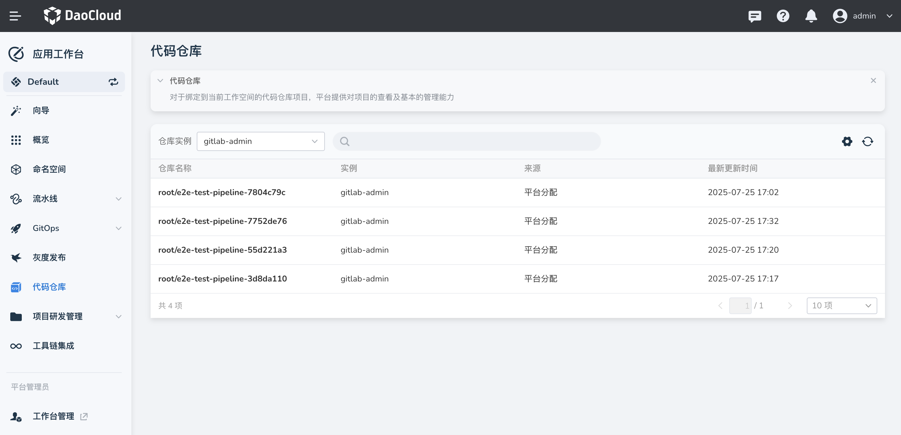

#  代码仓库

代码仓库聚焦于当前工作空间的代码仓库项目管理，为用户提供查看和基础管理能力，便于有序掌控代码资源，支持研发流程高效推进。

通过界面顶部的 **仓库实例** 下拉框（如示例中的 “gitlab - admin”），可筛选不同代码仓库实例，快速定位目标仓库，加快操作效率。

## 仓库信息查看

列表展示以下关键信息，帮助用户全面了解仓库状态：

- **仓库名称** ：唯一标识代码仓库（如 `root/e2e-test-pipeline-7804c79c`），便于区分。点击仓库名称，可以进入详情页。
- **实例** ：所属的仓库实例（如 `gitlab - admin`），明确资源归属。
- **来源** ：显示仓库的创建或接入渠道（如 `平台分配`）。
- **最新更新时间** ：记录最近一次更新的时间（如 `2025-07-25 17:02`），评估活跃度和时效性。

## 基础管理操作

界面右上角提供以下常用操作：

- **设置** ⚙️：进入配置页面，调整仓库参数以满足研发需求。
- **刷新** 图标：同步最新仓库数据，确保信息实时准确。

## 应用价值与使用场景

在现代研发流程中，代码仓库是核心资产的承载体。此功能的引入为不同角色带来以下价值：

- **开发人员** 可快速查找、访问目标仓库，掌握更新动态，支持代码开发、合并、迭代等工作。
- **管理人员** 可利用基础管理功能，分配和监控代码资源，确保团队协作高效、透明。

此功能有助于落地 CI/CD 等 DevOps 实践，提升代码交付效率，推动产品快速上线。
