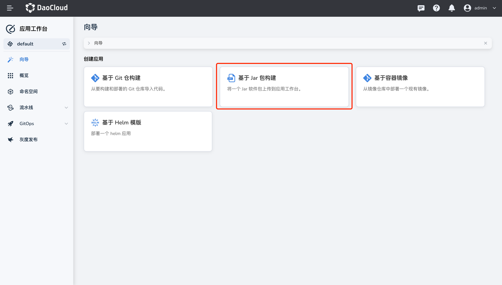
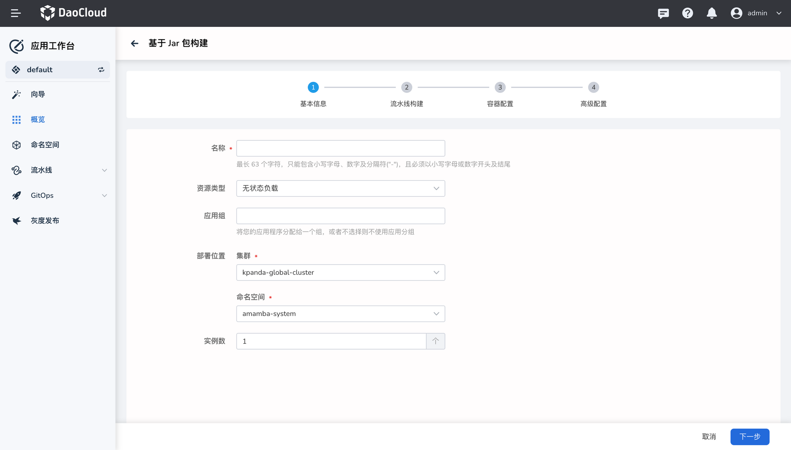
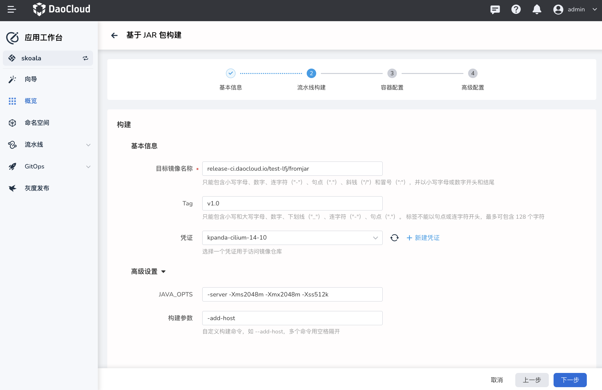
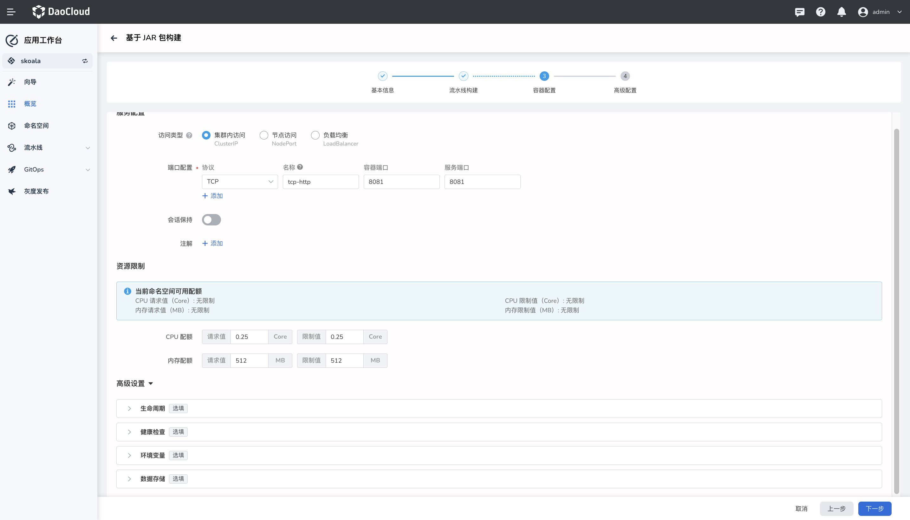
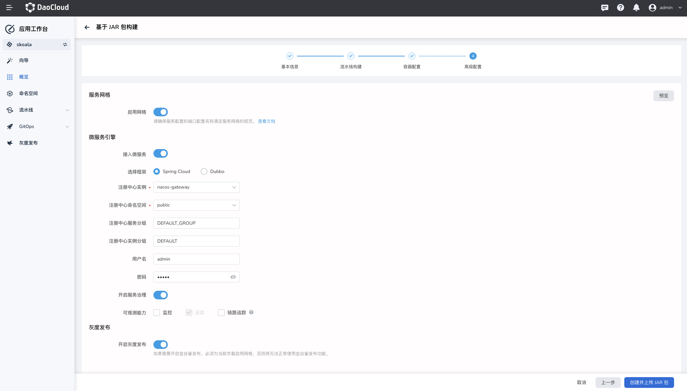
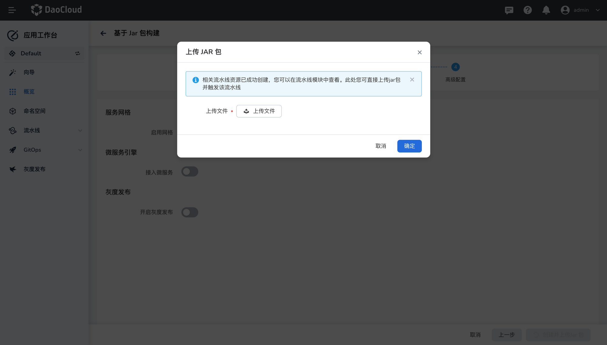
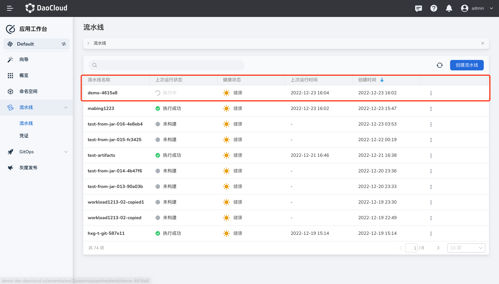
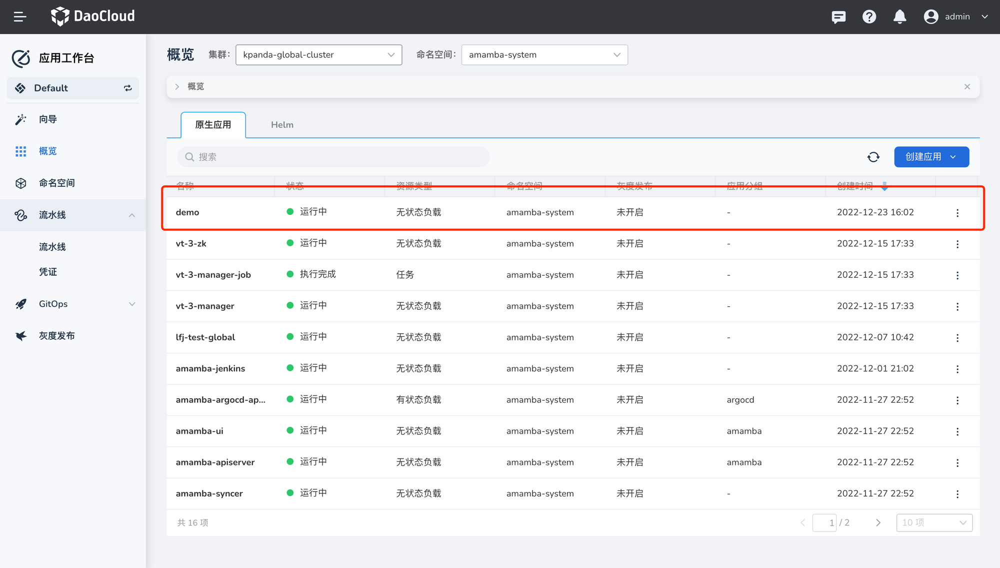

# 基于 Jar 包部署 Java 应用

应用工作台支持通过 [Git 仓库](create-git-based-ms.md)、Jar 包、容器镜像、Helm 模板等四种方式构建应用。本文介绍如何通过 Jar 文件部署 Java 应用程序。

## 前提条件

1. 创建一个[工作空间](../../../ghippo/user-guide/workspace/workspaces.md)和一个[用户](../../../ghippo/user-guide/access-control/user.md)，该用户需加入该工作空间并具备 `Workspace Editor` 角色。

2. [创建访问镜像仓库的凭证](../pipeline/credential.md)，例如 `registry`。

3. 准备一个镜像仓库，例如 Harbor 仓库。

## 操作步骤

1. 在左侧导航栏点击`向导`，然后选择`基于 Jar 包构建`。

    

2. 参考下列要求填写基本信息，然后点击`下一步`。

    - 名称：最长 63 个字符，只能包含小写字母、数字及分隔符("-")，且必须以小写字母或数字开头及结尾。
    - 资源类型：选择要创建的应用属于无状态负载，还是有状态负载。
    - 应用组：为应用选择所属的分组。为空表示不对此应用进行分组。
    - 部署位置：选择将应用部署在哪个集群下的哪个命名空间。只能选择当前工作空间下存在的集群。
    - 实例数：为应用设置 Pod 的数量。

        

3. 参考下列要求配置流水线，然后点击`下一步`。

    - 目标镜像名称：为目标镜像命名，需包含目标镜像的存储路径，例如 `release-ci.daocloud.io/test-lfj/fromjar`。
    - Tag：为目标镜像打标签，例如版本号 `v1.0`。
    - 凭证：选择访问镜像仓库的凭证，`registry-credential`。
    - ContextPath：填写相对于代码根目录的路径，为 `docker build` 指定上下文路径。该路径下的所有文件都会被打包用于构建镜像。如果不填，则使用 Dockerfile 文件所在的目录。
    - 构建参数：构建参数会以 `--build-arg` 的形式传递到 build 命令中，支持将上游制品下载地址、上游镜像下载地址设置为参数，也支持自定义任意参数。

        

4. 参考下列要求填写容器配置，然后点击`下一步`。

    - 访问类型：支持通过 clusterIP 仅允许在集群内访问该应用，或者通过 NodePort 允许在集群外部访问，或者通过负载均衡器进行访问。
    - 端口配置：根据实际业务场景填写需要暴露的端口号。
    - 资源限制：CPU 和内存配额不得超出应用所在的命名空间在当前工作空间中的剩余资源。

        > 有关服务配置的更多详细说明，可参考[创建服务](../../../kpanda/user-guide/services-routes/create-services.md)。

        

5. 参考下列说明选择是否开启高级功能，然后点击`创建并上传 Jar 包`。

    - 服务网格：选择是否启用 [DCE 5.0 的服务网格](../../../mspider/intro/what.md)模块来治理微服务流量。
    - 微服务引擎：是否将新创建的应用接入 [DCE 5.0 的微服务引擎](../../../skoala/intro/what.md)模块。
    - 灰度发布：选择是否开启灰度发布。有关灰度发布的更多内容，可参考[金丝雀发布](../release/canary.md)。

        

6. 选择需要上传的文件，点击`确定` 。

    

7. 创建成功后会触发运行对应的流水线，在左侧导航栏点击`流水线`可查看其运行状态。

    > 流水线的命名规则为“对应的应用名称-随机数”，例如通过流水线名称 `demo-4615a8` 即可得知对应的应用名为 `demo`。

    

8. 等待流水线执行成功后，在左侧导航栏点击`概览`，选择`原生应用`页签即可查看新建的应用。

    
