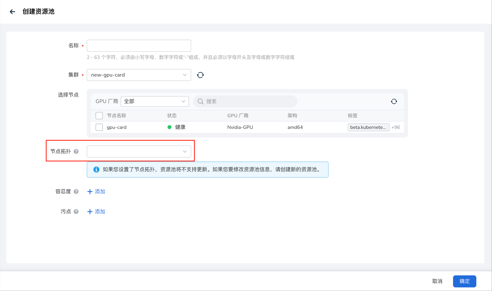
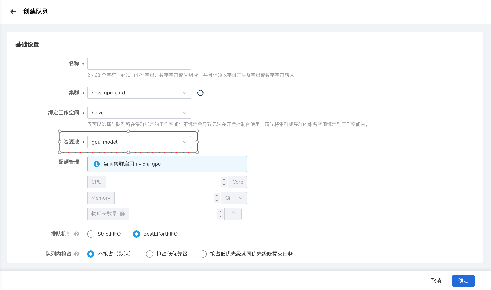

# 拓扑感知调度训练任务

在人工智能和机器学习领域，模型训练任务，如大型语言模型 LLM 的分布式训练，对计算资源和网络性能提出了极高要求。这些任务通常涉及多个 Pod 之间的频繁通信，例如梯度聚合和数据交换，网络延迟和带宽利用率直接影响训练效率。

在现代数据中心中，复杂的网络拓扑结构（如节点、机架、区块）使得 Pod 的物理位置对通信性能至关重要。Kubernetes 默认调度器主要根据 CPU 和内存等资源进行分配，缺乏对网络拓扑的感知，可能导致 Pod 分布在网络上较远的节点，增加通信开销并延长训练时间。

Kueue 是 Kubernetes 原生的作业队列系统，通过配额管理和队列机制优化批处理作业的资源分配。Baize 基于其拓扑感知调度（Topology Aware Scheduling, TAS）功能，利用数据中心的拓扑信息，将 Pod 智能地调度到网络拓扑上更靠近的节点上，从而减少网络跳跃、提升通信吞吐量。TAS 特别适合模型训练场景，能够显著降低分布式训练中的网络延迟，加速梯度同步和数据传输，为 AI/ML 工作负载提供高效、可靠的调度支持。

本文介绍如何使用拓扑感知调度能力，详细步骤如下：

1. 手动创建 Topology CR

    前面提到，数据中心的组织单元具有层次结构，运行在同一组织单元内的 Pod 之间的网络带宽优于运行在不同单元的 Pod。 

    我们可以通过节点标签来表示数据中心内节点的层次结构，相同层级的节点可以组成一个超节点，一个超节点表示一个网络拓扑性能域，多个超节点通过层级连接，形成树状结构。

    Baize 暂不支持通过界面创建节点拓扑，需用户手动在 GPU 集群创建 Topology CR。

    Yaml 示例如下：

    ```yaml
    apiVersion: kueue.x-k8s.io/v1alpha1
    kind: Topology
    metadata:
      name: default
    spec:
      levels:
        - nodeLabel: shanghai-cube/super-node # 一个超节点表示一个网络拓扑性能域，多个超节点通过层级连接，形成树状结构。

    ---
    apiVersion: kueue.x-k8s.io/v1beta1
    kind: ResourceFlavor
    metadata:
      name: tas-flavor
    spec:
      nodeLabels:
        metax-tech.com/driver.ready: 'true'
      topologyName: default
    ```

1. 创建资源池

    操作流程参考[创建资源池](../oam/resource/create.md)，请选择需要调度的节点和已创建好的节点拓扑。

    

1. 创建队列

    操作流程参考[创建队列](../oam/queue/create.md)，选择上文创建好的资源池。

    

1. 创建训练任务

    以上步骤基本完成 TAS 配置工作，接下来就可以在 PodTemplate 级别创建具有 TAS 配置的训练任务，操作流程参考[创建训练任务](../developer/jobs/create.md)。

    训练任务中选择的队列，其资源池包含拓扑信息，会根据 TAS 配置自动化调度。在同一拓扑域内的节点上调度相关联的所有 Pod，是一种偏好而不是要求，默认匹配到拓扑的最低层级，如果 PodSet 无法适应给定的拓扑域，则考虑下一个拓扑级别。

至此，完成训练任务基于拓扑感知调度的所有操作。