# 使用智能算力微调 ChatGLM3 模型

本文以 `ChatGLM3` 模型为例，演示如何在 DCE 5.0 智能算力中使用 LoRA（Low-Rank Adaptation，低秩自适应）微调 ChatGLM3 模型。
Demo 程序来自 [ChatGLM3](https://github.com/THUDM/ChatGLM3/blob/main/finetune_demo/lora_finetune.ipynb) 官方案例。

微调的大致流程为：

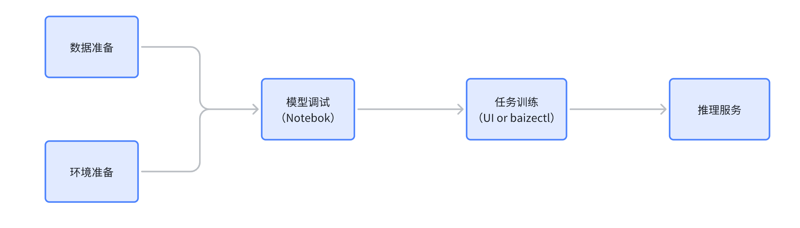

## 环境依赖

- GPU 显存至少 20GB，推荐使用 RTX4090、NVIDIA A/H 系列显卡
- 可用磁盘空间至少 200GB
- CPU 至少 8 核，推荐 16 核
- 内存 64GB，推荐 128GB

!!! info

    在开始体验之前，请检查 DCE 5.0 以及[智能算力部署](../intro/install.md)正确，GPU 队列资源初始化成功，且算力资源充足。

## 数据准备

利用 DCE 5.0 智能算力提供的数据集管理功能，快速将微调大模型所需的数据进行预热及持久化，减少因为准备数据导致的 GPU 资源占用，提高资源利用效率。


在数据集列表页面，创建需要的数据资源，这些资源包含了 ChatGLM3 代码，也可以是数据文件，所有这些数据都可以通过数据集列表来统一管理。

### 代码及模型文件

[ChatGLM3](https://github.com/THUDM/ChatGLM3) 是智谱 AI 和清华大学 KEG 实验室联合发布的对话预训练模型。

先拉取 ChatGLM3 代码仓库，下载预训练模型，用于后续的微调任务。

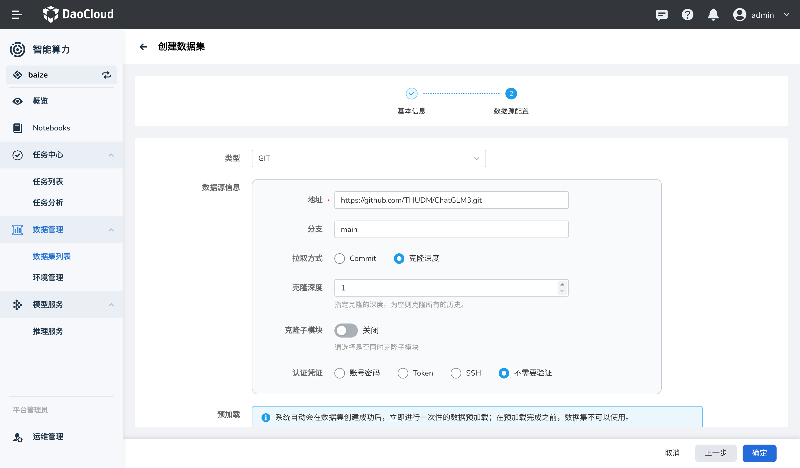

DCE 5.0 智能算力会在后台进行全自动数据预热，以便后续的任务能够快速访问数据。

### AdvertiseGen 数据集

国内数据可以从 [Tsinghua Cloud](https://cloud.tsinghua.edu.cn/f/b3f119a008264b1cabd1/?dl=1) 直接获取，这里使用 `HTTP` 的数据源方式。

注意创建完成后，需要等待数据集预热完成，一般很快，根据您的网络情况而定。

### 微调输出数据

同时，您需要准备一个空的数据集，用于存放微调任务完成后输出的模型文件，这里创建一个空的数据集，以 `PVC` 为例。

!!! warning

    注意需要使用支持 `ReadWriteMany` 的存储类型，以便后续的任务能够快速访问数据。

## 环境准备

对于模型开发者来说，准备模型开发需要的 Python 环境依赖是非常重要的，传统做法将环境依赖直接打包到开发工具的镜像中，
或者直接在本地环境中安装，但是这样做会导致环境依赖的不一致，而且不利于环境的管理和依赖更新及同步。

DCE 5.0 智能算力提供了环境管理的能力，将 Python 环境依赖包管理和开发工具、任务镜像等进行解耦，解决了依赖管理混乱，环境不一致等问题。

这里使用 DCE 5.0 智能算力提供的环境管理功能，创建 ChatGLM3 微调所需的环境，以备后续使用。

!!! warning

    1. ChatGLM 仓库内有 `requirements.txt` 文件，里面包含了 ChatGLM3 微调所需的环境依赖
    2. 本次微调没有用到 `deepspeed` 和 `mpi4py` 包，建议从 `requirements.txt` 文件中将其注释掉，否则可能出现包编译不通过的情况

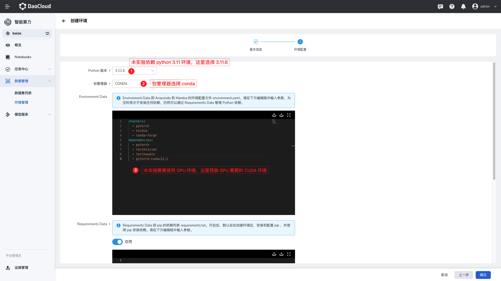

在环境管理列表，您可以快速创建一个 Python 环境，并通过简单的表单配置来完成环境的创建；这里需要一个 Python 3.11.x 环境，


因为本实验需要使用 CUDA，所以在这里需要配置 GPU 资源，用于预热需要资源的依赖库。

创建环境，需要去下载一系列的 Python 依赖，根据您的实际位置不同，可能会有不同的下载速度，这里使用了国内的镜像加速，可以加快下载速度。

## 使用 Notebook 作为 IDE

DCE 5.0 智能算力提供了 Notebook 作为 IDE 的功能，可以让用户在浏览器中直接编写代码，运行代码，查看代码运行结果，非常适合于数据分析、机器学习、深度学习等领域的开发。

您可以使用智能算力提供的 JupyterLab Notebook 来进行 ChatGLM3 的微调任务。

### 创建 JupyterLab Notebook

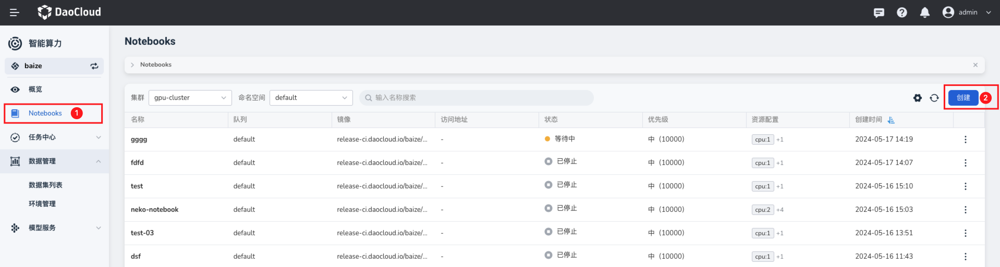

在 Notebook 列表中，可以根据页面操作指引，创建一个 Notebook。注意您需要根据前文提到的资源要求来配置对应的 Notebook 资源参数，
避免后续因为资源问题，影响微调过程。

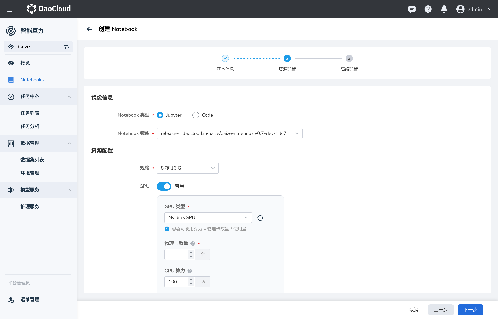

!!! note

    在创建 Notebook 时，可以将之前预加载的模型代码数据集和环境，直接挂载到 Notebook 中，极大节省了数据准备的时间。

#### 挂载数据集和代码

注意：ChatGLM3 的代码文件挂载到了 `/home/jovyan/ChatGLM3` 目录下，同时您也需要将 `AdvertiseGen` 数据集挂载到
`/home/jovyan/ChatGLM3/finetune_demo/data/AdvertiseGen` 目录下，以便后续的微调任务能够访问数据。

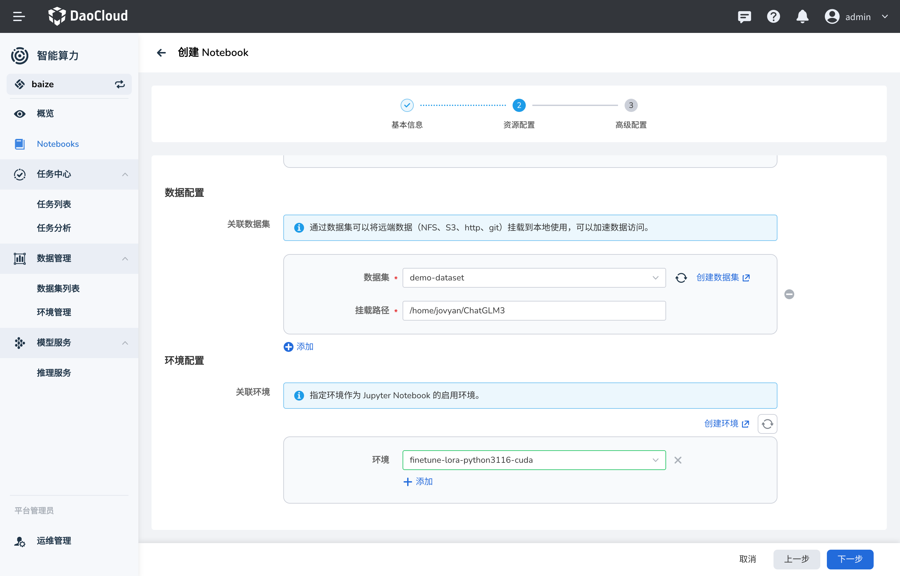

#### 挂载 PVC 到模型输出文件夹

本次使用的模型输出位置在 `/home/jovyan/ChatGLM3/finetune_demo/output` 目录下，可以将之前创建的 `PVC` 数据集挂载到这个目录下，
这样训练输出的模型就可以保存到数据集中，后续模型推理等任务可以直接访问。

创建完成后，可以看到 Notebook 的界面，您可以直接在 Notebook 中编写代码，运行代码，查看代码运行结果。

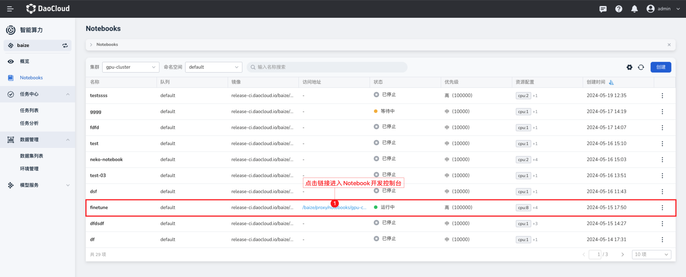

### 微调 ChatGLM3

当您进入到 Notebook 中后，可以在 Notebook 侧边栏会发现有一个 `File Browser` 的选项，可以看到之前挂载的数据集和代码，在这里找到 ChatGLM3 的文件夹。

您可以看到 ChatGLM3 的微调代码在 `finetune_demo` 文件夹中，这里可以直接打开 `lora_finetune.ipynb` 文件，这是 ChatGLM3 的微调代码。


首先，根据 `README.md` 的说明，您可以了解到整个微调的过程，建议先阅读一遍，确保基础的环境依赖和数据准备工作都已经完成。

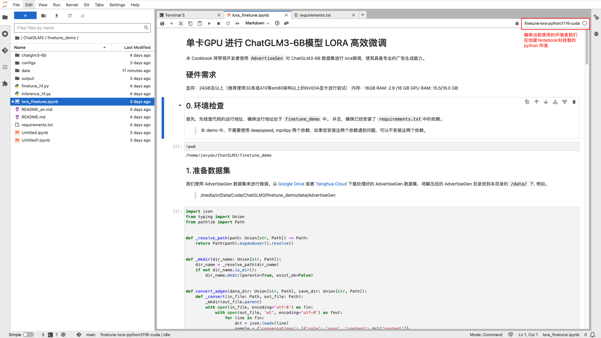

打开终端，并使用 `conda` 切换到您提前预热的环境中，此环境与 JupyterLab Kernel 保持一致，以便后续的代码运行。


### 数据预处理

首先，您需要将 `AdvertiseGen` 数据集进行预处理，对数据进行标准化处理，使其符合 `Lora` 预训练的标准格式要求；
这里将处理后的数据保存到 `AdvertiseGen_fix` 文件夹中。

```python
import json
from typing import Union
from pathlib import Path

def _resolve_path(path: Union[str, Path]) -> Path:
    return Path(path).expanduser().resolve()

def _mkdir(dir_name: Union[str, Path]):
    dir_name = _resolve_path(dir_name)
    if not dir_name.is_dir():
        dir_name.mkdir(parents=True, exist_ok=False)

def convert_adgen(data_dir: Union[str, Path], save_dir: Union[str, Path]):
    def _convert(in_file: Path, out_file: Path):
        _mkdir(out_file.parent)
        with open(in_file, encoding='utf-8') as fin:
            with open(out_file, 'wt', encoding='utf-8') as fout:
                for line in fin:
                    dct = json.loads(line)
                    sample = {'conversations': [{'role': 'user', 'content': dct['content']},
                                                {'role': 'assistant', 'content': dct['summary']}]}
                    fout.write(json.dumps(sample, ensure_ascii=False) + '\n')

    data_dir = _resolve_path(data_dir)
    save_dir = _resolve_path(save_dir)

    train_file = data_dir / 'train.json'
    if train_file.is_file():
        out_file = save_dir / train_file.relative_to(data_dir)
        _convert(train_file, out_file)

    dev_file = data_dir / 'dev.json'
    if dev_file.is_file():
        out_file = save_dir / dev_file.relative_to(data_dir)
        _convert(dev_file, out_file)

convert_adgen('data/AdvertiseGen', 'data/AdvertiseGen_fix')
```

为了节省调试的时间，您可以将 `/home/jovyan/ChatGLM3/finetune_demo/data/AdvertiseGen_fix/dev.json`
中的数据量缩减到 50 条，这里的数据是 JSON 格式，处理起来也是比较方便的。

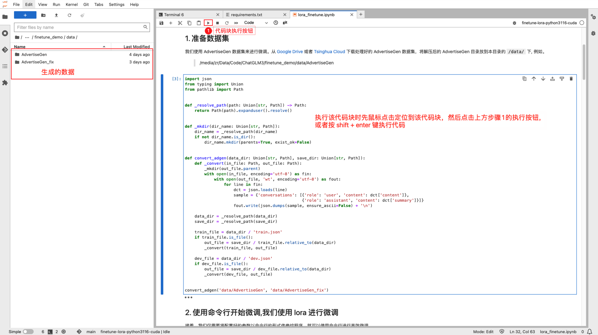

### 本地 LoRA 微调测试

完成数据的预处理之后，基本上您就可以直接微调测试了，可以在
`/home/jovyan/ChatGLM3/finetune_demo/configs/lora.yaml` 文件中配置微调的参数，一般需要关注的参数基本如下：

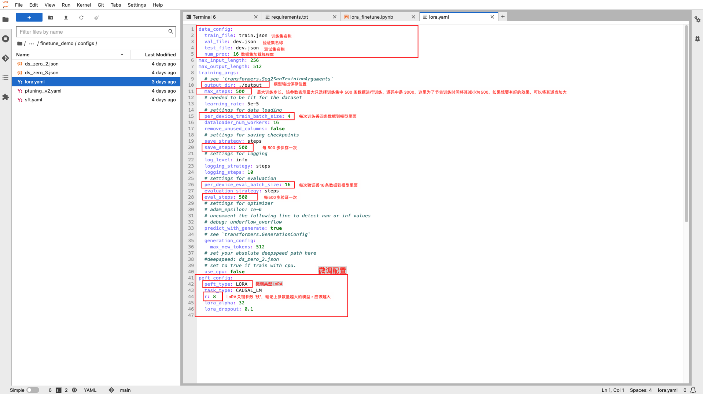

新开一个终端窗口，使用如下命令即可进行本地微调测试，请确保参数配置和路径正确：

```bash
!CUDA_VISIBLE_DEVICES=0 NCCL_P2P_DISABLE="1" NCCL_IB_DISABLE="1" python finetune_hf.py  data/AdvertiseGen_fix  ./chatglm3-6b  configs/lora.yaml
```

在这条命令中，

- `finetune_hf.py` 是 ChatGLM3 代码中的微调脚本
- `data/AdvertiseGen_fix` 是您预处理后的数据集
- `./chatglm3-6b` 是您预训练模型的路径
- `configs/lora.yaml` 是微调的配置文件

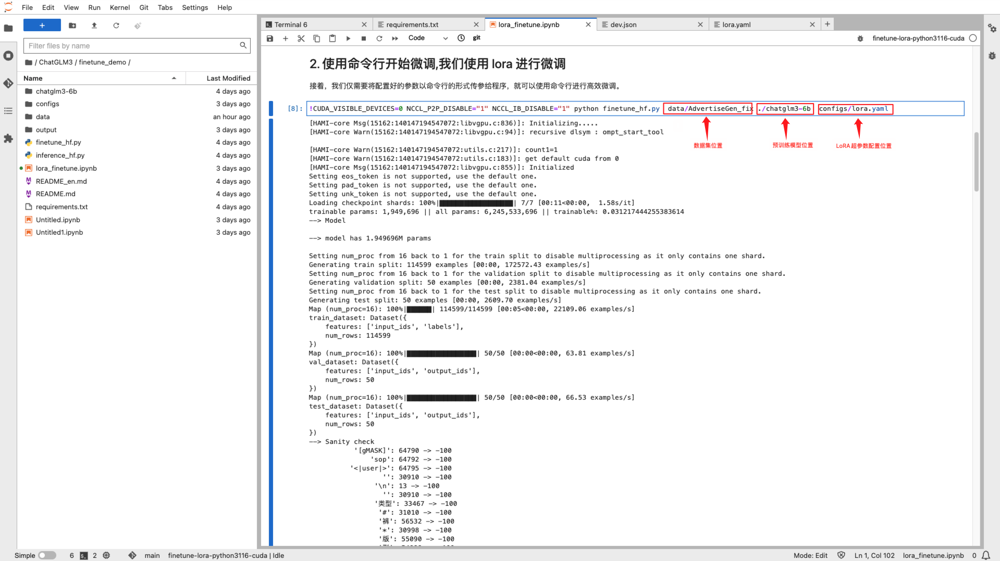

微调过程中可以使用 `nvidia-smi` 命令查看 GPU 显存使用情况：

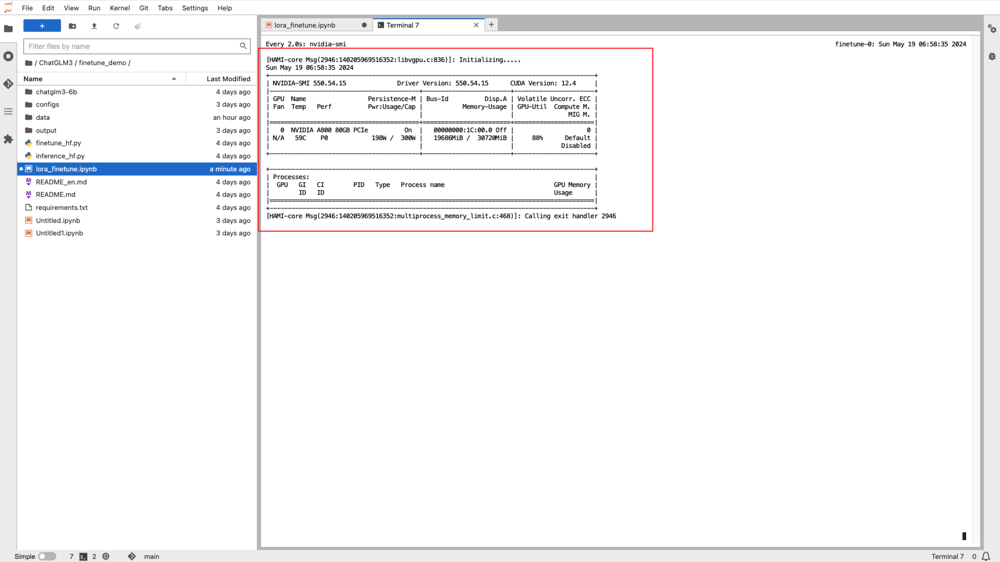

在微调完成后，在 `finetune_demo` 目录下会生成一个 `output` 目录，里面包含了微调的模型文件，
这样微调的模型文件就直接保存到您之前创建的 `PVC` 数据集中了。

## 微调任务提交

在本地微调测试完成后，确保您的代码和数据没有问题，接下来可以将微调任务提交到智能算力中，进行大规模的训练和微调任务。

> 这也是推荐的模型开发和微调流程，先在本地进行微调测试，确保代码和数据没有问题。

### 使用界面提交微调任务

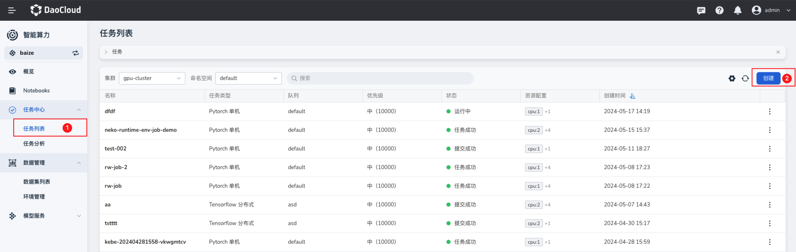

这里使用 `Pytorch` 来创建微调任务，根据您的实际情况，选择需要使用哪个集群的资源，注意需要满足前面资源准备中提及的资源要求。


- 镜像：可直接使用 baizectl 提供的模型镜像
- 启动命令，根据您在 Notebook 中使用 LoRA 微调的经验，代码文件和数据在 `/home/jovyan/ChatGLM3/finetune_demo` 目录下，所以您可以直接使用这个路径：

    ```bash
    bash -c "cd /home/jovyan/ChatGLM3/finetune_demo && CUDA_VISIBLE_DEVICES=0 NCCL_P2P_DISABLE="1" NCCL_IB_DISABLE="1" python finetune_hf.py  data/AdvertiseGen_fix  ./chatglm3-6b  configs/lora.yaml"
    ```

- 挂载环境，这样之前预加载的环境依赖不仅可以在 Notebook 中使用，同时也可以在任务中使用
- 数据集：直接使用之前预热的数据集
    - 将模型输出路径设置为之前创建的 PVC 数据集
    - 将 `AdvertiseGen` 数据集挂载到 `/home/jovyan/ChatGLM3/finetune_demo/data/AdvertiseGen` 目录下
- 配置足够的 GPU 资源，确保微调任务能够正常运行

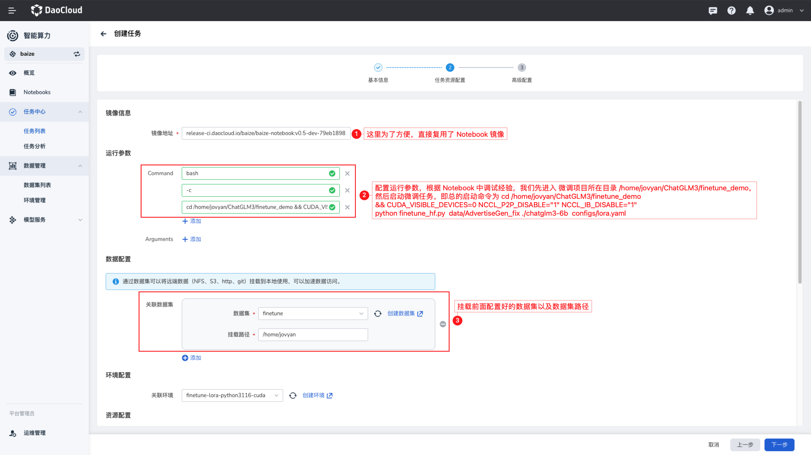

### 查看任务状态

任务成功提交后，您可以在任务列表中实时查看任务的训练进展，这里您可以看到任务的状态、资源使用情况、日志等信息。

> 查看任务日志


任务运行完成后，您可以在数据输出的数据集中查看微调的模型文件，这样就可以使用这个模型文件进行后续的推理任务。

### 使用 `baizectl` 提交任务

DCE 5.0 智能算力的 Notebook 支持免认证直接使用 `baizectl` 命令行工具，
如果您喜欢使用 `CLI`，那么可以直接使用 `baizectl` 提供的命令行工具，提交任务。

```bash
baizectl job submit --name finetunel-chatglm3 -t PYTORCH \
    --image release.daocloud.io/baize/baize-notebook:v0.5.0 \
    --priority baize-high-priority \
    --resources cpu=8,memory=16Gi,nvidia.com/gpu=1 \
    --workers 1 \
    --queue default \
    --working-dir /home/jovyan/ChatGLM3 \
    --datasets AdvertiseGen:/home/jovyan/ChatGLM3/finetune_demo/data/AdvertiseGen  \
    --datasets output:/home/jovyan/ChatGLM3/finetune_demo/output  \
    --labels job_type=pytorch \
    --restart-policy on-failure \
    -- bash -c "cd /home/jovyan/ChatGLM3/finetune_demo && CUDA_VISIBLE_DEVICES=0 NCCL_P2P_DISABLE="1" NCCL_IB_DISABLE="1" python finetune_hf.py  data/AdvertiseGen_fix  ./chatglm3-6b  configs/lora.yaml"
```

如果希望了解更多 `baizectl` 的使用说明，可以查看 [baizectl 使用文档](../developer/notebooks/baizectl.md)。

## 模型推理

在微调任务完成后，您可以使用微调的模型进行推理任务，这里您可以使用智能算力提供的推理服务，将输出后的模型创建为推理服务。


在推理服务列表中，您可以创建一个新的推理服务，在选择模型的位置，选择之前推理输出的数据集，并配置模型路径。


有关模型资源要求、推理服务的 GPU 资源要求，需要根据模型的大小和推理的并发量来配置，这里您可以根据之前微调任务的资源配置来配置。

### 配置模型运行时

配置模型的运行时尤为重要，目前 DCE 5.0 智能算力已经支持 `vLLM` 作为模型推理服务的运行时，可以直接选择 `vLLM`。

> vLLM 支持非常丰富的大语言模型，建议访问 [vLLM](https://docs.vllm.ai) 了解更多信息，这些模型都可以很方便地在智能算力中使用。

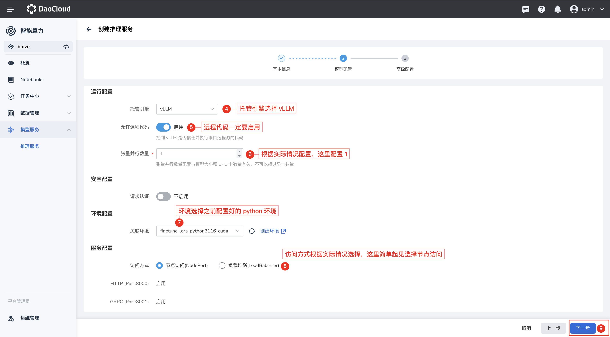

创建完成后，您可以在推理服务列表中看到您创建的推理服务，在模型服务列表，您可以直接获取模型的访问地址

### 使用模型服务测试

简单在终端中尝试，使用 `curl` 命令来测试模型服务，这里您可以看到返回的结果，这样就可以使用模型服务进行推理任务了。

```bash
curl -X POST http://10.20.100.210:31118/v2/models/chatglm3-6b/generate \
  -d '{"text_input": "hello", "stream": false, "sampling_parameters": "{\"temperature\": 0.7, \"top_p\": 0.95, \'max_tokens\": 1024｝"｝'
```


## 结语

本文以 `ChatGLM3` 为例，带您快速了解和上手 **智能算力** 的模型微调，使用 `LoRA` 微调了 ChatGLM3 模型。

DCE 5.0 智能算力提供了非常丰富的功能，可以帮助模型开发者快速进行模型开发、微调、推理等任务，同时也提供了丰富的 OpenAPI 接口，可以方便地与第三方应用生态进行结合。
