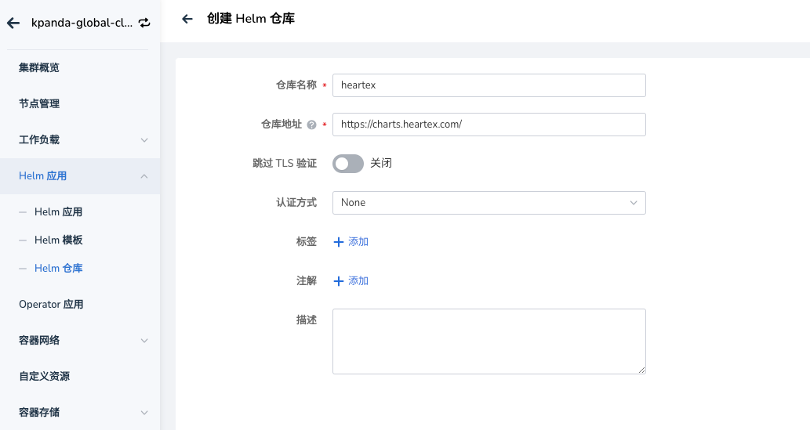

# 部署 Label Studio

!!! note

    参阅视频教程：[数据标注和数据集使用说明](../../videos/baize.md#_4)

[Label Studio](https://labelstud.io/) 是一个开源的数据标注工具，用于各种机器学习和人工智能任务。
以下是 Label Studio 的简要介绍：

- 支持图像、音频、视频、文本等多种数据类型的标注
- 可用于目标检测、图像分类、语音转录、命名实体识别等多种任务
- 提供可定制的标注界面
- 支持多种标注格式和导出选项

Label Studio 通过其灵活性和功能丰富性，为数据科学家和机器学习工程师提供了强大的数据标注解决方案。

## 部署到 DCE 5.0

要想在智能算力中使用 Label Studio，需将其部署到[全局服务集群](../../kpanda/user-guide/clusters/cluster-role.md#_2)，
你可以通过 Helm 的方式快速部署。

!!! note

    更多部署详情，请参阅 [Deploy Label Studio on Kubernetes](https://labelstud.io/guide/install_k8s)。

1. 打开全局服务集群界面，从左侧导航栏找到 __Helm 应用__ -> __Helm 仓库__ ，选择 __创建仓库__ 按钮，填写如下参数：

    

1. 添加成功后，点击列表右侧的 __┇__ ，选择 __同步仓库__ ，稍等片刻后完成同步。（后续更新 Label Studio 也会用到这个同步操作）。

    

1. 然后跳转到 __Helm 模板__ 页面，你可以搜索找到 `label-studio`，点击卡片。

    

1. 选择最新的版本，如下图配置安装参数，名称为 `label-stuio`，建议创建新的命令空间，配置参数切换到 `YAML` ，根据说明修改其中配置。

    ```yaml
    global:
      image:
        repository: heartexlabs/label-studio   # 如果无法访问 docker.io，在此处配置代理地址
      extraEnvironmentVars:
        LABEL_STUDIO_HOST: https://{DCE_访问地址}/label-studio    # 使用 DCE 5.0 的登录地址，请参阅当前网页 URL
        LABEL_STUDIO_USERNAME: {用户邮箱}    # 必须是邮箱，替换为自己的
        LABEL_STUDIO_PASSWORD: {用户密码}    
    app:
      nginx:
        livenessProbe:
          path: /label-studio/nginx_health
        readinessProbe:
          path: /label-studio/version
    ```

    

至此，完成了 Label studio 的安装。

!!! warning

    默认会安装 PostgreSQL 作为数据服务中间件，如果镜像拉取失败，可能是 `docker.io` 无法访问，注意切换到可用代理即可。

> 如果你有自己的 PostgreSQL 数据服务中间件，可以使用如下参数配置：

```yaml
global:
  image:
    repository: heartexlabs/label-studio   # 如果无法访问 docker.io，在此处配置代理地址
  extraEnvironmentVars:
    LABEL_STUDIO_HOST: https://{DCE_访问地址}/label-studio    # 使用 DCE 5.0 的登录地址，参阅当前网页 URL
    LABEL_STUDIO_USERNAME: {用户邮箱}    # 必须是邮箱，替换为自己的
    LABEL_STUDIO_PASSWORD: {用户密码}    
app:
  nginx:
    livenessProbe:
      path: /label-studio/nginx_health
    readinessProbe:
      path: /label-studio/version
postgresql:
  enabled: false  # 禁用内置的 PostgreSQL
externalPostgresql:
  host: "postgres-postgresql"  # PostgreSQL 地址
  port: 5432
  username: "label_studio"  # PostgreSQL 用户名
  password: "your_label_studio_password"  # PostgreSQL 密码
  database: "label_studio"  # PostgreSQL 数据库名
```

## 添加 GProduct 到导航栏

如果要添加 Label Studio 到 DCE 5.0 导航栏，可以参考[全局管理 OEM IN](../../ghippo/best-practice/oem/oem-in.md) 的方式。
以下案例是增加到智能算力二级导航的添加方式。

### 添加代理访问

```yaml
apiVersion: ghippo.io/v1alpha1
kind: GProductProxy
metadata:
  name: label-studio
spec:
  gproduct: label-studio
  proxies:
  - authnCheck: false
    destination:
      host: label-studio-ls-app.label-studio.svc.cluster.local
      port: 80
    match:
      uri:
        prefix: /label-studio
```

### 添加到智能算力

修改 CRD 为 `GProductNavigator` 的 CR `baize` ，然后在现有配置中进行如下变更：

```yaml
apiVersion: ghippo.io/v1alpha1
kind: GProductNavigator
metadata:
  annotations:
    meta.helm.sh/release-name: baize
    meta.helm.sh/release-namespace: baize-system
  labels:
    app.kubernetes.io/managed-by: Helm
    gProductName: baize
  name: baize
spec:
  category: cloudnativeai
  gproduct: baize
  iconUrl: ./ui/baize/logo.svg
  isCustom: false
  localizedName:
    en-US: Intelligent Engine
    zh-CN: 智能算力
  menus:
    - iconUrl: ''
      isCustom: false
      localizedName:
        en-US: Intelligent Engine
        zh-CN: 智能算力
      name: workspace-view
      order: 1
      url: ./baize
      visible: true
    - iconUrl: ''
      isCustom: false
      localizedName:
        en-US: Operator
        zh-CN: 运维管理
      name: admin-view
      order: 1
      url: ./baize/admin
      visible: true
    # 添加开始
    - iconUrl: ''
      localizedName:
        en-US: Data Annotation
        zh-CN: 数据标注
      name: label-studio
      order: 1
      target: blank    # 控制新开页
      url: https://{DCE_访问地址}/label-studio    # 访问地址
      visible: true
    # 添加结束
  name: 智能算力
  order: 10
  url: ./baize
  visible: true
```

### 添加效果


## 结语

以上，就是如何添加 Label Studio 并将其作为智能算力的标注组件，通过将标注后的数据添加到智能算力的数据集中，
联动算法开发，完善算法开发流程，后续如何使用请关注其他文档参考。
