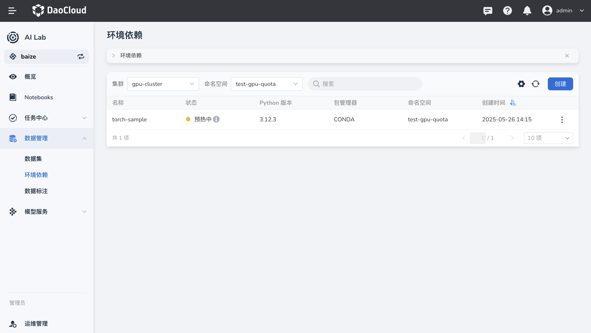
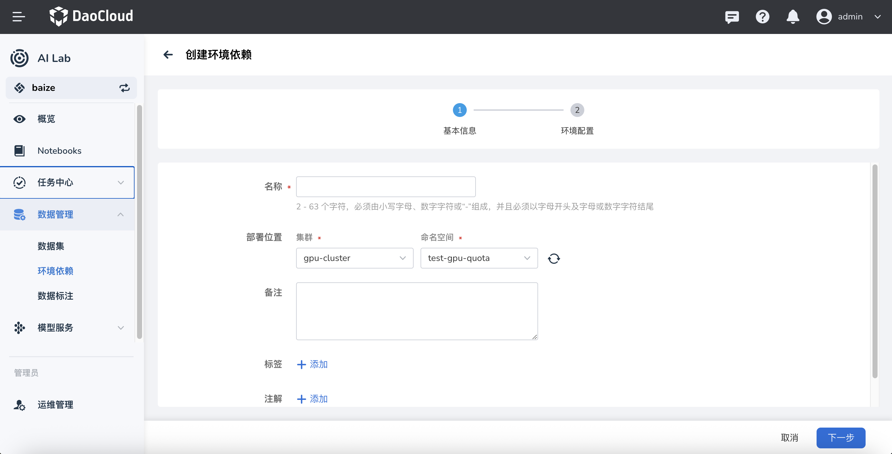
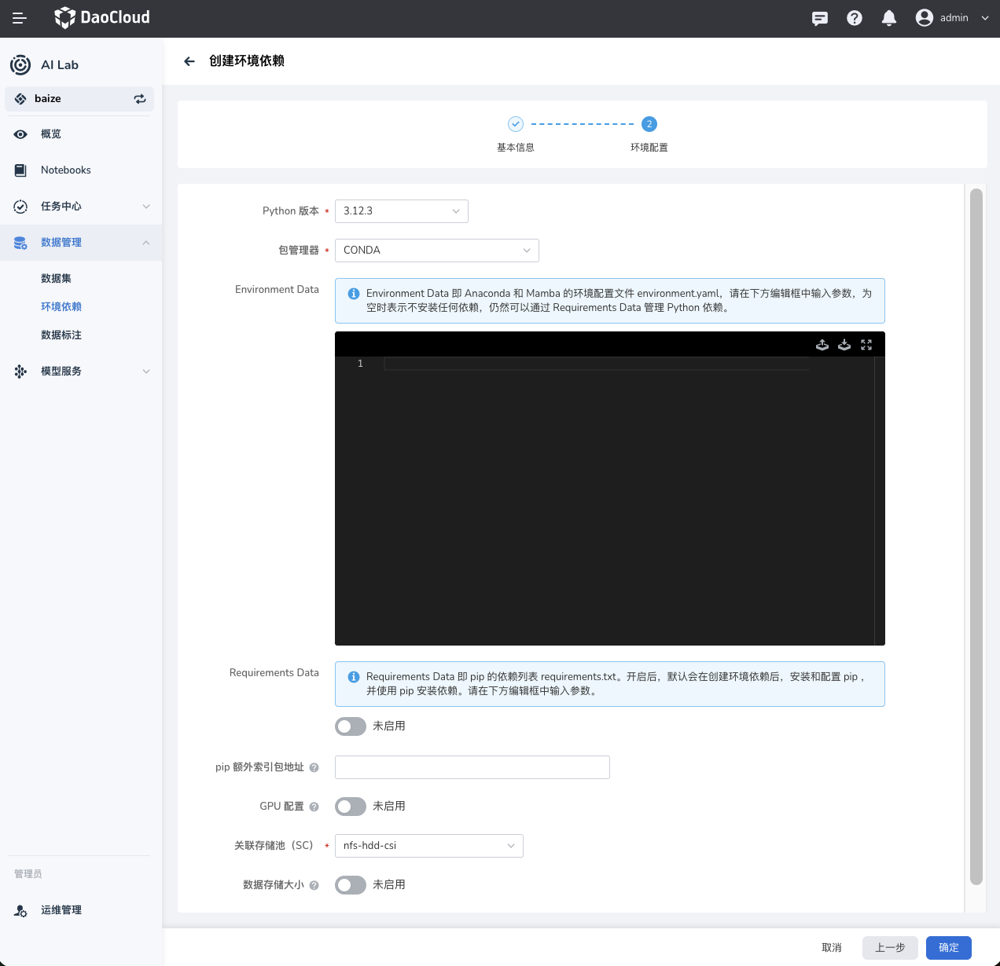

# Python 环境依赖库管理

本文档旨在指导用户通过 DCE 智能算力进行环境依赖库的管理，以下是具体操作步骤和注意事项。

1. [环境管理概述](#_1)
2. [创建新环境](#_3)
3. [配置环境](#_4)
4. [故障排除](#_6)

## 环境管理概述

传统方式，一般会将 Python 环境依赖在镜像中构建，镜像带有 Python 版本和依赖包的镜像，维护成本较高且更新不方便，往往需要重新构建镜像。

而在 DCE 5.0 智能算力中，用户可以通过 **环境管理** 模块来管理纯粹的环境依赖，将这部分从镜像中解耦，带来的优势有：

- 一份环境多处使用，同时可以在 Notebook、分布式训练任务、乃至推理服务中使用。
- 更新依赖包更加方便，只需要更新环境依赖即可，无需重新构建镜像。

以下为环境管理的主要组成部分：

- **集群** ：选择需要操作的集群。
- **命名空间** ：选择命名空间以限定操作范围。
- **环境列表** ：展示当前集群和命名空间下的所有环境及其状态。

### 环境列表字段说明

- **名称** ：环境的名称
- **状态** ：环境当前的状态（正常或失败），新创建环境有一个预热过程，预热成功后即可在其他任务中使用
- **创建时间** ：环境创建的时间

## 创建新环境

在 **环境管理** 界面，点击右上角的 **创建** 按钮，进入创建环境的流程。

填写以下基本信息：

- **名称** ：输入环境的名称，长度为 2-63 个字符，必须以小写字母、数字开头和结尾。
- **部署位置** ：
    - **集群** ：选择需要部署的集群，如 `gpu-cluster`。
    - **命名空间** ：选择命名空间，如 `default`。
- **备注**（可选）：填写备注信息。
- **标签**（可选）：为环境添加标签。
- **注解**（可选）：为环境添加注解。填写完成后，点击 **下一步** 进入环境配置。

## 配置环境

在环境配置步骤中，用户需要配置 Python 版本和依赖包管理工具。

### 配置环境设置

- **Python 版本** ：选择所需的 Python 版本，如 `3.12.3`。
- **包管理器** ：选择包管理工具，可选 `PIP` 或 `CONDA`。
- **Environment Data** ：
    - 如果选择 `PIP`：在下方编辑器中输入 `requirements.txt` 格式的依赖包列表。
    - 如果选择 `CONDA`：在下方编辑器中输入 `environment.yaml` 格式的依赖包列表。
- **其他选项**（可选）：
    - **pip 额外索引地址** ：配置 pip 额外的索引地址；适用于企业内部有自己的私有仓库或者 PIP 加速站点。
    - **GPU 配置** ：启用或禁用 GPU 配置；部分涉及到 GPU 的依赖包需要在预加载时配置 GPU 资源。
    - **关联存储** ：选择关联的存储配置；环境依赖包会存储在关联存储中，**注意：需要使用支持 `ReadWriteMany` 的存储。**

配置完成后，点击 **创建** 按钮，系统会自动创建并配置新的 Python 环境。

## 故障排除

- 如果环境创建失败：  
    - 检查网络连接是否正常。  
    - 确认填写的 Python 版本和包管理器配置无误。  
    - 确保所选集群和命名空间可用。

- 如果依赖预热失败：  
    - 检查 `requirements.txt` 或 `environment.yaml` 文件格式是否正确。  
    - 确认依赖包名称和版本是否正确无误。如遇到其他问题，请联系平台管理员或查看平台帮助文档获取更多支持。

---

以上即为在 DCE 5.0 智能算力中管理 Python 依赖库的基本操作步骤和注意事项。
