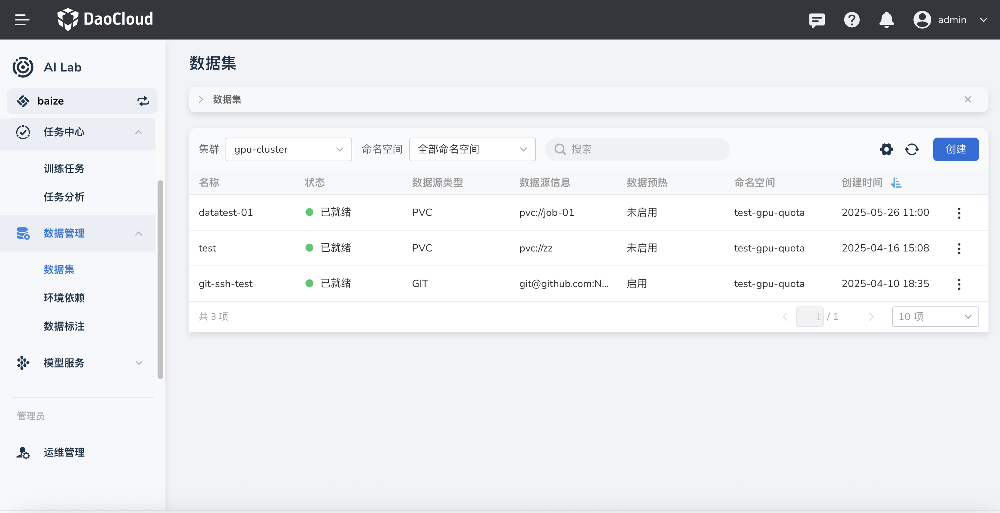
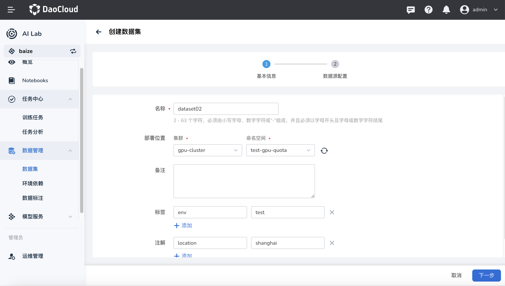
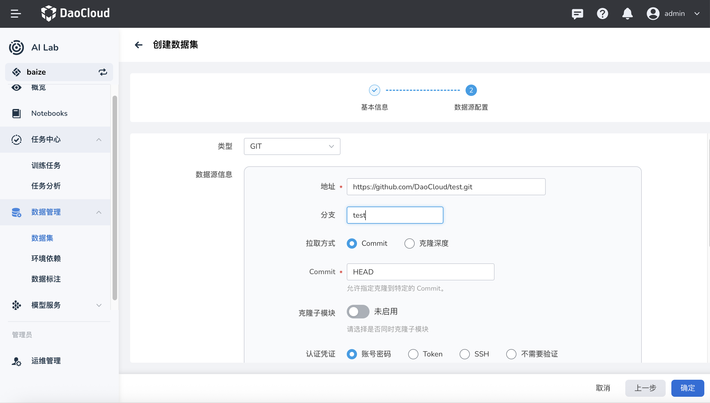
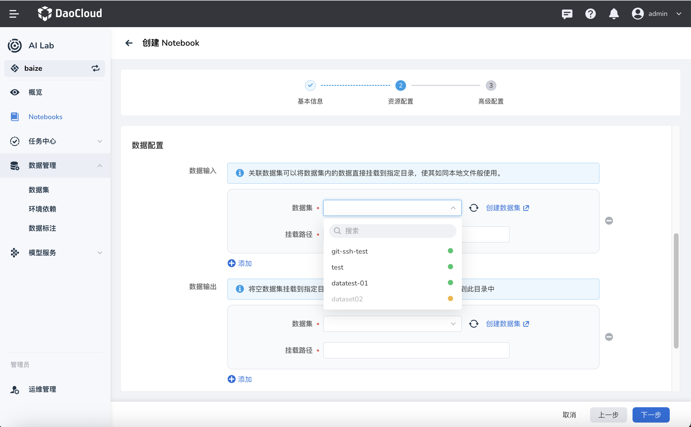
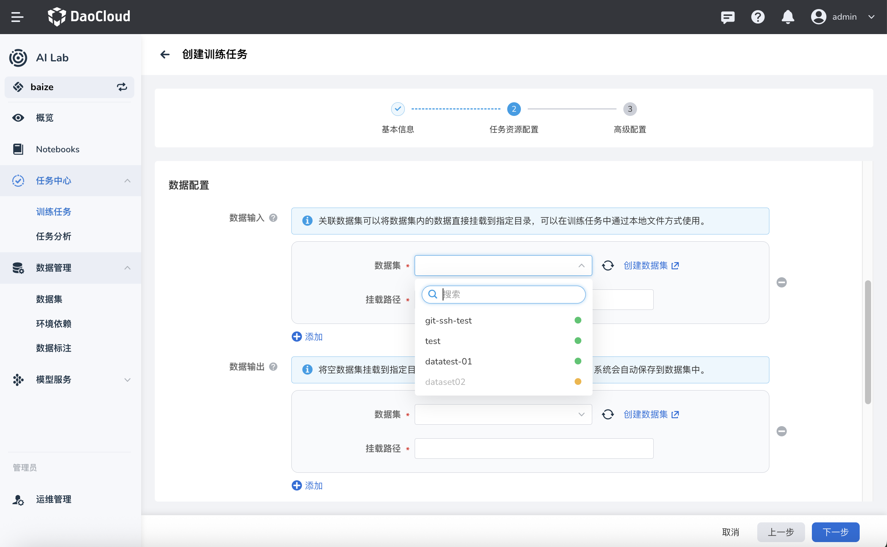
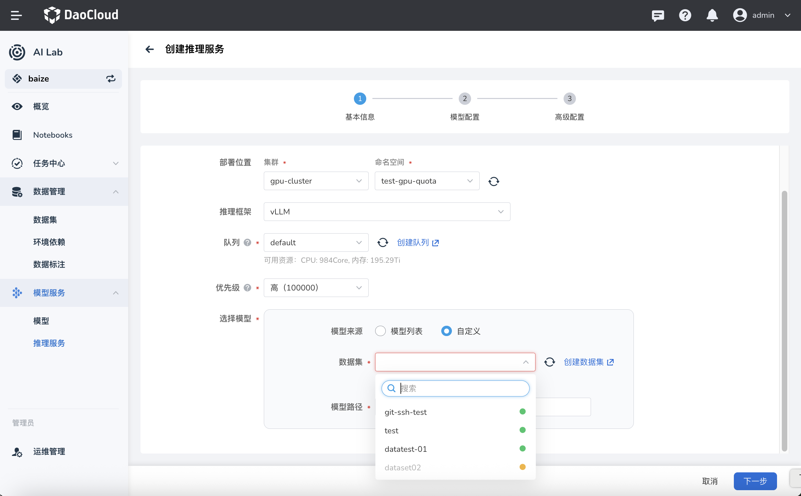

# 创建数据集

智能算力提供模型开发、训练以及推理过程所有需要的数据集管理功能。目前支持将多种数据源统一接入能力。

通过简单配置即可将数据源接入到智能算力中，实现数据的统一纳管、预热、数据集管理等功能。

## 创建数据集

1. 在左侧导航栏中点击 **数据管理** -> **数据集列表** ，点击右侧的 **创建** 按钮。

    

2. 选择数据集归属的工作集群、命名空间 **下一步** 。

    

3. 配置目标数据的数据源类型，然后点击 **确定** 。

    

    目前支持这几种数据源：

    - GIT：支持 GitHub、GitLab、Gitee 等仓库
    - S3：支持 Amazon 云等对象存储
    - HTTP：直接输入一个有效的 HTTP 网址
    - PVC：支持预先创建的 Kubernetes PersistentVolumeClaim
    - NFS：支持 NFS 共享存储

4. 数据集创建成功将返回数据集列表。你可以通过右侧的 **⋮** 执行更多操作。

    

!!! info

    系统自动会在数据集创建成功后，立即进行一次性的数据预加载；在预加载完成之前，数据集不可以使用。

## 数据集使用

数据集创建成功后，可以在模型训练、推理等任务中使用。

### 在 Notebook 中使用

在创建 Notebook 中，可以直接使用数据集；使用方式如下：

- 使用数据集做训练数据挂载
- 使用数据集做代码挂载

### 在 训练任务 中使用

- 使用数据集指定任务输出
- 使用数据集指定任务输入
- 使用数据集指定 TensorBoard 输出

### 在推理服务 中使用

- 使用数据集挂载模型

