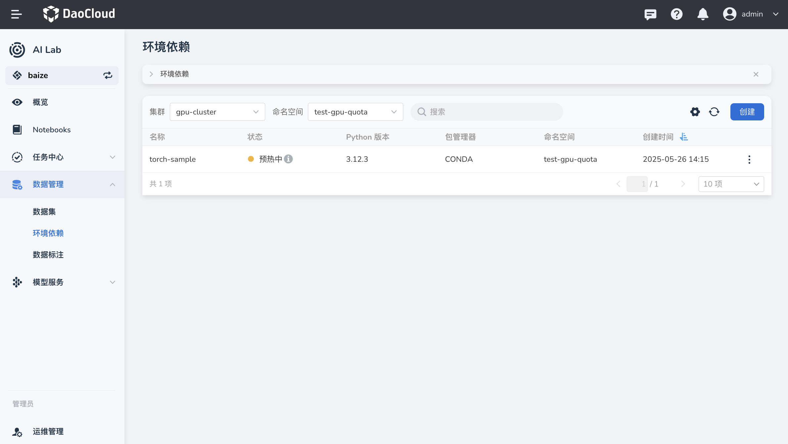
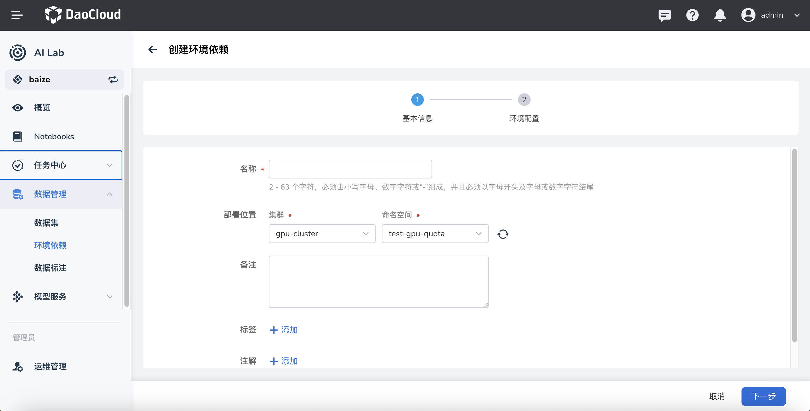
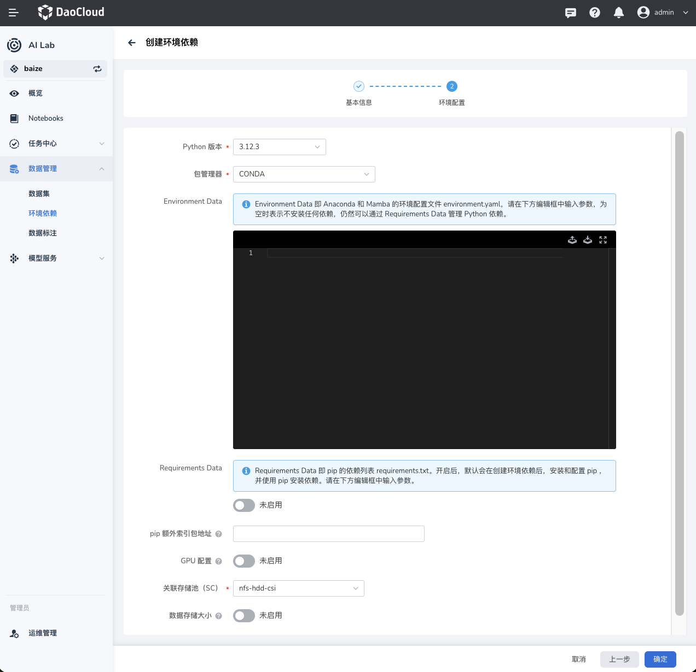

# 环境依赖

本文说明如何在 DCE AI Lab 中管理你的环境依赖库，以下是具体操作步骤和注意事项。

1. [环境依赖概述](#_2)
2. [创建新环境](#_3)
3. [配置环境](#_4)
4. [故障排除](#_5)

## 环境依赖概述

传统方式，一般会将 Python 环境依赖在镜像中构建，镜像带有 Python 版本和依赖包的镜像，维护成本较高且更新不方便，往往需要重新构建镜像。

而在 DCE 5.0 AI Lab 中，用户可以通过 **环境依赖** 模块来管理纯粹的环境依赖，将这部分从镜像中解耦，带来的优势有：

- 一份环境多处使用，同时可以在 Notebook、分布式训练任务、乃至推理服务中使用。
- 更新依赖包更加方便，只需要更新环境依赖即可，无需重新构建镜像。

以下为环境管理的主要组成部分：

- **集群** ：选择需要操作的集群。
- **命名空间** ：选择命名空间以限定操作范围。
- **环境列表** ：展示当前集群和命名空间下的所有环境及其状态。



| 字段 | 描述 | 举例值 |
|-----|------|-------|
| 名称 | 环境的名称 | my-environment |
| 状态 | 环境当前的状态（正常或失败），新创建环境有一个预热过程，预热成功后即可在其他任务中使用 | 正常 |
| Python 版本 | 环境当前的 Python 版本 | 3.12.3 |
| 包管理器 | 环境当前的包管理工具 | CONDA |
| 命名空间 | 环境当前所处的命名空间 | `default` |
| 创建时间 | 环境创建的时间 | 2023-10-01 10:00:00 |

## 创建新环境

在 **环境依赖** 界面，点击右上角的 **创建** 按钮，进入创建环境的流程。



| 字段 | 描述 | 举例值 |
|-----|------|------|
| 名称 | 输入环境的名称，长度为 2-63 个字符，必须以小写字母、数字开头和结尾。 | my-environment |
| 部署位置 | **集群** ：选择需要部署的集群 | `gpu-cluster` |
| | **命名空间** ：选择命名空间 | `default` |
| 备注 | 填写备注信息。 | 这是一个测试环境 |
| 标签 | 为环境添加标签。 | env:test |
| 注解 | 为环境添加注解。填写完成后，点击 **下一步** 进入环境配置。 | 注解示例 |

## 配置环境

在环境配置步骤中，用户需要配置 Python 版本和依赖包管理工具。



| 字段 | 描述 | 举例值 |
|-----|-----|--------|
| Python 版本 | 选择所需的 Python 版本 | 3.12.3 |
| 包管理器 | 选择包管理工具，可选 `PIP` 或 `CONDA` | PIP |
| Environment Data | 如果选择 `PIP`：在下方编辑器中输入 `requirements.txt` 格式的依赖包列表。 | numpy==1.21.0 |
| | 如果选择 `CONDA`：在下方编辑器中输入 `environment.yaml` 格式的依赖包列表。 | |
| 其他选项 | **pip 额外索引地址** ：配置 pip 额外的索引地址；适用于企业内部有自己的私有仓库或者 PIP 加速站点。 | `https://pypi.example.com` |
| | **GPU 配置** ：启用或禁用 GPU 配置；部分涉及到 GPU 的依赖包需要在预加载时配置 GPU 资源。 | 启用 |
| | **关联存储** ：选择关联的存储配置；环境依赖包会存储在关联存储中。注意：需要使用支持 `ReadWriteMany` 的存储。 | my-storage-config |
| | **数据存储大小** ：启用或禁用数据存储大小设置；合理评估数据量以避免造成存储资源浪费；如默认不配置，默认不限量（100TB）。 | 启用 |
| | **pip 镜像推荐** ：在中国大陆环境下，可使用清华 TUNA（`https://pypi.tuna.tsinghua.edu.cn/simple`）或阿里云（`https://mirrors.aliyun.com/pypi/simple`）等镜像以提升下载速度。 | |

配置完成后，点击 **创建** 按钮，系统会自动创建并配置新的 Python 环境。
	
### 示例依赖文件

在输入编辑器中可以参考以下模板进行填写。平台会自动写入环境名称和 Python 版本，无需手动指定。

在中国大陆网络环境中，可以优先使用国内的 Conda 镜像源（如清华 TUNA、阿里云等）来提升依赖下载速度。

```yaml title="environment.yaml"
channels:
  - defaults
  - https://mirrors.tuna.tsinghua.edu.cn/anaconda/pkgs/main
dependencies:
  - pytorch=2.2
  - torchvision
  - torchaudio
  - pip
  - pip:
      - numpy==1.24.4
      - matplotlib>=3.8
```

```txt title="requirements.txt"
torch==2.2.0
torchvision==0.17.0
torchaudio==2.2.0
numpy>=1.24
matplotlib>=3.8
```

## 故障排除

- 如果环境创建失败：  
    - 检查网络连接是否正常。  
    - 确认填写的 Python 版本和包管理器配置无误。  
    - 确保所选集群和命名空间可用。

- 如果依赖预热失败：  
    - 检查 `requirements.txt` 或 `environment.yaml` 文件格式是否正确。  
    - 确认依赖包名称和版本是否正确无误。如遇到其他问题，请联系平台管理员或查看平台帮助文档获取更多支持。

---

以上即为在 DCE 5.0 AI Lab 中管理 Python 依赖库的基本操作步骤和注意事项。
