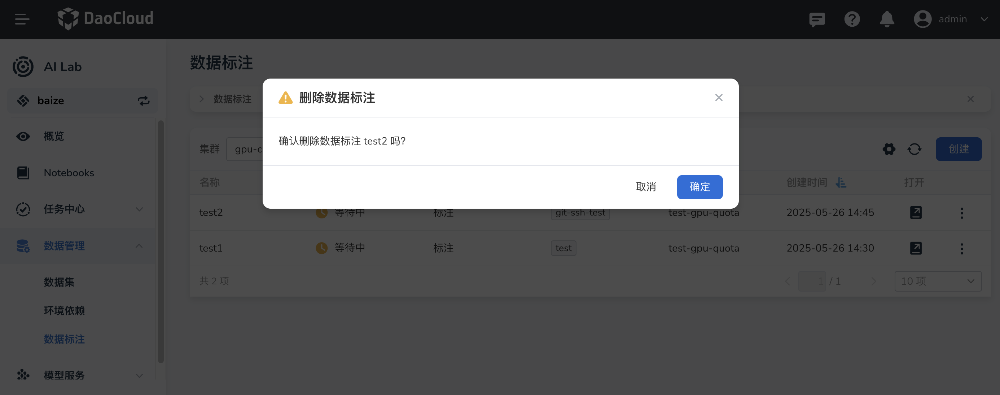

# 数据标注

AI Lab 提供数据标注功能，通过为图片、视频、文本、语音等原始数据添加标签或注释，为机器学习模型提供高质量训练数据，从而提升模型的理解能力和准确性。

## 创建数据标注

1. 在左侧导航栏中点击 **数据管理** -> **数据标注** ，点击右侧的 **创建** 按钮。

    

2. 选择数据标注归属的工作集群、命名空间、队列，配置数据标注的源数据、类型和标注结果，然后点击 **确定** 。

    

3. 数据标注创建成功将返回数据标注列表。你可以通过右侧的 **┇** 执行更多操作。

    

## 下载标注结果

标注结果支持一键下载，在数据标注列表右侧点击 **┇** ，在弹出菜单中选择 **下载标注结果** 。

## 删除数据标注

如果发现数据标注不再需要，可以从数据标注列表中删除。

1. 在数据标注列表右侧点击 **┇** ，在弹出菜单中选择 **删除** 。

    

2. 在弹窗中确认要删除的数据标注后点击 **删除** 。

    

3. 屏幕提示删除成功，该数据标注从列表中消失。

!!! caution

    数据标注一旦删除将不可恢复，请谨慎操作。
