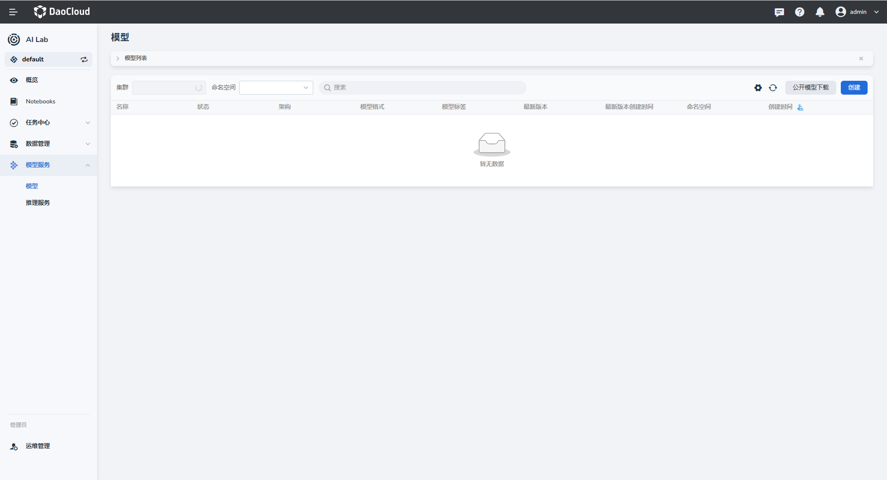
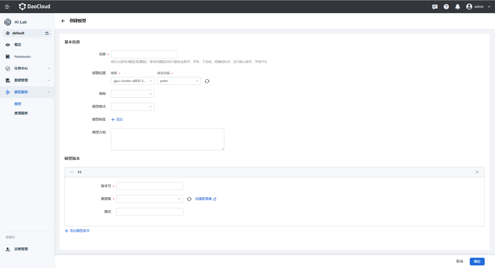
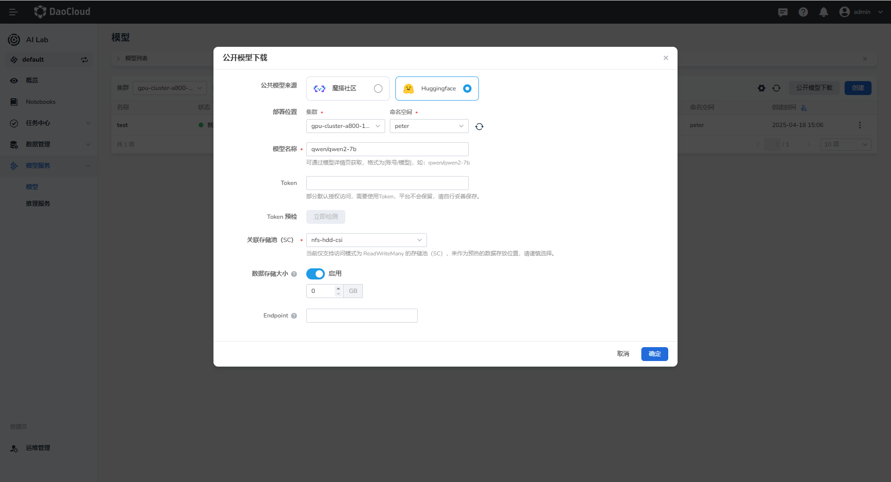
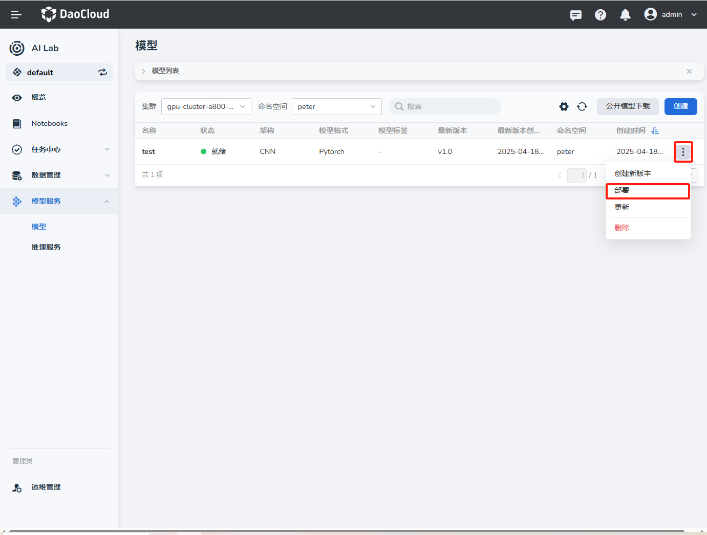
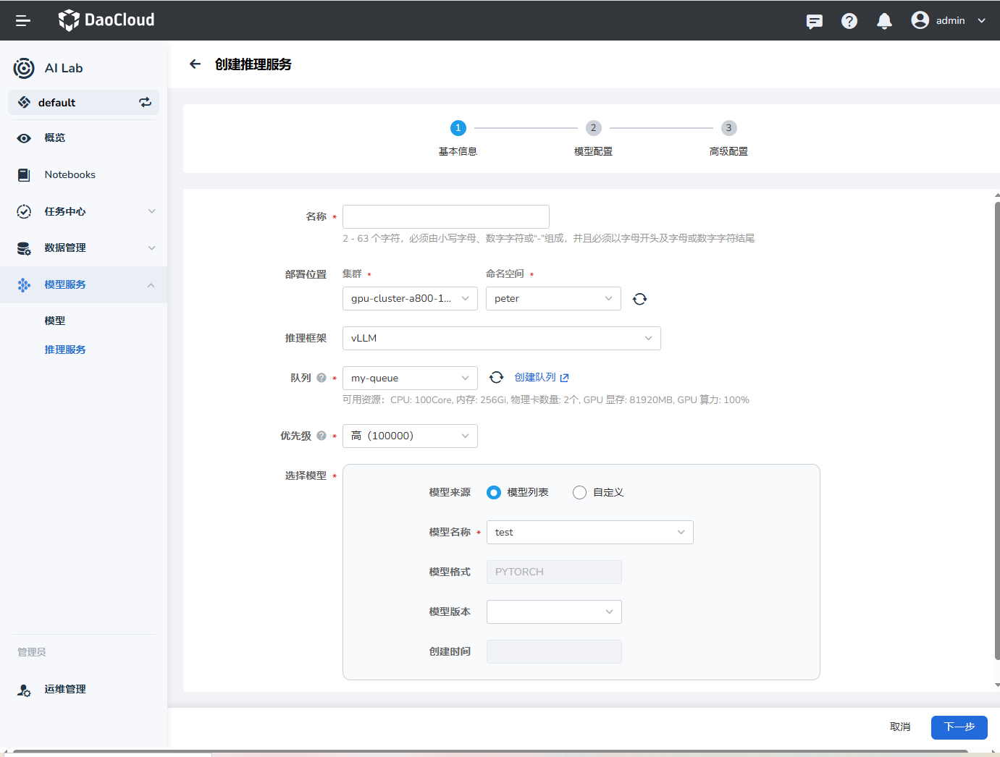
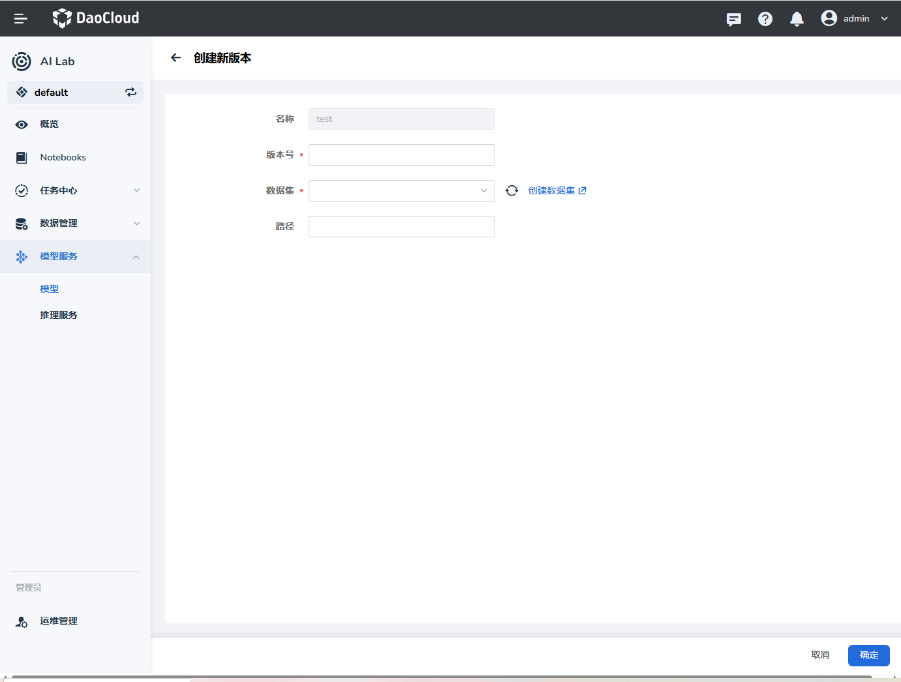
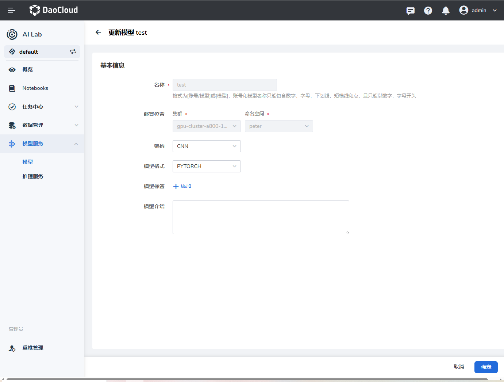
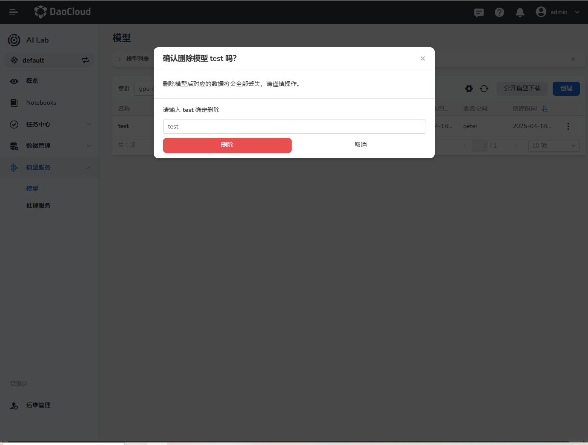

# 模型列表

AI Lab 模型列表用于展示和管理各种机器学习或深度学习模型，方便用户快速进行数据科学和机器学习实验。您可以在不同集群、命名空间中创建模型和下载公开模型，进行模型管理。

## 创建模型

1. 在左侧导航栏中点击 **模型服务** -> **模型** ，进入模型列表。点击右侧的 **创建** 按钮。

    

1. 选择模型部署的集群、命名空间、架构、模型格式、模型标签、模型介绍、模型版本等，然后点击 **确定** 。

    

目前支持的模型架构有：CNN、RNN、LSTM、TRANSFORMER、MLP、BERT、GAN、RESNET等，模型格式包括 PYTORCH、TENSORFLOW 和 ONNX 三种格式。

## 公开模型下载

AI Lab 支持从 魔搭社区 和 HuggingFace 下载模型，您可以在 [ModelScope 模型库](https://www.modelscope.cn/models) 和 [HuggingFace Model Hub](https://huggingface.co/models) 查看更多模型。

点击模型列表右侧的 **公开模型下载** 按钮，选择 **公开模型来源** ，设置模型部署的集群、命名空间、关联存储池、数据储存大小、Endpoint等，填写Token授权访问。然后点击 **确定** 。

## 模型部署

1. 在模型列表中，点击某个模型右侧的 **┇** ，在弹出菜单中选择 **部署** 。

    

1. 跳转到推理服务界面对模型进行部署。
 
    

## 创建新版本

在模型列表右侧点击 **┇** -> **创建新版本** ，在弹窗中设置新版本模型的版本号、数据集、路径等内容。

    
## 更新模型

在模型列表右侧点击 **┇** -> **更新** ，更新目标模型。

## 删除模型

在模型列表右侧点击 **┇** -> **删除** ，在弹窗中确认要删除的模型，输入模型名称后点击 **删除** 。

!!! caution

    模型一旦删除将不可恢复，请谨慎操作。
