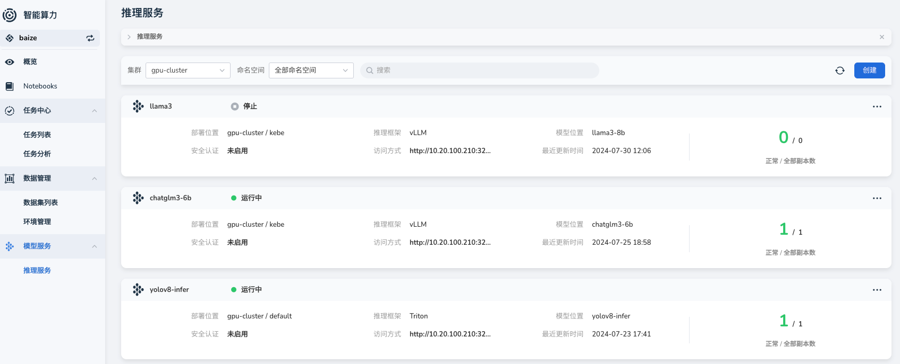

# 模型支持

## 介绍

随着智能算力的快速迭代，我们已经支持了多种模型的推理服务，您可以在这里看到我们支持模型的完整信息。

- 在 `v0.3.0` 版本中上线了模型推理服务，针对传统的深度学习模型，方便用户可以直接使用智能算力的推理服务，无需关心模型的部署和维护。
- 在 `v0.6.0` 支持了完整版本的 `vLLM` 推理能力，支持诸多大语言模型，如 `LLama`、`Qwen`、`ChatGLM` 等。

### 版本支持

!!! note

    推理能力的支持与智能算力的版本有关，请通过我们的 [Release Notes](../../intro/release-notes.md) 查看最新版本并及时更新。

### 支持的 GPU 类型

您可以在智能算力中使用经过 DCE 验证过的 GPU 类型；通过 [GPU 支持矩阵](../../../kpanda/user-guide/gpu/gpu-metrics.md) 查看更多信息。

## 产品界面

## Triton Inference Server

通过 Triton Inference Server 可以很好的支持传统的深度学习模型，我们目前支持主流的推理后端服务：

| Backend          | 支持模型格式                        | 介绍                                                                                                        |
| ---------------- | ----------------------------------- | ----------------------------------------------------------------------------------------------------------- |
| pytorch          | TorchScript、PyTorch 2.0 格式的模型 | [triton-inference-server/pytorch_backend](https://github.com/triton-inference-server/pytorch_backend)       |
| tensorflow       | TensorFlow 2.x                      | [triton-inference-server/tensorflow_backend](https://github.com/triton-inference-server/tensorflow_backend) |
| vLLM(Deprecated) | TensorFlow 2.x                      | [triton-inference-server/tensorflow_backend](https://github.com/triton-inference-server/tensorflow_backend) |

!!! danger

    使用 Triton 的 Backend `vLLM` 的方式已被弃用，推荐使用最新支持 `vLLM` 来部署您的大语言模型。

## vLLM

通过 vLLM 我们可以很快的使用大语言模型，您可以在这里看到我们支持的模型列表，这通常和 `vLLM Support Models` 保持一致。

- HuggingFace 模型：我们支持了 HuggingFace 的大部分模型，您可以在 [HuggingFace Model Hub](https://huggingface.co/models) 查看更多模型。
- [vLLM Support Models](https://docs.vllm.ai/en/stable/models/supported_models.html) 中支持的 大语言模型和 视觉语言模型。
- 使用 `vLLM` 支持框架的模型进行微调后的模型。

### vLLM 新特性

目前，我们还可以支持在使用 `vLLM` 作为推理工具时，使用 vLLM 的新特性，如：

- 在推理模型时，启用 `Lora Adapter` 来优化模型推理服务
- 提供兼容 `OpenAI` 的 `OpenAPI` 接口，方便用户切换到本地推理服务时，可以低成本的快速切换
