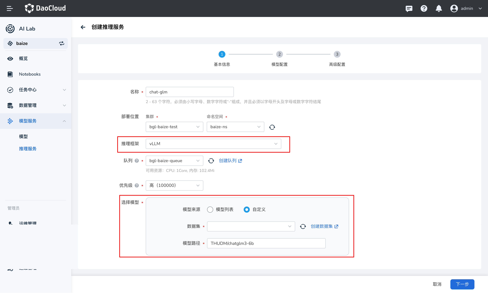
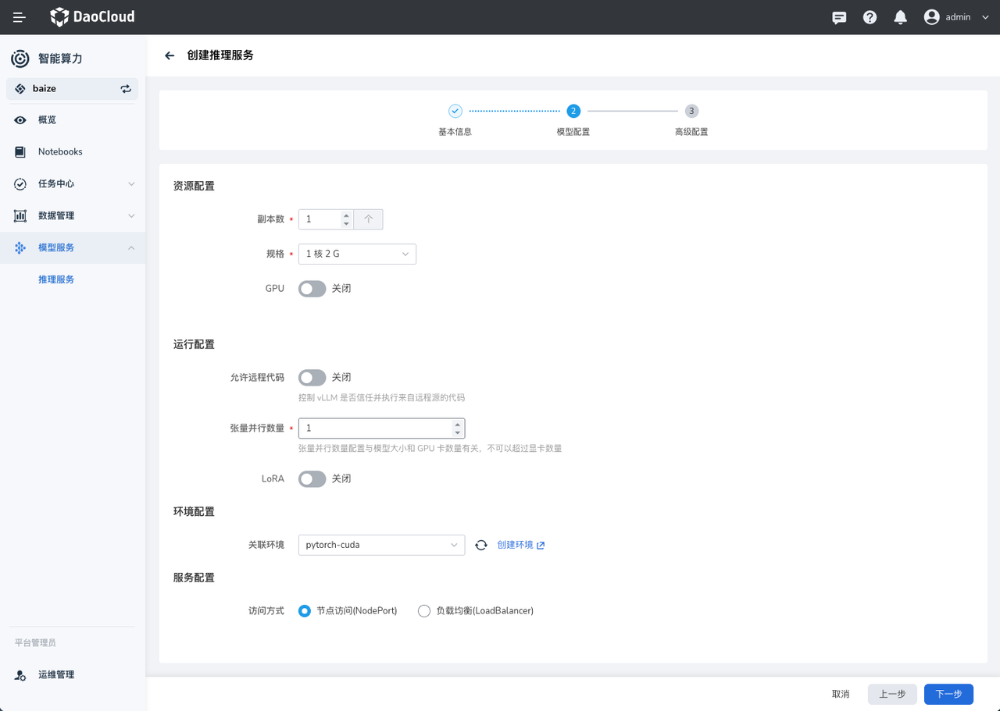

# 创建 vLLM 推理服务

AI Lab 支持以 vLLM 作为推理服务，提供全部 vLLM 的能力，同时提供了完全适配 OpenAI 接口定义。

## vLLM 介绍

vLLM 是一个快速且易于使用的用于推理和服务的库，vLLM 旨在极大地提升实时场景下的语言模型服务的吞吐与内存使用效率。vLLM 在速度、灵活性方面具有以下部分特点：

- 连续批处理传入请求；
- 使用 PagedAttention 高效管理注意力键和值内存；
- 与流行的 HuggingFace 型号无缝集成；
- 兼容 OpenAI 的 API 服务器。

## 前提条件

准备模型数据：在数据集管理中纳管模型代码，并保证数据成功预加载。

## 创建推理服务

1. 选择 `vLLM` 推理框架，并在选择模型模块选择提前创建好的模型数据集 `hdd-models` 并填写数据集中模型所在的`路径`信息。

    本文推理服务的创建使用 ChatGLM3 模型。

    

2. 配置推理服务的资源，并调整推理服务运行的参数。

    

    | 参数名 | 描述 |
    | -- | -- |
    | GPU 资源 | 根据模型规模以及集群资源可以为推理配置 GPU 资源。|
    | 允许远程代码 | 控制 vLLM 是否信任并执行来自远程源的代码 |
    | LoRA | **LoRA** 是一种针对深度学习模型的参数高效调整技术。它通过将原始模型参数矩阵分解为低秩矩阵，从而减少参数数量和计算复杂度。      1. `--lora-modules`：用来指定特定模块或层进行低秩近似     2. `max_loras_rank`：用来指定 LoRA 模型中每个适配层的最大秩，对于简单的任务，可以选择较小的秩值，而对于复杂任务，可能需要较大的秩值来保证模型性能。   3. `max_loras`：表示模型中可以包含的 LoRA 层的最大数量，根据模型大小、推理复杂度等因素自定   4.  `max_cpu_loras`：用于指定在 CPU 环境中可以处理的 LoRA 层的最大数。 |
    | 关联环境 | 通过选择环境预定义推理时所需的环境依赖。|

    !!! info

        支持配置 LoRA 参数的模型可参考 [vLLM 支持的模型](https://docs.vllm.ai/en/latest/models/supported_models.html)。

3. 在 **高级配置** 中，支持根据 GPU 资源等节点配置实现自动化的亲和性调度，同时也方便用户自定义调度策略。

## 验证推理服务

推理服务创建完成之后，点击推理服务名称进入详情，查看 API 调用方法。通过使用 Curl、Python、Nodejs 等方式验证执行结果。

拷贝详情中的 `curl` 命令，并在终端中执行命令发送一条模型推理请求，预期输出：

