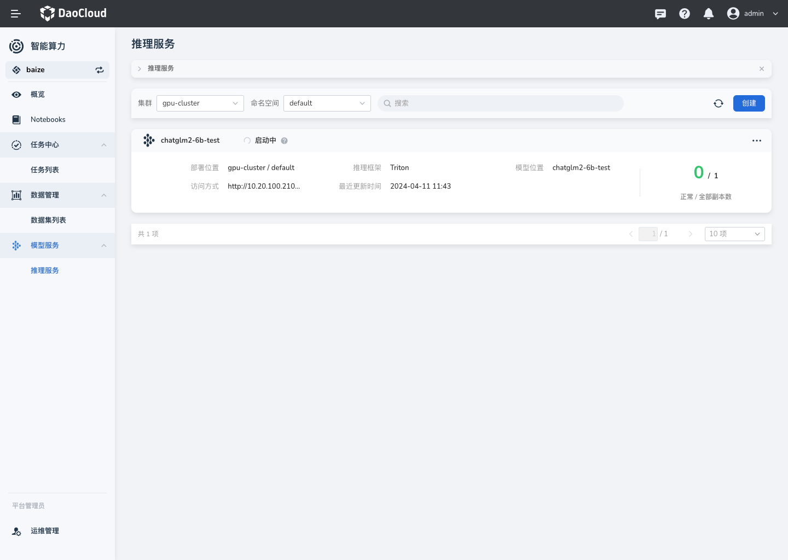
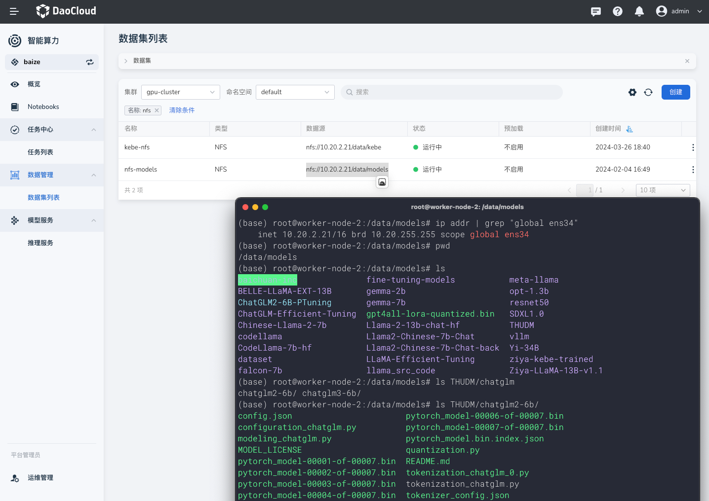
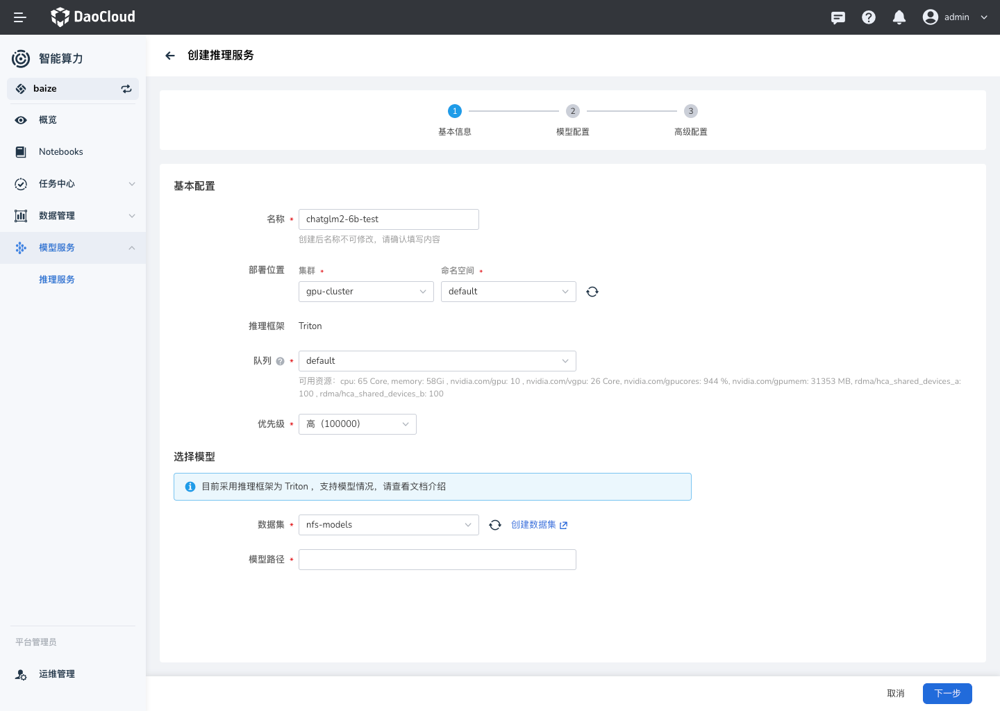
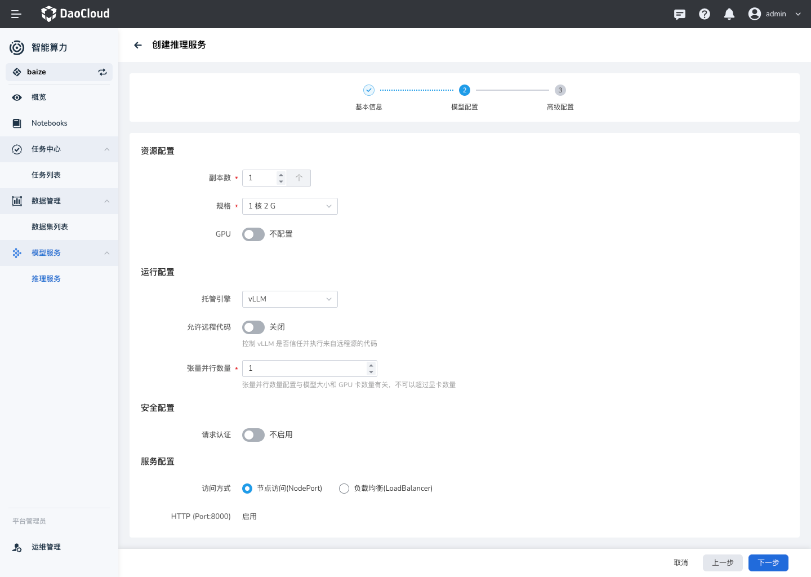

# 创建推理服务

智能算力目前提供以 Triton、vLLM 作为推理框架，用户只需简单配置即可快速启动一个高性能的推理服务。

## 推理服务控制台

## 准备模型数据集

在智能算力中，我们使用数据集来进行模型文件的管理；方便您将任务训练的模型文件，直接挂载到推理服务中使用。

默认情况下，推荐使用 `NFS` 或者 `S3` 服务来存储模型文件；

当您创建成功后，我们会自动进行模型文件预热到集群本地；**预热过程不会占用 GPU。**

> 这里以 `nfs` 为例。

## 创建

目前已经支持表单创建，可以参考文档进行服务创建。

### 配置队列

### 配置模型路径

参考上图中数据集的的模型位置，这里选择如下：

- 数据集为 `nfs-models`模型路径为：`THUDM/chatglm2-6b`

## 模型配置

### 配置认证策略

支持 `API key` 的请求方式认证，用户可以自定义增加认证参数。

### 高级设置：亲和性调度

支持 根据 GPU 资源等节点配置实现自动化的亲和性调度，同时也方便用户自定义调度策略

## 访问

### API 访问

### Web UI 访问（敬请期待）
