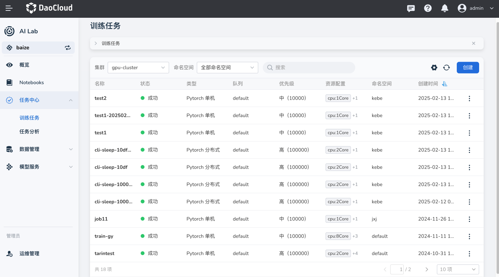
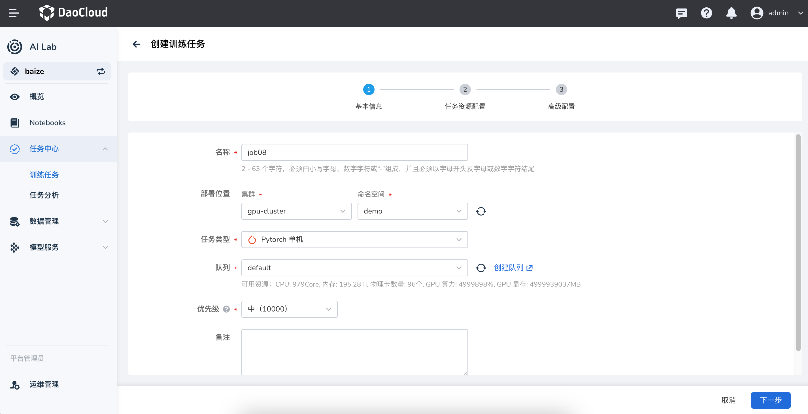
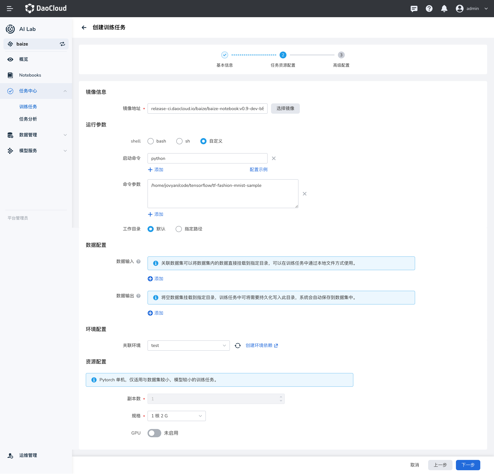
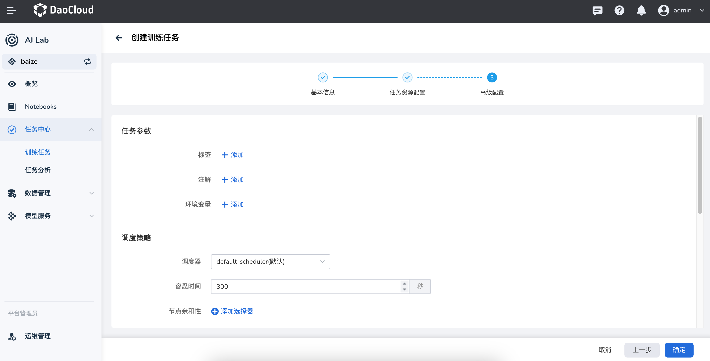

---
hide:
  - toc
---

# 创建任务（Job）

任务管理是指通过作业调度和管控组件来创建和管理任务生命周期的功能。

DCE 5.0 智算能力采用 Kubernetes 的 Job 机制来调度各项 AI 推理、训练任务。

1. 在左侧导航栏中点击 **任务中心** -> **任务列表** ，进入任务列表。点击右侧的 **创建** 按钮。

    

1. 系统会预先填充基础配置数据，包括要部署的集群、命名空间、任务类型、队列、优先级等。
   调整这些参数后点击 **下一步** 。

    

1. 配置镜像地址、运行参数以及关联的数据集后，点击 **下一步** 。

    

1. 按需添加标签、注解、环境变量等任务参数，选择调度策略后点击 **确定** 。

    

1. 任务创建成功后，会有几种运行状态：

    - 运行中
    - 排队中
    - 提交成功、提交失败
    - 任务成功、任务失败

## 下一步

- [查看任务负载](./view.md)
- [删除任务](./delete.md)
