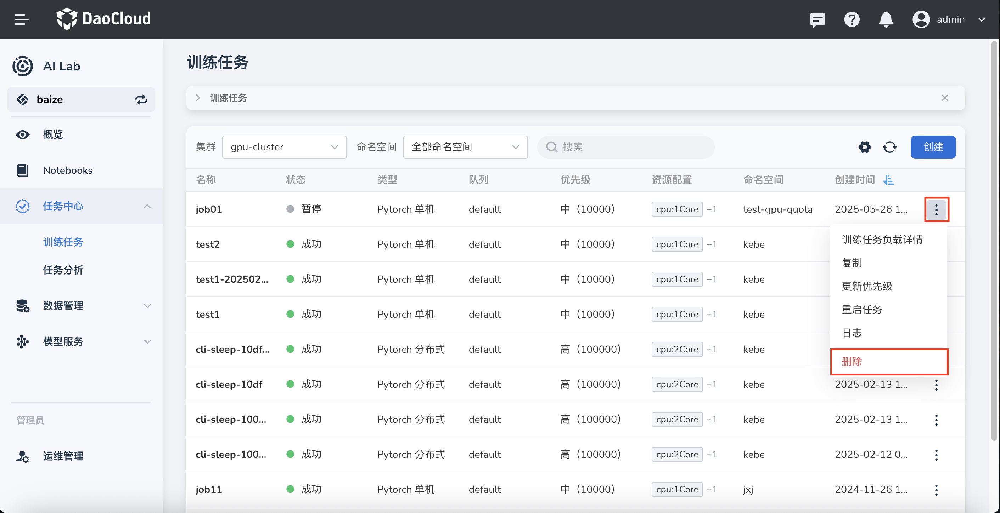

---
hide:
  - toc
---

# 删除任务（Job）

如果发现任务冗余、过期或因其他缘故不再需要，可以从任务列表中删除。

1. 在任务列表右侧点击 **⋮** ，在弹出菜单中选择 **删除** 。

    

1. 在弹窗中确认要删除的任务，输入任务名称后点击 **删除** 。

    

1. 屏幕提示删除成功，该任务从列表中消失。

    

!!! caution

    任务一旦删除将不可恢复，请谨慎操作。
