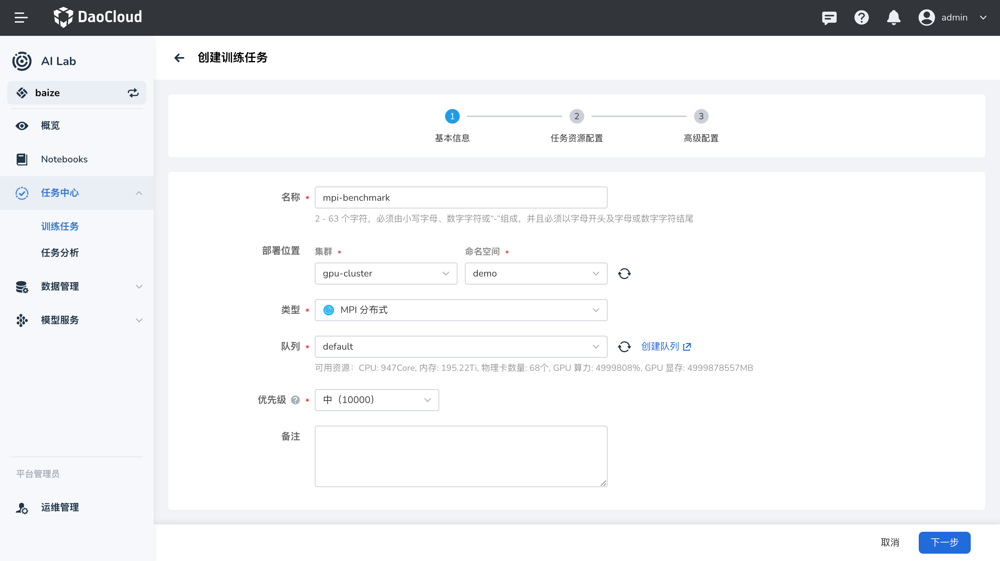

# MPI 任务

MPI（Message Passing Interface）是一种用于并行计算的通信协议，它允许多个计算节点之间进行消息传递和协作。
MPI 任务是使用 MPI 协议进行并行计算的任务，适用于需要大规模并行处理的应用场景，例如分布式训练、科学计算等。

在 AI Lab 中，我们提供了 MPI 任务的支持，您可以通过界面化操作，快速创建 MPI 任务，进行高性能的并行计算。
本教程将指导您如何在 AI Lab 中创建和运行一个 MPI 任务。

## 任务配置介绍

- **任务类型** ：`MPI`，用于运行并行计算任务。
- **运行环境** ：选用预装了 MPI 环境的镜像，或者在任务中指定安装必要的依赖。
- **MPIJob 配置** ：理解并配置 MPIJob 的各项参数，如副本数、资源请求等。

## 任务运行环境

在这里我们使用 `baize-notebook` 基础镜像和 **关联环境** 的方式来作为任务的基础运行环境。
确保运行环境中包含 MPI 及相关库，如 OpenMPI、`mpi4py` 等。

> **注意** ：了解如何创建环境，请参考[环境列表](../dataset/environments.md)。

## 创建 MPI 任务

### MPI 任务创建步骤



1. **登录平台** ：登录 AI Lab 平台，点击左侧导航栏中的 **任务中心**，进入 **训练任务** 页面。
2. **创建任务** ：点击右上角的 **创建** 按钮，进入任务创建页面。
3. **选择任务类型** ：在弹出的窗口中，选择任务类型为 `MPI`，然后点击 **下一步**。
4. **填写任务信息** ：填写任务名称和描述，例如 “benchmarks-mpi”，然后点击 **下一步**。
5. **配置任务参数** ：根据您的需求，配置任务的运行参数、镜像、资源等信息。

#### 运行参数

- **启动命令** ：使用 `mpirun`，这是运行 MPI 程序的命令。
- **命令参数** ：输入您要运行的 MPI 程序的参数。

**示例：运行 TensorFlow Benchmarks**

在本示例中，我们将运行一个 TensorFlow 的基准测试程序，使用 Horovod 进行分布式训练。
首先，确保您使用的镜像中包含所需的依赖项，例如 TensorFlow、Horovod、Open MPI 等。

**镜像选择** ：使用包含 TensorFlow 和 MPI 的镜像，例如 `mai.daocloud.io/docker.io/mpioperator/tensorflow-benchmarks:latest`。

**命令参数** ：

```bash
mpirun --allow-run-as-root -np 2 -bind-to none -map-by slot \
  -x NCCL_DEBUG=INFO -x LD_LIBRARY_PATH -x PATH \
  -mca pml ob1 -mca btl ^openib \
  python scripts/tf_cnn_benchmarks/tf_cnn_benchmarks.py \
  --model=resnet101 --batch_size=64 --variable_update=horovod
```

**说明** ：

- `mpirun`：MPI 的启动命令。
- `--allow-run-as-root`：允许以 root 用户运行（在容器中通常是 root 用户）。
- `-np 2`：指定运行的进程数为 2。
- `-bind-to none`，`-map-by slot`：MPI 进程绑定和映射的配置。
- `-x NCCL_DEBUG=INFO`：设置 NCCL（NVIDIA Collective Communication Library）的调试信息级别。
- `-x LD_LIBRARY_PATH`，`-x PATH`：在 MPI 环境中传递必要的环境变量。
- `-mca pml ob1 -mca btl ^openib`：MPI 的配置参数，指定传输层和消息层协议。
- `python scripts/tf_cnn_benchmarks/tf_cnn_benchmarks.py`：运行 TensorFlow 基准测试脚本。
- `--model=resnet101`，`--batch_size=64`，`--variable_update=horovod`：TensorFlow 脚本的参数，指定模型、批量大小和使用 Horovod 进行参数更新。

#### 资源配置

在任务配置中，需要为每个节点（Launcher 和 Worker）分配适当的资源，例如 CPU、内存和 GPU。

**资源示例** ：

- **Launcher（启动器）** ：

    - **副本数** ：1
    - **资源请求** ：
        - CPU：2 核
        - 内存：4 GiB

- **Worker（工作节点）** ：

    - **副本数** ：2
    - **资源请求** ：
        - CPU：2 核
        - 内存：4 GiB
        - GPU：根据需求分配

#### 完整的 MPIJob 配置示例

以下是完整的 MPIJob 配置示例，供您参考。

```yaml
apiVersion: kubeflow.org/v1
kind: MPIJob
metadata:
  name: tensorflow-benchmarks
spec:
  slotsPerWorker: 1
  runPolicy:
    cleanPodPolicy: Running
  mpiReplicaSpecs:
    Launcher:
      replicas: 1
      template:
        spec:
          containers:
            - name: tensorflow-benchmarks
              image: mai.daocloud.io/docker.io/mpioperator/tensorflow-benchmarks:latest
              command:
                - mpirun
                - --allow-run-as-root
                - -np
                - "2"
                - -bind-to
                - none
                - -map-by
                - slot
                - -x
                - NCCL_DEBUG=INFO
                - -x
                - LD_LIBRARY_PATH
                - -x
                - PATH
                - -mca
                - pml
                - ob1
                - -mca
                - btl
                - ^openib
                - python
                - scripts/tf_cnn_benchmarks/tf_cnn_benchmarks.py
                - --model=resnet101
                - --batch_size=64
                - --variable_update=horovod
              resources:
                limits:
                  cpu: "2"
                  memory: 4Gi
                requests:
                  cpu: "2"
                  memory: 4Gi
    Worker:
      replicas: 2
      template:
        spec:
          containers:
            - name: tensorflow-benchmarks
              image: mai.daocloud.io/docker.io/mpioperator/tensorflow-benchmarks:latest
              resources:
                limits:
                  cpu: "2"
                  memory: 4Gi
                  nvidia.com/gpumem: 1k
                  nvidia.com/vgpu: "1"
                requests:
                  cpu: "2"
                  memory: 4Gi
```

**配置解析** ：

- `apiVersion` 和 `kind`：表示资源的 API 版本和类型，`MPIJob` 是 Kubeflow 定义的自定义资源，用于创建 MPI 类型的任务。
- `metadata`：元数据，包含任务的名称等信息。
- `spec`：任务的详细配置。
    - `slotsPerWorker`：每个 Worker 节点的槽位数量，通常设置为 1。
    - `runPolicy`：运行策略，例如任务完成后是否清理 Pod。
    - `mpiReplicaSpecs`：MPI 任务的副本配置。
        - `Launcher`：启动器，负责启动 MPI 任务。
            - `replicas`：副本数，通常为 1。
            - `template`：Pod 模板，定义容器运行的镜像、命令、资源等。
        - `Worker`：工作节点，实际执行任务的计算节点。
            - `replicas`：副本数，根据并行需求设置，这里设置为 2。
            - `template`：Pod 模板，同样定义容器的运行环境和资源。

#### 设置任务副本数

在创建 MPI 任务时，需要根据 `mpiReplicaSpecs` 中配置的副本数，正确设置 **任务副本数**。

- **总副本数** = `Launcher` 副本数 + `Worker` 副本数
- 本示例中：

    - `Launcher` 副本数：1
    - `Worker` 副本数：2
    - **总副本数** ：1 + 2 = 3

因此，在任务配置中，您需要将 **任务副本数** 设置为 **3**。

#### 提交任务

配置完成后，点击 **提交** 按钮，开始运行 MPI 任务。

## 查看运行结果

任务提交成功后，您可以进入 **任务详情** 页面，查看资源的使用情况和任务的运行状态。
从右上角进入 **工作负载详情**，可以查看运行过程中每个节点的日志输出。

**示例输出**：

```bash
TensorFlow:  1.13
Model:       resnet101
Mode:        training
Batch size:  64
...

Total images/sec: 125.67
```

这表示 MPI 任务成功运行，TensorFlow 基准测试程序完成了分布式训练。

---

## 小结

通过本教程，您学习了如何在 AI Lab 平台上创建和运行一个 MPI 任务。我们详细介绍了 MPIJob 的配置方式，
以及如何在任务中指定运行的命令和资源需求。希望本教程对您有所帮助，如有任何问题，请参考平台提供的其他文档或联系技术支持。

---

**附录** ：

- 如果您的运行环境未预装所需的库（如 `mpi4py`、Horovod 等），请在任务中添加安装命令，或者使用预装了相关依赖的镜像。
- 在实际应用中，您可以根据需求修改 MPIJob 的配置，例如更改镜像、命令参数、资源请求等。
