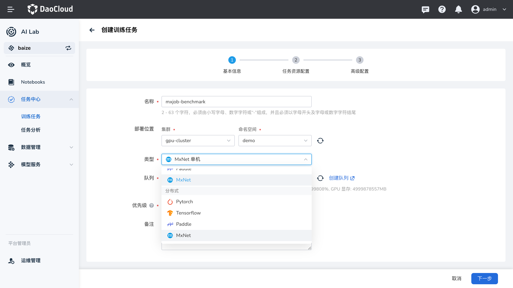

# MXNet 任务

!!! warning

    由于 Apache MXNet 项目已存档，因此 Kubeflow MXJob 将在未来的 Training Operator 1.9 版本中弃用和删除。

Apache MXNet 是一个高性能的深度学习框架，支持多种编程语言。MXNet 任务可以使用多种方式进行训练，包括单机模式和分布式模式。在 AI Lab 中，我们提供了对 MXNet 任务的支持，您可以通过界面化操作，快速创建 MXNet 任务，进行模型训练。

本教程将指导您如何在 AI Lab 平台上创建和运行 MXNet 的单机和分布式任务。

## 任务配置介绍

- **任务类型**：`MXNet`，支持单机和分布式两种模式。
- **运行环境**：选择包含 MXNet 框架的镜像，或在任务中安装必要的依赖。

## 任务运行环境

我们使用 `release-ci.daocloud.io/baize/kubeflow/mxnet-gpu:latest` 镜像作为任务的基础运行环境。该镜像预装了 MXNet 及其相关依赖，支持 GPU 加速。

> **注意**：了解如何创建和管理环境，请参考 [环境列表](../dataset/environments.md)。

## 创建 MXNet 任务



### MXNet 单机任务

#### 创建步骤

1. **登录平台**：登录 AI Lab 平台，点击左侧导航栏中的 **任务中心**，进入 **训练任务** 页面。
2. **创建任务**：点击右上角的 **创建** 按钮，进入任务创建页面。
3. **选择任务类型**：在弹出的窗口中，选择任务类型为 `MXNet`，然后点击 **下一步**。
4. **填写任务信息**：填写任务名称和描述，例如 “MXNet 单机训练任务”，然后点击 **确定**。
5. **配置任务参数**：根据您的需求，配置任务的运行参数、镜像、资源等信息。

#### 运行参数

- **启动命令**：`python3`
- **命令参数**：

    ```bash
    /mxnet/mxnet/example/gluon/mnist/mnist.py --epochs 10 --cuda
    ```

    **说明**：

    - `/mxnet/mxnet/example/gluon/mnist/mnist.py`：MXNet 提供的 MNIST 手写数字识别示例脚本。
    - `--epochs 10`：设置训练轮数为 10。
    - `--cuda`：使用 CUDA 进行 GPU 加速。

#### 资源配置

- **副本数**：1（单机任务）
- **资源请求**：
    - **CPU**：2 核
    - **内存**：4 GiB
    - **GPU**：1 块

#### 完整的 MXJob 配置示例

以下是单机 MXJob 的 YAML 配置：

```yaml
apiVersion: "kubeflow.org/v1"
kind: "MXJob"
metadata:
  name: "mxnet-single-job"
spec:
  jobMode: MXTrain
  mxReplicaSpecs:
    Worker:
      replicas: 1
      restartPolicy: Never
      template:
        spec:
          containers:
            - name: mxnet
              image: release-ci.daocloud.io/baize/kubeflow/mxnet-gpu:latest
              command: ["python3"]
              args:
                [
                  "/mxnet/mxnet/example/gluon/mnist/mnist.py",
                  "--epochs",
                  "10",
                  "--cuda",
                ]
              ports:
                - containerPort: 9991
                  name: mxjob-port
              resources:
                limits:
                  cpu: "2"
                  memory: 4Gi
                  nvidia.com/gpu: 1
                requests:
                  cpu: "2"
                  memory: 4Gi
                  nvidia.com/gpu: 1
```

**配置解析**：

- `apiVersion` 和 `kind`：指定资源的 API 版本和类型，这里是 `MXJob`。
- `metadata`：元数据，包括任务名称等信息。
- `spec`：任务的详细配置。
    - `jobMode`：设置为 `MXTrain`，表示训练任务。
    - `mxReplicaSpecs`：MXNet 任务的副本配置。
        - `Worker`：指定工作节点的配置。
            - `replicas`：副本数，这里为 1。
            - `restartPolicy`：重启策略，设为 `Never`，表示任务失败时不重启。
            - `template`：Pod 模板，定义容器的运行环境和资源。
                - `containers`：容器列表。
                    - `name`：容器名称。
                    - `image`：使用的镜像。
                    - `command` 和 `args`：启动命令和参数。
                    - `ports`：容器端口配置。
                    - `resources`：资源请求和限制。

#### 提交任务

配置完成后，点击 **提交** 按钮，开始运行 MXNet 单机任务。

#### 查看运行结果

任务提交成功后，您可以进入 **任务详情** 页面，查看资源的使用情况和任务的运行状态。从右上角进入 **工作负载详情**，可以查看运行过程中的日志输出。

**示例输出**：

```bash
Epoch 1: accuracy=0.95
Epoch 2: accuracy=0.97
...
Epoch 10: accuracy=0.98
Training completed.
```

这表示 MXNet 单机任务成功运行，模型训练完成。

---

### MXNet 分布式任务

在分布式模式下，MXNet 任务可以使用多台计算节点共同完成训练，提高训练效率。

#### 创建步骤

1. **登录平台**：同上。
2. **创建任务**：点击右上角的 **创建** 按钮，进入任务创建页面。
3. **选择任务类型**：选择任务类型为 `MXNet`，然后点击 **下一步**。
4. **填写任务信息**：填写任务名称和描述，例如 “MXNet 分布式训练任务”，然后点击 **确定**。
5. **配置任务参数**：根据需求，配置运行参数、镜像、资源等。

#### 运行参数

- **启动命令**：`python3`
- **命令参数**：

    ```bash
    /mxnet/mxnet/example/image-classification/train_mnist.py --num-epochs 10 --num-layers 2 --kv-store dist_device_sync --gpus 0
    ```

    **说明**：

    - `/mxnet/mxnet/example/image-classification/train_mnist.py`：MXNet 提供的图像分类示例脚本。
    - `--num-epochs 10`：训练轮数为 10。
    - `--num-layers 2`：模型的层数为 2。
    - `--kv-store dist_device_sync`：使用分布式设备同步模式。
    - `--gpus 0`：使用 GPU 进行加速。

#### 资源配置

- **任务副本数**：3（包括 Scheduler、Server 和 Worker）
- **各角色资源请求**：
    - **Scheduler**（调度器）：
        - **副本数**：1
        - **资源请求**：
            - CPU：2 核
            - 内存：4 GiB
            - GPU：1 块
    - **Server**（参数服务器）：
        - **副本数**：1
        - **资源请求**：
            - CPU：2 核
            - 内存：4 GiB
            - GPU：1 块
    - **Worker**（工作节点）：
        - **副本数**：1
        - **资源请求**：
            - CPU：2 核
            - 内存：4 GiB
            - GPU：1 块

#### 完整的 MXJob 配置示例

以下是分布式 MXJob 的 YAML 配置：

```yaml
apiVersion: "kubeflow.org/v1"
kind: "MXJob"
metadata:
  name: "mxnet-job"
spec:
  jobMode: MXTrain
  mxReplicaSpecs:
    Scheduler:
      replicas: 1
      restartPolicy: Never
      template:
        spec:
          containers:
            - name: mxnet
              image: release-ci.daocloud.io/baize/kubeflow/mxnet-gpu:latest
              ports:
                - containerPort: 9991
                  name: mxjob-port
              resources:
                limits:
                  cpu: "2"
                  memory: 4Gi
                  nvidia.com/gpu: 1
                requests:
                  cpu: "2"
                  memory: 4Gi
    Server:
      replicas: 1
      restartPolicy: Never
      template:
        spec:
          containers:
            - name: mxnet
              image: release-ci.daocloud.io/baize/kubeflow/mxnet-gpu:latest
              ports:
                - containerPort: 9991
                  name: mxjob-port
              resources:
                limits:
                  cpu: "2"
                  memory: 4Gi
                  nvidia.com/gpu: 1
                requests:
                  cpu: "2"
                  memory: 4Gi
    Worker:
      replicas: 1
      restartPolicy: Never
      template:
        spec:
          containers:
            - name: mxnet
              image: release-ci.daocloud.io/baize/kubeflow/mxnet-gpu:latest
              command: ["python3"]
              args:
                [
                  "/mxnet/mxnet/example/image-classification/train_mnist.py",
                  "--num-epochs",
                  "10",
                  "--num-layers",
                  "2",
                  "--kv-store",
                  "dist_device_sync",
                  "--gpus",
                  "0",
                ]
              ports:
                - containerPort: 9991
                  name: mxjob-port
              resources:
                limits:
                  cpu: "2"
                  memory: 4Gi
                  nvidia.com/gpu: 1
                requests:
                  cpu: "2"
                  memory: 4Gi
```

**配置解析**：

- **Scheduler（调度器）**：负责协调集群中各节点的任务调度。
- **Server（参数服务器）**：用于存储和更新模型参数，实现分布式参数同步。
- **Worker（工作节点）**：实际执行训练任务。
- **资源配置**：为各角色分配适当的资源，确保任务顺利运行。

#### 设置任务副本数

在创建 MXNet 分布式任务时，需要根据 `mxReplicaSpecs` 中配置的副本数，正确设置 **任务副本数**。

- **总副本数** = Scheduler 副本数 + Server 副本数 + Worker 副本数
- 本示例中：
    - Scheduler 副本数：1
    - Server 副本数：1
    - Worker 副本数：1
    - **总副本数**：1 + 1 + 1 = 3

因此，在任务配置中，需要将 **任务副本数** 设置为 **3**。

#### 提交任务

配置完成后，点击 **提交** 按钮，开始运行 MXNet 分布式任务。

#### 查看运行结果

进入 **任务详情** 页面，查看任务的运行状态和资源使用情况。您可以查看每个角色（Scheduler、Server、Worker）的日志输出。

**示例输出**：

```bash
INFO:root:Epoch[0] Batch [50]     Speed: 1000 samples/sec   accuracy=0.85
INFO:root:Epoch[0] Batch [100]    Speed: 1200 samples/sec   accuracy=0.87
...
INFO:root:Epoch[9] Batch [100]    Speed: 1300 samples/sec   accuracy=0.98
Training completed.
```

这表示 MXNet 分布式任务成功运行，模型训练完成。

---

## 小结

通过本教程，您学习了如何在 AI Lab 平台上创建和运行 MXNet 的单机和分布式任务。我们详细介绍了 MXJob 的配置方式，以及如何在任务中指定运行的命令和资源需求。希望本教程对您有所帮助，如有任何问题，请参考平台提供的其他文档或联系技术支持。

---

## 附录

- **注意事项**：
    - 确保您使用的镜像包含所需的 MXNet 版本和依赖。
    - 根据实际需求调整资源配置，避免资源不足或浪费。
    - 如需使用自定义的训练脚本，请修改启动命令和参数。

- **参考文档**：
    - [MXNet 官方文档](https://mxnet.apache.org/)
    - [Kubeflow MXJob 指南](https://v1-8-branch.kubeflow.org/docs/components/training/mxnet/)
