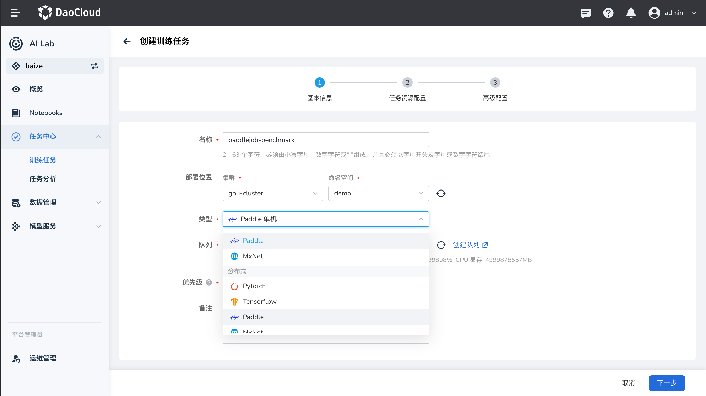

# PaddlePaddle 任务

PaddlePaddle（飞桨）是百度开源的深度学习平台，支持丰富的神经网络模型和分布式训练方式。PaddlePaddle 任务可以通过单机或分布式模式进行训练。在 AI Lab 平台中，我们提供了对 PaddlePaddle 任务的支持，您可以通过界面化操作，快速创建 PaddlePaddle 任务，进行模型训练。

本教程将指导您如何在 AI Lab 平台上创建和运行 PaddlePaddle 的单机和分布式任务。

## 任务配置介绍

-   **任务类型**：`PaddlePaddle`，支持单机和分布式两种模式。
-   **运行环境**：选择包含 PaddlePaddle 框架的镜像，或在任务中安装必要的依赖。

## 任务运行环境

我们使用 `registry.baidubce.com/paddlepaddle/paddle:2.4.0rc0-cpu` 镜像作为任务的基础运行环境。该镜像预装了 PaddlePaddle 框架，适用于 CPU 计算。如果需要使用 GPU，请选择对应的 GPU 版本镜像。

> **注意**：了解如何创建和管理环境，请参考 [环境列表](../dataset/environments.md)。

## 创建 PaddlePaddle 任务



### PaddlePaddle 单机训练任务

#### 创建步骤

1. **登录平台**：登录 AI Lab 平台，点击左侧导航栏中的 **任务中心**，进入 **训练任务** 页面。
2. **创建任务**：点击右上角的 **创建** 按钮，进入任务创建页面。
3. **选择任务类型**：在弹出的窗口中，选择任务类型为 `PaddlePaddle`，然后点击 **下一步**。
4. **填写任务信息**：填写任务名称和描述，例如 “PaddlePaddle 单机训练任务”，然后点击 **确定**。
5. **配置任务参数**：根据您的需求，配置任务的运行参数、镜像、资源等信息。

#### 运行参数

-   **启动命令**：`python`
-   **命令参数**：

    ```bash
    -m paddle.distributed.launch run_check
    ```

    **说明**：

    -   `-m paddle.distributed.launch`：使用 PaddlePaddle 提供的分布式启动模块，即使在单机模式下也可以使用，方便将来迁移到分布式。
    -   `run_check`：PaddlePaddle 提供的测试脚本，用于检查分布式环境是否正常。

#### 资源配置

-   **副本数**：1（单机任务）
-   **资源请求**：
    -   **CPU**：根据需求设置，建议至少 1 核
    -   **内存**：根据需求设置，建议至少 2 GiB
    -   **GPU**：如果需要使用 GPU，选择 GPU 版本的镜像，并分配相应的 GPU 资源

#### 完整的 PaddleJob 配置示例

以下是单机 PaddleJob 的 YAML 配置：

```yaml
apiVersion: kubeflow.org/v1
kind: PaddleJob
metadata:
    name: paddle-simple-cpu
    namespace: kubeflow
spec:
    paddleReplicaSpecs:
        Worker:
            replicas: 1
            restartPolicy: OnFailure
            template:
                spec:
                    containers:
                        - name: paddle
                          image: registry.baidubce.com/paddlepaddle/paddle:2.4.0rc0-cpu
                          command:
                              [
                                  'python',
                                  '-m',
                                  'paddle.distributed.launch',
                                  'run_check',
                              ]
```

**配置解析**：

-   `apiVersion` 和 `kind`：指定资源的 API 版本和类型，这里是 `PaddleJob`。
-   `metadata`：元数据，包括任务名称和命名空间。
-   `spec`：任务的详细配置。
    -   `paddleReplicaSpecs`：PaddlePaddle 任务的副本配置。
        -   `Worker`：指定工作节点的配置。
            -   `replicas`：副本数，这里为 1，表示单机训练。
            -   `restartPolicy`：重启策略，设为 `OnFailure`，表示任务失败时自动重启。
            -   `template`：Pod 模板，定义容器的运行环境和资源。
                -   `containers`：容器列表。
                    -   `name`：容器名称。
                    -   `image`：使用的镜像。
                    -   `command`：启动命令和参数。

#### 提交任务

配置完成后，点击 **提交** 按钮，开始运行 PaddlePaddle 单机任务。

#### 查看运行结果

任务提交成功后，您可以进入 **任务详情** 页面，查看资源的使用情况和任务的运行状态。从右上角进入 **工作负载详情**，可以查看运行过程中的日志输出。

**示例输出**：

```bash
run check success, PaddlePaddle is installed correctly on this node :)
```

这表示 PaddlePaddle 单机任务成功运行，环境配置正常。

---

### PaddlePaddle 分布式训练任务

在分布式模式下，PaddlePaddle 任务可以使用多台计算节点共同完成训练，提高训练效率。

#### 创建步骤

1. **登录平台**：同上。
2. **创建任务**：点击右上角的 **创建** 按钮，进入任务创建页面。
3. **选择任务类型**：选择任务类型为 `PaddlePaddle`，然后点击 **下一步**。
4. **填写任务信息**：填写任务名称和描述，例如 “PaddlePaddle 分布式训练任务”，然后点击 **确定**。
5. **配置任务参数**：根据需求，配置运行参数、镜像、资源等。

#### 运行参数

-   **启动命令**：`python`
-   **命令参数**：

    ```bash
    -m paddle.distributed.launch train.py --epochs=10
    ```

    **说明**：

    -   `-m paddle.distributed.launch`：使用 PaddlePaddle 提供的分布式启动模块。
    -   `train.py`：您的训练脚本，需要放在镜像中或挂载到容器内。
    -   `--epochs=10`：训练的轮数，这里设置为 10。

#### 资源配置

-   **任务副本数**：根据 `Worker` 副本数设置，这里为 2。
-   **资源请求**：
    -   **CPU**：根据需求设置，建议至少 1 核
    -   **内存**：根据需求设置，建议至少 2 GiB
    -   **GPU**：如果需要使用 GPU，选择 GPU 版本的镜像，并分配相应的 GPU 资源

#### 完整的 PaddleJob 配置示例

以下是分布式 PaddleJob 的 YAML 配置：

```yaml
apiVersion: kubeflow.org/v1
kind: PaddleJob
metadata:
    name: paddle-distributed-job
    namespace: kubeflow
spec:
    paddleReplicaSpecs:
        Worker:
            replicas: 2
            restartPolicy: OnFailure
            template:
                spec:
                    containers:
                        - name: paddle
                          image: registry.baidubce.com/paddlepaddle/paddle:2.4.0rc0-cpu
                          command:
                              [
                                  'python',
                                  '-m',
                                  'paddle.distributed.launch',
                                  'train.py',
                              ]
                          args:
                              - '--epochs=10'
```

**配置解析**：

-   `Worker`：
    -   `replicas`：副本数，设置为 2，表示使用 2 个工作节点进行分布式训练。
    -   其他配置与单机模式类似。

#### 设置任务副本数

在创建 PaddlePaddle 分布式任务时，需要根据 `paddleReplicaSpecs` 中配置的副本数，正确设置 **任务副本数**。

-   **总副本数** = `Worker` 副本数
-   本示例中：
    -   `Worker` 副本数：2
    -   **总副本数**：2

因此，在任务配置中，需要将 **任务副本数** 设置为 **2**。

#### 提交任务

配置完成后，点击 **提交** 按钮，开始运行 PaddlePaddle 分布式任务。

#### 查看运行结果

进入 **任务详情** 页面，查看任务的运行状态和资源使用情况。您可以查看每个工作节点的日志输出，确认分布式训练是否正常运行。

**示例输出**：

```bash
Worker 0: Epoch 1, Batch 100, Loss 0.5
Worker 1: Epoch 1, Batch 100, Loss 0.6
...
Training completed.
```

这表示 PaddlePaddle 分布式任务成功运行，模型训练完成。

---

## 小结

通过本教程，您学习了如何在 AI Lab 平台上创建和运行 PaddlePaddle 的单机和分布式任务。我们详细介绍了 PaddleJob 的配置方式，以及如何在任务中指定运行的命令和资源需求。希望本教程对您有所帮助，如有任何问题，请参考平台提供的其他文档或联系技术支持。

---

## 附录

-   **注意事项**：
    -   **训练脚本**：确保 `train.py`（或其他训练脚本）在容器内存在。您可以通过自定义镜像、挂载持久化存储等方式将脚本放入容器。
    -   **镜像选择**：根据您的需求选择合适的镜像，例如使用 GPU 时选择 `paddle:2.4.0rc0-gpu` 等。
    -   **参数调整**：可以通过修改 `command` 和 `args` 来传递不同的训练参数。

-   **参考文档**：
    -   [PaddlePaddle 官方文档](https://www.paddlepaddle.org.cn/documentation/docs/zh/2.6/guides/index_cn.html)
    -   [Kubeflow PaddleJob 指南](https://www.kubeflow.org/docs/components/training/user-guides/paddle/)
