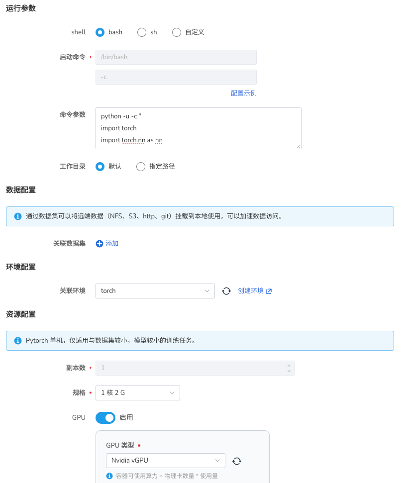

# Pytorch 任务

Pytorch 是一个开源的深度学习框架，它提供了一个灵活的训练和部署环境。
Pytorch 任务是一个使用 Pytorch 框架的任务。

在 AI Lab 中，我们提供了 Pytorch 任务支持和适配，您可以通过界面化操作，
快速创建 Pytorch 任务，进行模型训练。

## 任务配置介绍

- 任务类型同时支持 `Pytorch 单机` 和 `Pytorch 分布式` 两种模式。
- 运行镜像内已经默认支持 Pytorch 框架，无需额外安装。

## 任务运行环境

在这里我们使用 `baize-notebook` 基础镜像 和 `关联环境` 的方式来作为任务基础运行环境。

> 了解如何创建环境，请参考 [环境列表](../dataset/environments.md)。

## 创建任务

### Pytorch 单机任务



1. 登录 AI Lab 平台，点击左侧导航栏中的 **任务中心** ，进入 **训练任务** 页面。
2. 点击右上角的 **创建** 按钮，进入任务创建页面。
3. 选择任务类型为 `Pytorch 单机`，点击 **下一步** 。
4. 填写任务名称、描述后点击 **确定** 。

#### 运行参数

- 启动命令 使用 `bash`
- 命令参数使用

```python
import torch
import torch.nn as nn
import torch.optim as optim

# 定义一个简单的神经网络
class SimpleNet(nn.Module):
    def __init__(self):
        super(SimpleNet, self).__init__()
        self.fc = nn.Linear(10, 1)

    def forward(self, x):
        return self.fc(x)

# 创建模型、损失函数和优化器
model = SimpleNet()
criterion = nn.MSELoss()
optimizer = optim.SGD(model.parameters(), lr=0.01)

# 生成一些随机数据
x = torch.randn(100, 10)
y = torch.randn(100, 1)

# 训练模型
for epoch in range(100):
    # 前向传播
    outputs = model(x)
    loss = criterion(outputs, y)
    
    # 反向传播和优化
    optimizer.zero_grad()
    loss.backward()
    optimizer.step()
    
    if (epoch + 1) % 10 == 0:
        print(f'Epoch [{epoch+1}/100], Loss: {loss.item():.4f}')

print('Training finished.')
```

#### 运行结果

任务提交成功，我们可以进入任务详情查看到资源的使用情况，从右上角去往 **工作负载详情** ，可以查看训练过程中的日志输出

```bash
[HAMI-core Warn(1:140244541377408:utils.c:183)]: get default cuda from (null)
[HAMI-core Msg(1:140244541377408:libvgpu.c:855)]: Initialized
Epoch [10/100], Loss: 1.1248
Epoch [20/100], Loss: 1.0486
Epoch [30/100], Loss: 0.9969
Epoch [40/100], Loss: 0.9611
Epoch [50/100], Loss: 0.9360
Epoch [60/100], Loss: 0.9182
Epoch [70/100], Loss: 0.9053
Epoch [80/100], Loss: 0.8960
Epoch [90/100], Loss: 0.8891
Epoch [100/100], Loss: 0.8841
Training finished.
[HAMI-core Msg(1:140244541377408:multiprocess_memory_limit.c:468)]: Calling exit handler 1
```

### Pytorch 分布式任务

1. 登录 AI Lab 平台，点击左侧导航栏中的 **任务中心** ，进入 **任务列表** 页面。
2. 点击右上角的 **创建** 按钮，进入任务创建页面。
3. 选择任务类型为 `Pytorch 分布式`，点击 **下一步** 。
4. 填写任务名称、描述后点击 **确定** 。

#### 运行参数

- 启动命令 使用 `bash`
- 命令参数使用

```python
import os
import torch
import torch.distributed as dist
import torch.nn as nn
import torch.optim as optim
from torch.nn.parallel import DistributedDataParallel as DDP

class SimpleModel(nn.Module):
    def __init__(self):
        super(SimpleModel, self).__init__()
        self.fc = nn.Linear(10, 1)

    def forward(self, x):
        return self.fc(x)

def train():
    # 打印环境信息
    print(f'PyTorch version: {torch.__version__}')
    print(f'CUDA available: {torch.cuda.is_available()}')
    if torch.cuda.is_available():
        print(f'CUDA version: {torch.version.cuda}')
        print(f'CUDA device count: {torch.cuda.device_count()}')

    rank = int(os.environ.get('RANK', '0'))
    world_size = int(os.environ.get('WORLD_SIZE', '1'))
    
    print(f'Rank: {rank}, World Size: {world_size}')

    # 初始化分布式环境
    try:
        if world_size > 1:
            dist.init_process_group('nccl')
            print('Distributed process group initialized successfully')
        else:
            print('Running in non-distributed mode')
    except Exception as e:
        print(f'Error initializing process group: {e}')
        return

    # 设置设备
    try:
        if torch.cuda.is_available():
            device = torch.device(f'cuda:{rank % torch.cuda.device_count()}')
            print(f'Using CUDA device: {device}')
        else:
            device = torch.device('cpu')
            print('CUDA not available, using CPU')
    except Exception as e:
        print(f'Error setting device: {e}')
        device = torch.device('cpu')
        print('Falling back to CPU')

    try:
        model = SimpleModel().to(device)
        print('Model moved to device successfully')
    except Exception as e:
        print(f'Error moving model to device: {e}')
        return

    try:
        if world_size > 1:
            ddp_model = DDP(model, device_ids=[rank % torch.cuda.device_count()] if torch.cuda.is_available() else None)
            print('DDP model created successfully')
        else:
            ddp_model = model
            print('Using non-distributed model')
    except Exception as e:
        print(f'Error creating DDP model: {e}')
        return

    loss_fn = nn.MSELoss()
    optimizer = optim.SGD(ddp_model.parameters(), lr=0.001)

    # 生成一些随机数据
    try:
        data = torch.randn(100, 10, device=device)
        labels = torch.randn(100, 1, device=device)
        print('Data generated and moved to device successfully')
    except Exception as e:
        print(f'Error generating or moving data to device: {e}')
        return

    for epoch in range(10):
        try:
            ddp_model.train()
            outputs = ddp_model(data)
            loss = loss_fn(outputs, labels)
            optimizer.zero_grad()
            loss.backward()
            optimizer.step()
            
            if rank == 0:
                print(f'Epoch {epoch}, Loss: {loss.item():.4f}')
        except Exception as e:
            print(f'Error during training epoch {epoch}: {e}')
            break

    if world_size > 1:
        dist.destroy_process_group()

if __name__ == '__main__':
    train()
```

#### 任务副本数

注意 `Pytorch 分布式` 训练任务会创建一组 `Master` 和 `Worker` 的训练 Pod，
`Master` 负责协调训练任务，`Worker` 负责实际的训练工作。

!!! note

    本次演示中：`Master` 副本数为 1，`Worker` 副本数为 2；
    所以我们需要在 **任务配置** 中设置副本数为 3，即 `Master` 副本数 + `Worker` 副本数。
    Pytorch 会自动调谐 `Master` 和 `Worker` 的角色。

#### 运行结果

同样，我们可以进入任务详情，查看资源的使用情况，以及每个 Pod 的日志输出。
