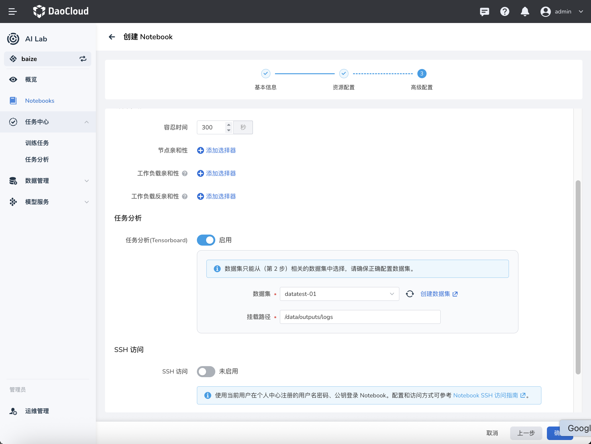
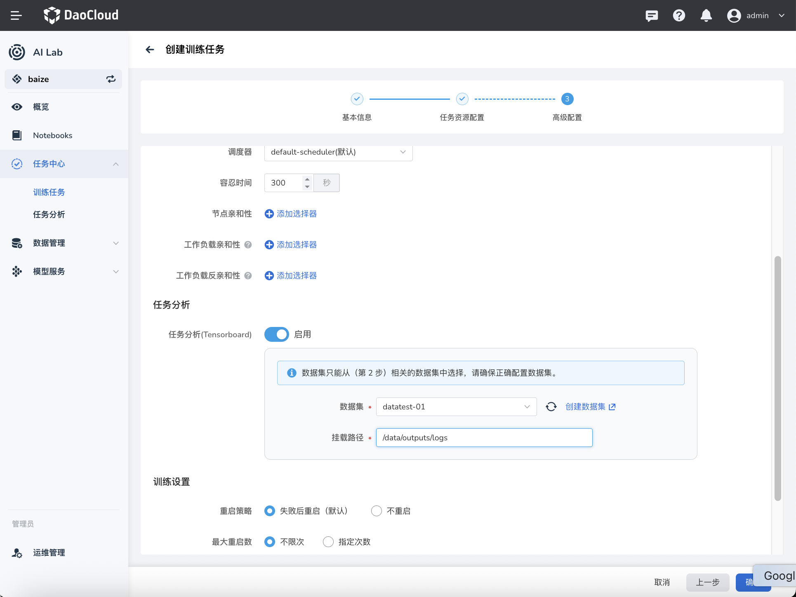
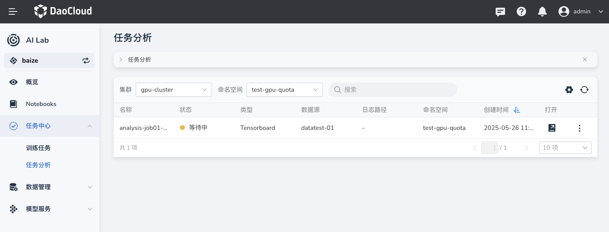

# 任务分析介绍

在 DCE 智能算力模块中，提供了模型开发过程重要的可视化分析工具，用于展示机器学习模型的训练过程和结果。
本文将介绍 任务分析（Tensorboard）的基本概念、在智能算力系统中的使用方法，以及如何配置数据集的日志内容。

## 1. Tensorboard 是什么？

!!! note
    Tensorboard 是 TensorFlow 提供的一个可视化工具，用于展示机器学习模型的训练过程和结果。
    它可以帮助开发者更直观地理解模型的训练动态，分析模型性能，调试模型问题等。


### Tensorboard 在模型开发过程中的作用及优势

- **可视化训练过程**：通过图表展示训练和验证的损失、精度等指标，帮助开发者直观地观察模型的训练效果。
- **调试和优化模型**：通过查看不同层的权重、梯度分布等，帮助开发者发现和修正模型中的问题。
- **对比不同实验**：可以同时展示多个实验的结果，方便开发者对比不同模型和超参数配置的效果。
- **追踪训练数据**：记录训练过程中使用的数据集和参数，确保实验的可复现性。

## 如何创建 Tensorboard

在智能算力系统中，我们提供了便捷的方式来创建和管理 Tensorboard。以下是具体步骤：

### 在创建时 Notebook 启用 Tensorboard

1. **创建 Notebook**：在智能算力平台上创建一个新的 Notebook。
2. **启用 Tensorboard**：在创建 Notebook 的创建页面中，“启用 Tensorboard”选项，并指定数据集和日志路径。



### 在分布式任务创建及完成后启用 Tensorboard

1. **创建分布式任务**：在智能算力平台上创建一个新的分布式训练任务。
2. **配置 Tensorboard**：在任务配置页面中，“启用 Tensorboard”选项，并指定数据集和日志路径。
3. **任务完成后查看 Tensorboard**：任务完成后，可以在任务详情页面中查看 Tensorboard 的链接，点击链接即可查看训练过程的可视化结果。



### 在 Notebook 中直接引用 Tensorboard

在 Notebook 中，可以通过代码直接启动 Tensorboard。以下是一个示例代码：

```python
# 导入必要的库
import tensorflow as tf
import datetime

# 定义日志目录
log_dir = "logs/fit/" + datetime.datetime.now().strftime("%Y%m%d-%H%M%S")

# 创建 Tensorboard 回调
tensorboard_callback = tf.keras.callbacks.TensorBoard(log_dir=log_dir, histogram_freq=1)

# 构建并编译模型
model = tf.keras.models.Sequential([
    tf.keras.layers.Flatten(input_shape=(28, 28)),
    tf.keras.layers.Dense(512, activation='relu'),
    tf.keras.layers.Dropout(0.2),
    tf.keras.layers.Dense(10, activation='softmax')
])

model.compile(optimizer='adam',
              loss='sparse_categorical_crossentropy',
              metrics=['accuracy'])

# 训练模型并启用 Tensorboard 回调
model.fit(x_train, y_train, epochs=5, validation_data=(x_test, y_test), callbacks=[tensorboard_callback])
```

## 如何配置数据集的日志内容

在使用 Tensorboard 时，可以记录和配置不同的数据集和日志内容。以下是一些常见的配置方式：

### 配置训练和验证数据集的日志

在训练模型时，可以通过 TensorFlow 的 `tf.summary` API 来记录训练和验证数据集的日志。以下是一个示例代码：

```python
# 导入必要的库
import tensorflow as tf

# 创建日志目录
train_log_dir = 'logs/gradient_tape/train'
val_log_dir = 'logs/gradient_tape/val'
train_summary_writer = tf.summary.create_file_writer(train_log_dir)
val_summary_writer = tf.summary.create_file_writer(val_log_dir)

# 训练模型并记录日志
for epoch in range(EPOCHS):
    for (x_train, y_train) in train_dataset:
        # 训练步骤
        train_step(x_train, y_train)
        with train_summary_writer.as_default():
            tf.summary.scalar('loss', train_loss.result(), step=epoch)
            tf.summary.scalar('accuracy', train_accuracy.result(), step=epoch)

    for (x_val, y_val) in val_dataset:
        # 验证步骤
        val_step(x_val, y_val)
        with val_summary_writer.as_default():
            tf.summary.scalar('loss', val_loss.result(), step=epoch)
            tf.summary.scalar('accuracy', val_accuracy.result(), step=epoch)
```

### 配置自定义日志

除了训练和验证数据集的日志外，还可以记录其他自定义的日志内容，例如学习率、梯度分布等。以下是一个示例代码：

```python
# 记录自定义日志
with train_summary_writer.as_default():
    tf.summary.scalar('learning_rate', learning_rate, step=epoch)
    tf.summary.histogram('gradients', gradients, step=epoch)
```

## Tensorboard 管理

在智能算力中，通过各种方式创建出来的 Tensorboard 会统一展示在任务分析的页面中，方便用户查看和管理。



用户可以在任务分析页面中查看 Tensorboard 的链接、状态、创建时间等信息，并通过链接直接访问 Tensorboard 的可视化结果。
