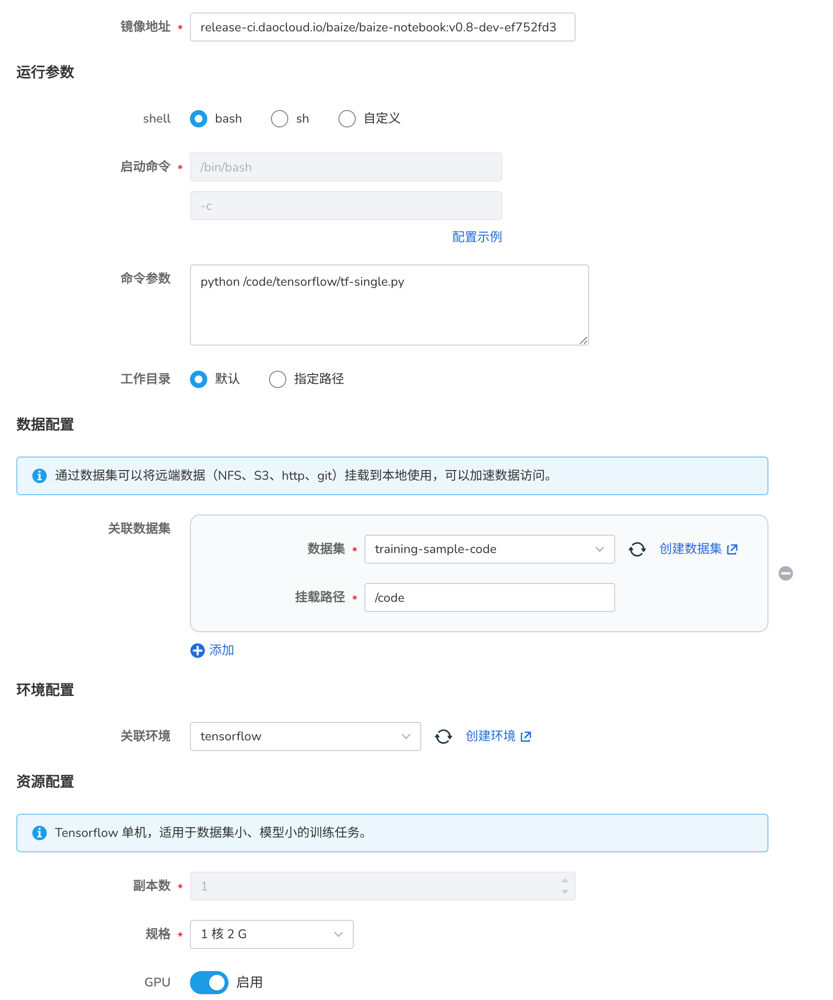
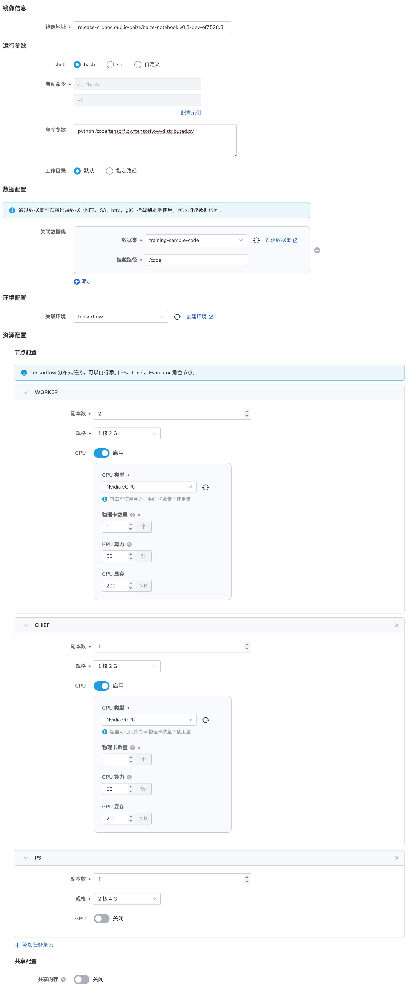

# Tensorflow 任务

Tensorflow 是除了 Pytorch 另外一个非常活跃的开源的深度学习框架，它提供了一个灵活的训练和部署环境。

在 AI Lab 中，我们同样提供了 Tensorflow 框架的支持和适配，您可以通过界面化操作，快速创建 Tensorflow 任务，进行模型训练。

## 任务配置介绍

- 任务类型同时支持 `Tensorflow 单机` 和 `Tensorflow 分布式` 两种模式。
- 运行镜像内已经默认支持 Tensorflow 框架，无需额外安装。

## 任务运行环境

在这里我们使用 `baize-notebook` 基础镜像 和 `关联环境` 的方式来作为任务基础运行环境。

> 了解如何创建环境，请参考 [环境列表](../dataset/environments.md)。

## 创建任务

### 示例 TFJob 单机任务



1. 登录 AI Lab 平台，点击左侧导航栏中的 **任务中心** ，进入 **训练任务** 页面。
2. 点击右上角的 **创建** 按钮，进入任务创建页面。
3. 选择任务类型为 `Tensorflow 单机`，点击 **下一步** 。
4. 填写任务名称、描述后点击 **确定** 。

#### 提前预热代码仓库

使用 **AI Lab** -> **数据集列表** ，创建一个数据集，并将远端 Github 的代码拉取到数据集中，
这样在创建任务时，可以直接选择数据集，将代码挂载到任务中。

演示代码仓库地址：[https://github.com/d-run/training-sample-code/](https://github.com/d-run/training-sample-code/)

#### 运行参数

- 启动命令 使用 `bash`
- 命令参数使用 `python /code/tensorflow/tf-single.py`

```python
"""
  pip install tensorflow numpy
"""

import tensorflow as tf
import numpy as np

# 创建一些随机数据
x = np.random.rand(100, 1)
y = 2 * x + 1 + np.random.rand(100, 1) * 0.1

# 创建一个简单的模型
model = tf.keras.Sequential([
    tf.keras.layers.Dense(1, input_shape=(1,))
])

# 编译模型
model.compile(optimizer='adam', loss='mse')

# 训练模型，将 epochs 改为 10
history = model.fit(x, y, epochs=10, verbose=1)

# 打印最终损失
print('Final loss: {' + str(history.history['loss'][-1]) +'}')

# 使用模型进行预测
test_x = np.array([[0.5]])
prediction = model.predict(test_x)
print(f'Prediction for x=0.5: {prediction[0][0]}')
```

#### 运行结果

任务提交成功后，可以进入任务详情查看到资源的使用情况，从右上角去往 **工作负载详情** ，可以查看训练过程中的日志输出。

### TFJob 分布式任务

1. 登录 **AI Lab** ，点击左侧导航栏中的 **任务中心** ，进入 **任务列表** 页面。
2. 点击右上角的 **创建** 按钮，进入任务创建页面。
3. 选择任务类型为 `Tensorflow 分布式`，点击 **下一步** 。
4. 填写任务名称、描述后点击 **确定** 。

#### 示例任务介绍



本次包含了三种角色：`Chief`、`Worker` 和 `Parameter Server (PS)`。

- Chief: 主要负责协调训练过程和模型检查点的保存。
- Worker: 执行实际的模型训练。
- PS: 在异步训练中用于存储和更新模型参数。

为不同的角色分配了不同的资源。`Chief` 和 `Worker` 使用 GPU，而 `PS` 使用 CPU 和较大的内存。

#### 运行参数

- 启动命令 使用 `bash`
- 命令参数使用 `python /code/tensorflow/tensorflow-distributed.py`

```python
import os
import json
import tensorflow as tf

class SimpleModel(tf.keras.Model):
    def __init__(self):
        super(SimpleModel, self).__init__()
        self.fc = tf.keras.layers.Dense(1, input_shape=(10,))

    def call(self, x):
        return self.fc(x)

def train():
    # 打印环境信息
    print(f"TensorFlow version: {tf.__version__}")
    print(f"GPU available: {tf.test.is_gpu_available()}")
    if tf.test.is_gpu_available():
        print(f"GPU device count: {len(tf.config.list_physical_devices('GPU'))}")

    # 获取分布式训练信息
    tf_config = json.loads(os.environ.get('TF_CONFIG') or '{}')
    task_type = tf_config.get('task', {}).get('type')
    task_id = tf_config.get('task', {}).get('index')

    print(f"Task type: {task_type}, Task ID: {task_id}")

    # 设置分布式策略
    strategy = tf.distribute.experimental.MultiWorkerMirroredStrategy()
    
    with strategy.scope():
        model = SimpleModel()
        loss_fn = tf.keras.losses.MeanSquaredError()
        optimizer = tf.keras.optimizers.SGD(learning_rate=0.001)

    # 生成一些随机数据
    data = tf.random.normal((100, 10))
    labels = tf.random.normal((100, 1))

    @tf.function
    def train_step(inputs, labels):
        with tf.GradientTape() as tape:
            predictions = model(inputs)
            loss = loss_fn(labels, predictions)
        gradients = tape.gradient(loss, model.trainable_variables)
        optimizer.apply_gradients(zip(gradients, model.trainable_variables))
        return loss

    for epoch in range(10):
        loss = train_step(data, labels)
        if task_type == 'chief':
            print(f'Epoch {epoch}, Loss: {loss.numpy():.4f}')

if __name__ == '__main__':
    train()
```

#### 运行结果

同样，我们可以进入任务详情，查看资源的使用情况，以及每个 Pod 的日志输出。
