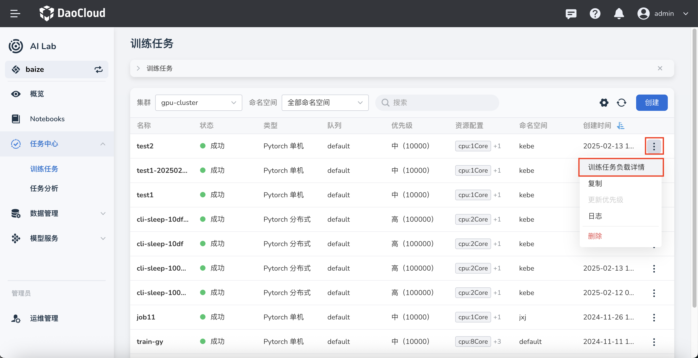
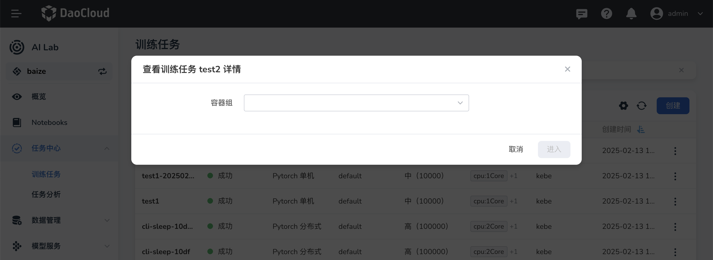

# 查看任务（Job）工作负载

任务创建好后，都会显示在任务列表中。

1. 在任务列表中，点击某个任务右侧的 **⋮** -> **任务负载详情** 。

    

1. 出现一个弹窗选择要查看哪个 Pod 后，点击 **进入** 。

    

1. 跳转到容器管理界面，可以查看容器的工作状态、标签与注解以及发生的事件。

    

1. 你还可以查看当前 Pod 最近一段时间的详细日志。
   此处默认展示 100 行日志，如果要查看更详细的日志活下载日志，请点击顶部的蓝色 **可观测性** 文字。

    

1. 当然你还可以通过右上角的 **...** ，查看当前 Pod 的 YAML、上传和下载文件。
   以下是一个 Pod 的 YAML 示例。

```yaml
kind: Pod
apiVersion: v1
metadata:
  name: neko-tensorboard-job-test-202404181843-skxivllb-worker-0
  namespace: default
  uid: ddedb6ff-c278-47eb-ae1e-0de9b7c62f8c
  resourceVersion: '41092552'
  creationTimestamp: '2024-04-18T10:43:36Z'
  labels:
    training.kubeflow.org/job-name: neko-tensorboard-job-test-202404181843-skxivllb
    training.kubeflow.org/operator-name: pytorchjob-controller
    training.kubeflow.org/replica-index: '0'
    training.kubeflow.org/replica-type: worker
  annotations:
    cni.projectcalico.org/containerID: 0cfbb9af257d5e69027c603c6cb2d3890a17c4ae1a145748d5aef73a10d7fbe1
    cni.projectcalico.org/podIP: ''
    cni.projectcalico.org/podIPs: ''
    hami.io/bind-phase: success
    hami.io/bind-time: '1713437016'
    hami.io/vgpu-devices-allocated: GPU-29d5fa0d-935b-2966-aff8-483a174d61d1,NVIDIA,1024,20:;
    hami.io/vgpu-devices-to-allocate: ;
    hami.io/vgpu-node: worker-a800-1
    hami.io/vgpu-time: '1713437016'
    k8s.v1.cni.cncf.io/network-status: |-
      [{
          "name": "kube-system/calico",
          "ips": [
              "10.233.97.184"
          ],
          "default": true,
          "dns": {}
      }]
    k8s.v1.cni.cncf.io/networks-status: |-
      [{
          "name": "kube-system/calico",
          "ips": [
              "10.233.97.184"
          ],
          "default": true,
          "dns": {}
      }]
  ownerReferences:
    - apiVersion: kubeflow.org/v1
      kind: PyTorchJob
      name: neko-tensorboard-job-test-202404181843-skxivllb
      uid: e5a8b05d-1f03-4717-8e1c-4ec928014b7b
      controller: true
      blockOwnerDeletion: true
spec:
  volumes:
    - name: 0-dataset-pytorch-examples
      persistentVolumeClaim:
        claimName: pytorch-examples
    - name: kube-api-access-wh9rh
      projected:
        sources:
          - serviceAccountToken:
              expirationSeconds: 3607
              path: token
          - configMap:
              name: kube-root-ca.crt
              items:
                - key: ca.crt
                  path: ca.crt
          - downwardAPI:
              items:
                - path: namespace
                  fieldRef:
                    apiVersion: v1
                    fieldPath: metadata.namespace
        defaultMode: 420
  containers:
    - name: pytorch
      image: m.daocloud.io/docker.io/pytorch/pytorch
      command:
        - bash
      args:
        - '-c'
        - >-
          ls -la /root && which pip && pip install pytorch_lightning tensorboard
          && python /root/Git/pytorch/examples/mnist/main.py
      ports:
        - name: pytorchjob-port
          containerPort: 23456
          protocol: TCP
      env:
        - name: PYTHONUNBUFFERED
          value: '1'
        - name: PET_NNODES
          value: '1'
      resources:
        limits:
          cpu: '4'
          memory: 8Gi
          nvidia.com/gpucores: '20'
          nvidia.com/gpumem: '1024'
          nvidia.com/vgpu: '1'
        requests:
          cpu: '4'
          memory: 8Gi
          nvidia.com/gpucores: '20'
          nvidia.com/gpumem: '1024'
          nvidia.com/vgpu: '1'
      volumeMounts:
        - name: 0-dataset-pytorch-examples
          mountPath: /root/Git/pytorch/examples
        - name: kube-api-access-wh9rh
          readOnly: true
          mountPath: /var/run/secrets/kubernetes.io/serviceaccount
      terminationMessagePath: /dev/termination-log
      terminationMessagePolicy: File
      imagePullPolicy: Always
  restartPolicy: Never
  terminationGracePeriodSeconds: 30
  dnsPolicy: ClusterFirst
  serviceAccountName: default
  serviceAccount: default
  nodeName: worker-a800-1
  securityContext: {}
  affinity: {}
  schedulerName: hami-scheduler
  tolerations:
    - key: node.kubernetes.io/not-ready
      operator: Exists
      effect: NoExecute
      tolerationSeconds: 300
    - key: node.kubernetes.io/unreachable
      operator: Exists
      effect: NoExecute
      tolerationSeconds: 300
  priorityClassName: baize-high-priority
  priority: 100000
  enableServiceLinks: true
  preemptionPolicy: PreemptLowerPriority
status:
  phase: Succeeded
  conditions:
    - type: Initialized
      status: 'True'
      lastProbeTime: null
      lastTransitionTime: '2024-04-18T10:43:36Z'
      reason: PodCompleted
    - type: Ready
      status: 'False'
      lastProbeTime: null
      lastTransitionTime: '2024-04-18T10:46:34Z'
      reason: PodCompleted
    - type: ContainersReady
      status: 'False'
      lastProbeTime: null
      lastTransitionTime: '2024-04-18T10:46:34Z'
      reason: PodCompleted
    - type: PodScheduled
      status: 'True'
      lastProbeTime: null
      lastTransitionTime: '2024-04-18T10:43:36Z'
  hostIP: 10.20.100.211
  podIP: 10.233.97.184
  podIPs:
    - ip: 10.233.97.184
  startTime: '2024-04-18T10:43:36Z'
  containerStatuses:
    - name: pytorch
      state:
        terminated:
          exitCode: 0
          reason: Completed
          startedAt: '2024-04-18T10:43:39Z'
          finishedAt: '2024-04-18T10:46:34Z'
          containerID: >-
            containerd://09010214bcf3315e81d38fba50de3943c9d2b48f50a6cc2e83f8ef0e5c6eeec1
      lastState: {}
      ready: false
      restartCount: 0
      image: m.daocloud.io/docker.io/pytorch/pytorch:latest
      imageID: >-
        m.daocloud.io/docker.io/pytorch/pytorch@sha256:11691e035a3651d25a87116b4f6adc113a27a29d8f5a6a583f8569e0ee5ff897
      containerID: >-
        containerd://09010214bcf3315e81d38fba50de3943c9d2b48f50a6cc2e83f8ef0e5c6eeec1
      started: false
  qosClass: Guaranteed
```
