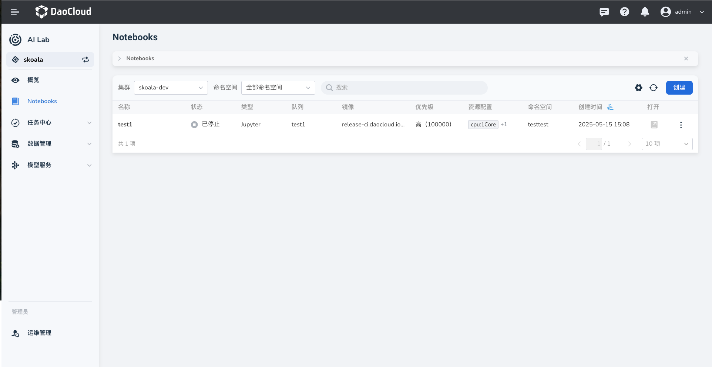
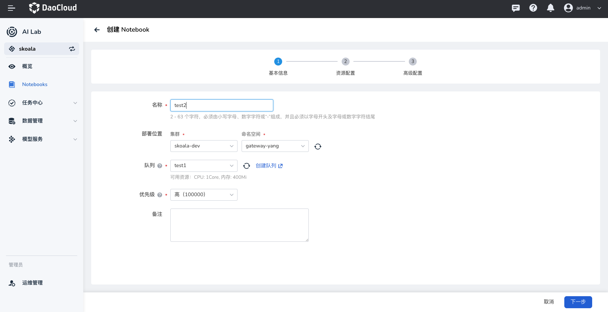

---
hide:
  - toc
---

# 创建 Notebook

Notebook 提供了一个在线的 Web 交互式编程环境，方便开发者快速进行数据科学和机器学习实验。

进入开发者控制台后，开发者可以在不同集群、命名空间中创建和管理 Notebook。

1. 在左侧导航栏中点击 **Notebooks** ，进入 Notebook 列表。点击右侧的 **创建** 按钮。

    

1. 系统会预先填充基础配置数据，包括要部署的集群、命名空间、Notebook 镜像地址、队列、资源、用户目录等。
   调整这些参数后点击 **确定** 。

    

1. 刚创建的 Notebook 状态为 **等待中** ，片刻后将变为 **运行中** ，默认最新的位于列表顶部。

    

1. 点击右侧的 **⋮** ，可以执行更多操作：更新参数、启动/暂停、查看工作负载详情和删除。

!!! note

    如果选择纯 CPU 资源后，发现挂载了节点上的所有 GPU 卡，可以尝试添加 container env 来解决此问题：

    ```config
    NVIDIA_VISIBLE_DEVICES=""
    ```
