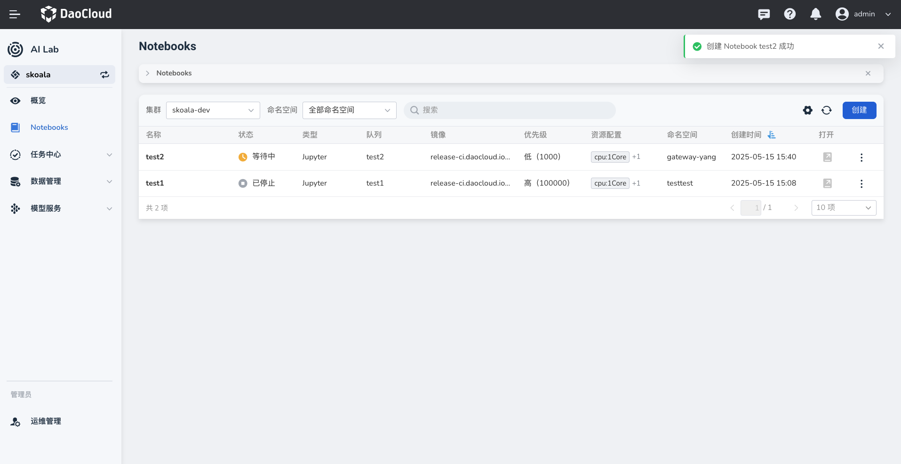

---
hide:
  - toc
---

# 创建 Notebook

Notebook 提供了一个在线交互式编程环境，方便开发者快速进行数据科学和机器学习实验。
为迎接 AI 浪潮，AI Lab 已集成了当前最流行的 Jupyter Notebook 数据科学交互式开发环境 (IDE)。

您进入 AI Lab 开发者控制台后，可以在不同集群、命名空间中创建和管理 Notebook。

1. 在左侧导航栏中点击 **Notebooks** ，进入 Notebook 列表。点击右侧的 **创建** 按钮。

    

1. 系统会预先填充基础配置数据，包括要部署的集群、命名空间、队列和优先级。

    

1. 在 **资源配置** 中，系统预先填充部分配置信息，包括Notebook 镜像类型、镜像地址、资源规格、用户目录。也可手动添加 数据配置和环境依赖配置。

    

1. 在 **高级配置** 中，可自定义任务参数、调度策略、任务分析、SSH访问、自动保存等参数。
   调整完所有参数后点击 **确定** 。

    

1. 刚创建的 Notebook 状态为 **等待中** ，片刻后将变为 **运行中** ，默认最新的位于列表顶部。

    

1. 点击右侧的 **┇** ，可以执行更多操作：更新参数、启动/暂停、克隆 Notebook 、查看工作负载详情和删除。

!!! note

    如果选择纯 CPU 资源后，发现挂载了节点上的所有 GPU 卡，可以尝试添加一条 container env 来解决此问题：

    ```config
    NVIDIA_VISIBLE_DEVICES=""
    ```
