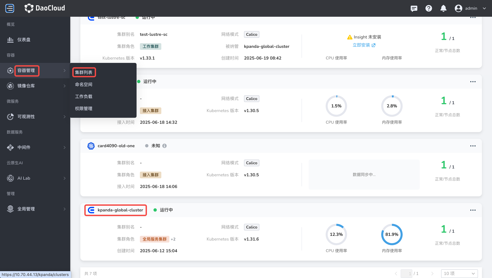

# 为 Notebook 定制开发环境镜像

*[Baize]: AI Lab 组件的开发代号

Notebook 提供了一套功能强大的在线开发环境。然而，在面对特定算法模型时，
您可能需要不同版本的依赖库（例如特定版本的 CUDA、PyTorch 或 TensorFlow）。此时，平台内置镜像无法完全覆盖需求。

本文档将指导您如何基于 AI Lab 提供的基础镜像，构建并注册包含自定义依赖的 Notebook 镜像，使平台用户在创建 Notebook 实例时能够直接选择该自定义镜像。

## 前提条件

在开始操作前，请确保您已具备以下条件：

### 权限要求

- 拥有目标 Kubernetes 集群的 kubectl 管理权限，或具备通过平台界面编辑 **baize-system** 命名空间下 ConfigMap 与 Deployment 资源的权限；
- 拥有一个可用的容器镜像仓库，并具备向该仓库推送镜像的权限。

### 工具要求

- 本地或服务器上已安装容器构建工具；
- 本地已配置好 kubectl 命令行工具并连接到目标集群。

## 操作步骤

整个过程分为四个核心步骤：

1. [获取基础 Notebook 镜像](#notebook_1)：获取当前 AI Lab 版本对应的 Notebook 基础镜像地址。
1. [定制并构建镜像](#_5)：编写 Dockerfile 添加自定义依赖，并构建、推送镜像。
1. [注册新镜像](#_6)：将新镜像的地址注册到 AI Lab 的配置中，并重启服务使其生效。
1. [使用新环境](#_7)：在创建 Notebook 实例时，从下拉列表中选择您新添加的镜像。

### 获取基础 Notebook 镜像

首先，我们需要找到当前 AI Lab 版本所依赖的基础 Notebook 镜像地址，该地址将作为 Dockerfile 的 `FROM` 源。

=== "命令行操作"

    1. 通过 SSH 登录到 Kubernetes 集群的管理节点。

    1. 执行以下命令，查看已安装的 AI Lab 版本。这将帮助您定位对应版本的镜像。

        ```bash
        helm list -n baize-system | grep baize
        ```

        您将看到类似如下的输出，请记下 `APP VERSION` 列的版本号（例如 `v0.19.1`）。

        ```text
        NAME    NAMESPACE     REVISION    UPDATED                                  STATUS      CHART            APP VERSION
        baize   baize-system  5           2025-08-18 11:39:12.328965189 +0800 CST  deployed    baize-v0.19.1    v0.19.1
        ```

    1. 执行以下命令，在输出的 YAML 内容中，找到 `notebook_images` 或类似字段，定位到与版本号匹配的镜像地址。
       复制其中一个与版本匹配的镜像地址备用，例如 `192.168.157.30/release.daocloud.io/baize/baize-notebook:v0.19.1`。

        ```bash
        kubectl get cm baize -n baize-system -o yaml
        ```

        

=== "界面化操作"

    1. 登录 DCE 5.0，从左侧导航栏进入 **容器管理** -> **集群列表** ，找到并点击 **kapanda-global-cluster** 全局服务集群。

        

    1. 在 **kapanda-global-cluster** 集群的左侧导航栏，选择 **配置与密钥** -> **配置项** (ConfigMap)。
       并在页面顶部的 **命名空间** 下拉框中，选择 **baize-system**

        

    1. 在列表中找到并点击进入名为 **baize** 的配置项。

        

    1. 点击页面右上角的 **编辑 YAML**

        

    1. 在弹出的 YAML 编辑器中，找到 `data.config.yaml` -> `notebook_images:` 字段。列表中展示了当前所有内置的 Notebook 镜像。
       复制其中一个作为基础镜像地址，例如 `192.168.157.30/release.daocloud.io/baize/baize-notebook:v0.19.1`。

        

### 定制并构建镜像

本示例演示如何安装特定 CUDA 版本的 PyTorch。

1. 在本地开发环境或构建服务器上创建 `Dockerfile`，以[上一步获取的基础镜像](#notebook_1)为起点，安装所需依赖。

    ```dockerfile title="Dockerfile 示例"
    # 使用上一步获取的基础镜像地址
    FROM 192.168.157.30/release.daocloud.io/baize/baize-notebook:v0.19.1

    # 安装所需要的依赖，例如支持 CUDA 11.8 的 PyTorch
    RUN pip install torch==2.0.1 torchvision==0.15.2 torchaudio==2.0.2 --index-url https://download.pytorch.org/whl/cu118
    ```

1. 构建并推送定制镜像：

    ```bash
    # 定义新镜像的完整名称和标签
    export CUSTOM_IMAGE_NAME="<your-registry-address>/baize/baize-notebook:v0.19.1-cuda11.8-torch2.0.1"

    # 构建镜像
    podman build -t ${CUSTOM_IMAGE_NAME} -f Dockerfile .

    # 推送镜像到您的仓库
    podman push ${CUSTOM_IMAGE_NAME}
    ```

    !!! note

        请将 `<your-registry-address>/...` 替换为您自己的镜像仓库地址，并为其设定一个清晰可辨的标签（Tag），例如包含版本号、CUDA 版本和关键库。

### 注册新镜像

镜像推送到仓库后，我们需要修改 AI Lab 的配置，让平台“知道”这个新环境的存在，并重启服务以应用配置。

=== "命令行操作"

    1. 在管理节点上，执行以下命令进入 `baize` ConfigMap 的编辑模式。

        ```bash
        kubectl edit cm baize -n baize-system
        ```

    1. 在 YAML 编辑器中，找到 `notebook_images` 列表。在列表中添加一个新的条目，指向推送的定制镜像。最后保存并退出编辑器。

        ```yaml title="data.config.yaml"
        # ... (已有配置)
        data:
          config.yaml: |-
            ...
            notebook_images:
              # - name: ... (已有的内置镜像)
              # - name: ... (已有的内置镜像)
              - name: <your-registry-address>/baize/baize-notebook:v0.19.1-cuda11.8-torch2.0.1
                type: JUPYTER
              ...
        # ... (其他配置)
        ```

        - `name`: 这是上一节定制并构建出的镜像 `CUSTOM_IMAGE_NAME`
        - `type`: 指定镜像的分类。如果主要用于 Jupyter，请设置 `JUPYTER`

    1. 在管理节点上，请依次执行以下命令，重启服务。

        ```bash
        # 重启 baize-apiserver
        kubectl rollout restart deployment baize-apiserver -n baize-system
        ```

=== "界面化操作"

    1. 返回[获取基础 Notebook 镜像](#notebook_1)中打开的 Baize ConfigMap **编辑 YAML** 界面。
    找到 `data.config.yaml` -> `notebook_images:` 列表。在列表末尾添加一个新条目，
    `name` 值为[定制并构建镜像](#_5)时推送的 `CUSTOM_IMAGE_NAME`。点击右下角的 **确定** 保存更改。

        

    1. 重启服务。仍在 **kapanda-global-cluster** 集群页面。从左侧导航栏进入 **工作负载** -> **无状态负载** 。并在页面上方将 **命名空间** 选择为 **baize-system**

        

    1. 在列表中找到 **baize-apiserver**，点击右侧的 **┇** 操作按钮，选择 **修改状态** -> **重启**

        

### 使用新环境

完成以上所有步骤后，您的新环境就已经准备就绪了。

1. 导航至 **AI Lab** -> **开发控制台** -> **Notebooks**。点击右上角的 **创建**

    

1. 在创建 Notebook 的 **资源配置** 环节中选择配置的 Notebook 类型，**镜像类型** 选择 **预制镜像** 。
   在 **镜像地址** 的下拉菜单中，您现在应该能看到刚刚添加的自定义镜像选项（例如 `...:v0.19.1-cuda11.8-torch2.0`）。
   选择该镜像，配置其他资源后即可创建实例。

    
