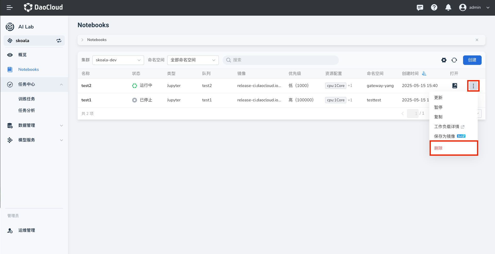

---
hide:
  - toc
---

# 删除 Notebook

如果发现 Notebook 冗余、过期或因其他缘故不再需要，可以从 Notebook 列表中删除。

1. 在 Notebook 列表右侧点击 **⋮** ，在弹出菜单中选择 **删除** 。

    

1. 在弹窗中确认要删除的任务，输入 Notebook 名称后点击 **删除** 。

    

1. 屏幕提示删除成功，该 Notebook 从列表中消失。

    

!!! caution

    Notebook 一旦删除将不可恢复，请谨慎操作。
