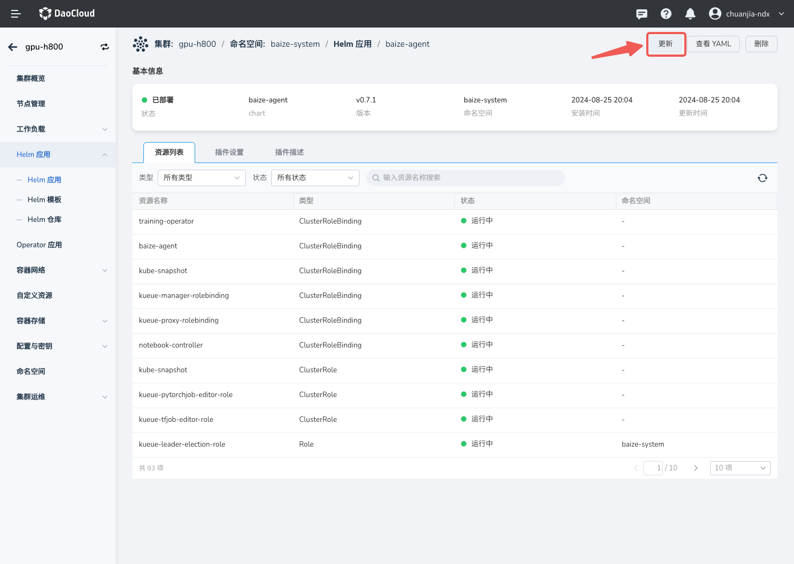
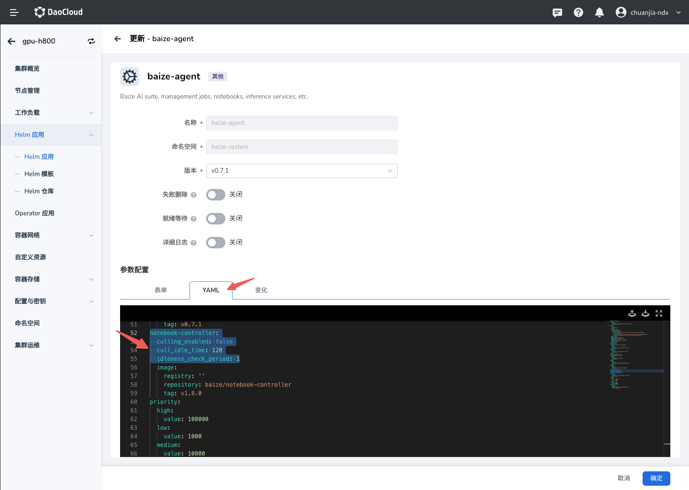

# Notebook 闲置超时自动关机

在默认情况下，为优化资源利用率，AI Lab 启用了 Notebook 闲置超时自动关机功能；
当 Notebook 长时间无操作时，系统会自动关机 Notebook，释放资源。

- 优点：通过这个方式，可以极大减少因为长时间无操作导致的资源浪费，提高资源利用效率。
- 缺点：如果 Notebook 未配置相关备份策略，可能导致数据丢失。

!!! note

    当前，此功能为集群级别配置，默认开启，默认超时时长为 30 分钟。

## 配置变更

目前配置修改方式为手动修改，后续会提供更加便捷的配置方式。

修改工作集群中 `baize-agent` 的部署参数，正确的修改方式为更新 Helm 应用，

### 界面化修改

1. 在集群管理界面找到对应的工作集群，进入集群详情，选择 __Helm 应用__ ，在 `baize-system`
   命名空间下找到 `baize-agent`，在右上角点击 __更新__ 按钮：

    

1. 如图修改 YAML 代码：

    

    ```yaml
    ...
    notebook-controller:
      culling_enabled: false
      cull_idle_time: 120
      idleness_check_period: 1
    ...
    ```

1. 确认参数修改成功后，点击 **下一步** 和 **确定** 。

### 命令行修改

进入控制台以后，使用 `helm upgrade` 命令更改配置：

```bash
# 设定版本号
export VERSION=0.8.0

# 更新 Helm Chart 
helm upgrade --install baize-agent baize/baize-agent \
    --namespace baize-system \
    --create-namespace \
    --set global.imageRegistry=release.daocloud.io \
    --set notebook-controller.culling_enabled=true \    # 开启自动关机，默认为 true
    --set notebook-controller.cull_idle_time=120 \      # 设置闲置超时时间为 120 分钟，默认为 30 分钟
    --set notebook-controller.idleness_check_period=1 \ # 设置检查间隔为 1 分钟，默认为 1 分钟
    --version=$VERSION
```

!!! note

    为了避免自动关机后丢失数据，您可以将 AI Lab 升级到 v0.8.0 及更高版本，在 Notebook 配置中启用关机自动保存功能。
