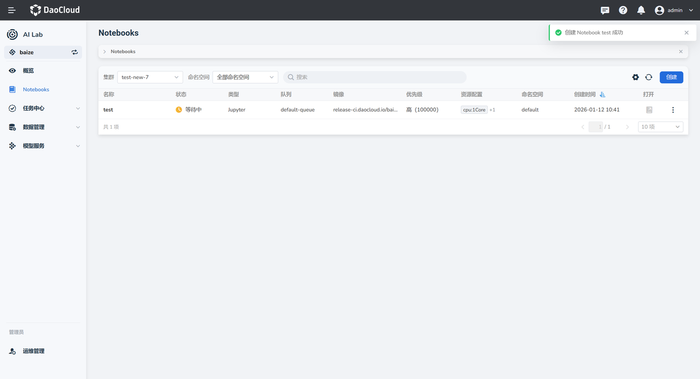

# 在 Notebook 中使用 Docker 功能

当需要在 Notebook 中执行 Docker 命令（如构建、运行或推送镜像）时，请启用 docker。

## 启用并使用 Docker

### 前提条件

已安装所需插件。
具体操作步骤请参考教程：[管理 Helm 应用](../../../kpanda/user-guide/helm/helm-app.md)

### 启用 Docker 功能

1. 登录 __AI Lab__ 平台，进入 Notebook 界面，点击 __创建__ 按钮。

    !!! Tip "更新操作"

        若要在已创建的实例中打开 docker ，则先点击对应实例右侧的 __⁝__ 按钮，然后选择 __更新__.

2. 在创建 Notebook 界面中填写基本信息后，点击 __下一步__。

3. 完成资源配置后，点击 __下一步__。
   
4. 在高级配置中，勾选 __启用 Docker__ 选项，点击 __确定__。

5. 创建完成后，返回 Notebook 列表页面。
   
    

    ### 验证已启动 docker

6. 当 Notebook 实例状态由 __等待中__ 变为 __运行中__ 时，表示实例已成功启动。如一直在 __等待中__ ，请刷新页面
   
7. 此时，实例右侧的 __打开__ 列的图标将由灰色变为黑色，处于可点击状态。点击该图标，进入对应的 Notebook 实例。

### 验证 Docker 功能是否可用

在 Notebook 的终端环境中，可通过执行以下命令验证 Docker 环境是否已成功启用。

```bash
# 查看正在运行的容器
docker ps
# 查看所有容器（包括已停止的）
docker ps -a
# 查看指定容器的详细信息（将 <container_name> 替换为实际容器名或容器 ID）
docker inspect <container_name>
```

若命令可正常执行，并返回 Docker 容器列表信息（即使列表为空），则表示 Docker 服务已正常启动。

若提示 Docker 命令不存在或无法连接 Docker daemon，请确认在创建 Notebook 时已勾选 __启用 Docker__ 选项。

## 基本容器管理

Docker 功能提供完整的容器生命周期管理能力，支持容器的创建、启动、停止、删除等基本操作。

### 创建和运行容器

使用 docker run 命令创建并启动容器：
 基本语法

```bash
docker run [OPTIONS] IMAGE [COMMAND] [ARG...]
# 运行一个简单的 Ubuntu 容器
docker run -it ubuntu:20.04 /bin/bash
# 后台运行容器
docker run -d --name my-app nginx:latest
# 指定端口映射
docker run -d -p 8080:80 --name web-server nginx:latest
```

| 参数 | 说明 |
|------|------|
| `-d` | 后台运行容器 |
| `-it` | 交互式运行，分配伪终端 |
| `--name` | 指定容器名称 |
| `-p` | 端口映射，格式为 宿主机端口:容器端口 |
| `-v` | 挂载数据卷 |
  
### 管理容器

查看容器状态：
```bash
# 查看正在运行的容器
docker ps
# 查看所有容器（包括已停止的）
docker ps -a
# 查看容器详细信息
docker inspect container_name
```

启动和停止容器：

```bash
# 启动已停止的容器
docker start container_name
# 停止运行中的容器
docker stop container_name
# 重启容器
docker restart container_name
```

### 进入容器

进入正在运行的容器：

```bash
# 进入容器的交互式终端  
docker exec -it container_name /bin/bash
# 执行单个命令  
docker exec container_name ls -la /app
```

!!! Tip

    建议使用 docker exec 而不是 docker attach 来进入容器，因为 exec 会创建新的进程， 退出时不会影响容器的运行状态。

## 挂载存储

Notebook 可以挂载 PVC 或通过数据空间实现数据的持久化存储，其挂载路径可以关联到 Docker，从而实现容器间的数据共享和数据的持久化存储。

```bash
# 挂载到指定目录
docker run -d -v /root/data:/workspace/data --name dev-env python:3.9
```

## 镜像制作

Docker 功能支持多种方式制作和保存自定义镜像，满足不同场景的需求。

### docker build

使用 Dockerfile 构建镜像是最常用的方式：

```bash
#基本构建命令
docker build -t my-app:latest .
#指定 Dockerfile 路径
docker build -f /path/to/Dockerfile -t my-app:v1.0 .
```

### docker save

将镜像导出为 tar 文件：

```bash
# 导出单个镜像
docker save -o my-image.tar my-app:latest
```
 
导出的镜像可以通过 `docker load` 命令导入：

```bash 
# 导入镜像
docker load -i my-image.tar
```

## 使用 GPU

在 Notebook 中启用 Docker 功能后，可以将 GPU 资源挂载到容器中，为 AI 训练和推理提供硬件加速能力。

### 先挂载 GPU

使用 `--gpus` 参数将 GPU 设备挂载到容器：

```bash
# 挂载所有 GPU
docker run --gpus all -it pytorch/pytorch:latest python
# 挂载指定数量的 GPU
docker run --gpus 2 -it tensorflow/tensorflow:latest-gpu python
# 挂载指定的 GPU
docker run --gpus device=0 -it nvidia/cuda:11.8-devel-ubuntu20.04
```

### 支持哪些 GPU

Notebook 支持多种 GPU，详情见[GPU 支持矩阵](../../../kpanda/user-guide/gpu/gpu_matrix.md)

## 网络配置

Docker 容器可以通过多种网络模式与宿主机和外部网络进行通信。

### 端口映射

将容器端口映射到宿主机端口，实现外部访问：

```bash
# 映射单个端口
docker run -d -p 8080:80 --name web-app nginx:latest
# 映射多个端口
docker run -d \  -p 8080:80 \  -p 8443:443 \  --name web-server nginx:latest
# 映射到指定 IP
docker run -d -p 127.0.0.1:8080:80 --name local-app nginx:latest
# 映射随机端口
docker run -d -P --name random-port nginx:latest
```

## 高级功能

Notebook 的 Docker 功能支持 buildx 和 Compose 等高级工具，满足复杂场景下的容器化开发需求。

### Docker buildx

Docker buildx 是 Docker 的扩展构建功能，支持多平台构建和高级构建特性。

#### 基本用法

```bash
# 查看 buildx 版本
docker buildx version
# 查看可用的构建器
docker buildx ls
# 创建新的构建器
docker buildx create --name mybuilder --use
# 启动构建器
docker buildx inspect --bootstrap
```

#### 多平台构建

```bash
# 构建多平台镜像
docker buildx build --platform linux/amd64,linux/arm64 -t my-app:latest .
# 构建并推送到仓库
docker buildx build --platform linux/amd64,linux/arm64 -t my-app:latest --push .
# 构建特定平台
docker buildx build --platform linux/amd64 -t my-app:amd64 .
```

### Docker Compose

Docker Compose 用于定义和运行多容器应用程序。

#### 安装和基本用法

```bash
# 检查 Compose 版本
docker compose version
# 启动服务
docker compose up -d
# 查看服务状态
docker compose ps
# 停止服务
docker compose down
# 查看日志
docker compose logs
```

## 访问镜像仓库

 Notebook 的 Docker 功能支持访问镜像仓库以及其他公有和私有镜像仓库。

### 镜像仓库

 本平台提供内置的[镜像仓库](../../../kangaroo/intro/index.md)服务，用户可以存储和管理自定义镜像。

#### 访问仓库

```bash
# 查看仓库地址（示例）
# 实际地址请参考平台提供的 _*我的镜像*_ 中仓库信息
REGISTRY_URL="harbor.io"
# 拉取镜像
docker pull ${REGISTRY_URL}/my-namespace/my-app:latest
# 推送镜像
docker push ${REGISTRY_URL}/my-namespace/my-app:latest
```

#### 认证配置

!!! note

    当前版本暂不支持自动注入用户名和密码，需要手动配置认证信息。

手动配置认证：

```bash
# 登录到 AI Lab 镜像仓库
docker login registry.io -u your-username
# 输入密码
Password: your-password
# 验证登录状态
docker info | grep -A 5 "Registry Mirrors"
```

## 故障排查

常见问题及解决方法：

- **容器启动失败**

```bash
# 查看容器日志
docker logs container_name
# 查看容器详细信息
docker inspect container_name
```

- **端口访问问题**

```bash
# 检查端口映射
docker port container_name
# 检查防火墙设置
netstat -tlnp | grep :8080
```

- **GPU 不可用**

```bash
# 检查 GPU 状态
nvidia-smi
# 验证容器内 GPU 访问
docker exec container_name nvidia-smi
```

!!! warning "重要提醒"

    - Notebook 关机时，运行中的 Docker 容器会被停止
    - 重启 Notebook 后，需要手动重启 Docker 容器
    - 删除 Notebook 会同时删除所有 Docker 容器和未持久化的数据

!!! tip "最佳实践"

    - 使用 Docker Compose 管理复杂的多容器应用
    - 定期清理未使用的镜像和容器以节省存储空间
    - 为生产环境的容器配置健康检查和重启策略
    - 使用标准化的镜像命名和版本管理规范

通过合理使用 Notebook 的 Docker 功能，开发者可以构建灵活、高效的容器化开发和部署环境，
充分利用 AI Lab 平台的计算资源和存储能力。