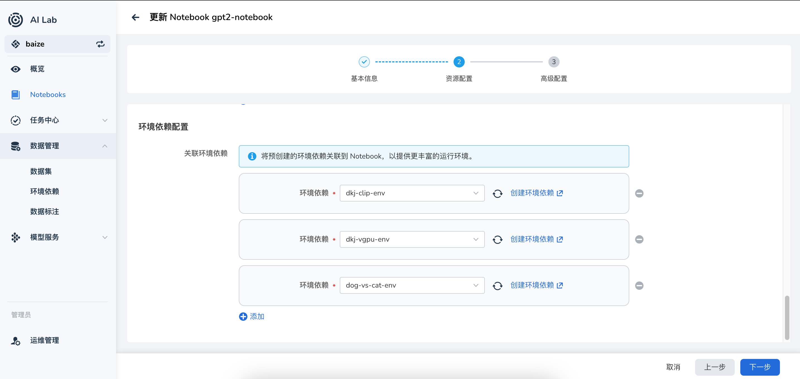
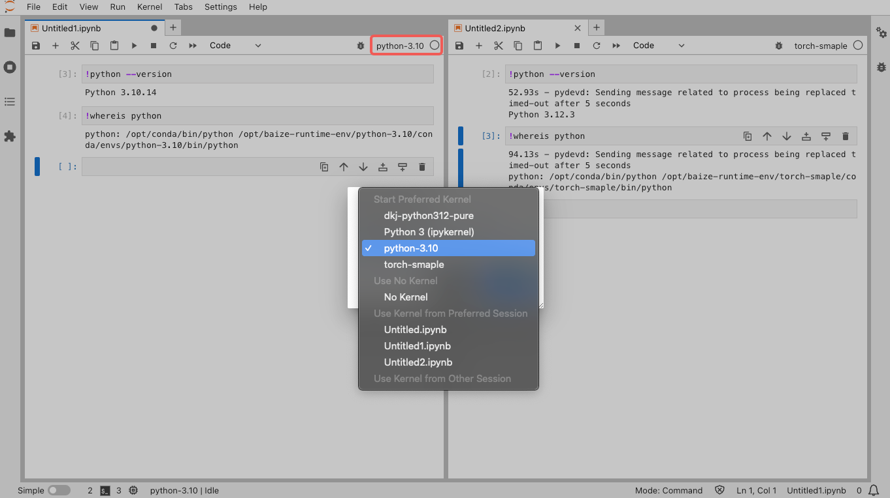

# 在 Notebook 中使用环境

环境管理是 AI Lab 的重要功能之一，通过在 **Notebook** 中关联对应的环境，可以快速切换不同的环境，方便用户进行开发和调试。

## 创建 Notebook 时选择环境

在创建 **Notebook** 时，可以选择一个或多个的环境 **Envs** 。如果没有合适的环境，可以去 **环境管理** 中创建一个新的环境。



> 如何创建环境，请参考[环境管理](../dataset/environments.md)。

## 在 Notebook 使用环境

!!! note

    在 Notebook 中，我们同时提供了 `conda` 和 `mamba` 两种，用户可以根据自己的需求选择合适的环境管理工具。

AI Lab 中，我们采用了 `conda` 环境管理工具，用户可以在 Notebook 中通过 `!conda env list` 命令查看当前环境列表。

```bash
(base) jovyan@chuanjia-jupyter-0:~/yolov8$ conda env list
# conda environments:
#
dkj-python312-pure       /opt/baize-runtime-env/dkj-python312-pure/conda/envs/dkj-python312-pure
python-3.10              /opt/baize-runtime-env/python-3.10/conda/envs/python-3.10
torch-smaple             /opt/baize-runtime-env/torch-smaple/conda/envs/torch-smaple
base                  *  /opt/conda     # 当前激活的环境
baize-base               /opt/conda/envs/baize-base
```

这个命令会列出所有的 `conda` 环境，并在当前激活的环境前面加上一个星号（*）。

## JupyterLab 的 Kernel 环境管理

在 Jupyterlab 中，我们自动将 Notebook 关联的环境绑定到 Kernel 列表中，用户可以通过 Kernel 快速切换环境。



通过以上办法，可以同时在一个 Notebook 中使用不同编写和调试算法。

## Terminal 切换环境

> AI Lab 的 Notebook 目前也已经支持了 VSCode。

如果您更喜欢在 Terminal 中管理和切换环境，可以安装如下步骤：

在首次启动并使用 Notebook 时，需要先执行 `conda init`，然后再执行 `conda activate <env_name>` 切换到对应的环境。

```bash
(base) jovyan@chuanjia-jupyter-0:~/yolov8$ conda init bash# 初始化 bash 环境, 仅首次使用需要执行
no change     /opt/conda/condabin/conda
 change     /opt/conda/bin/conda
 change     /opt/conda/bin/conda-env
 change     /opt/conda/bin/activate
 change     /opt/conda/bin/deactivate
 change     /opt/conda/etc/profile.d/conda.sh
 change     /opt/conda/etc/fish/conf.d/conda.fish
 change     /opt/conda/shell/condabin/Conda.psm1
 change     /opt/conda/shell/condabin/conda-hook.ps1
 change     /opt/conda/lib/python3.11/site-packages/xontrib/conda.xsh
 change     /opt/conda/etc/profile.d/conda.csh
 change     /home/jovyan/.bashrc
 action taken.
Added mamba to /home/jovyan/.bashrc

==> For changes to take effect, close and re-open your current shell. <==

(base) jovyan@chuanjia-jupyter-0:~/yolov8$ source ~/.bashrc  # 重新加载 bash 环境
(base) jovyan@chuanjia-jupyter-0:~/yolov8$ conda activate python-3.10   # 切换到 python-3.10 环境
(python-3.10) jovyan@chuanjia-jupyter-0:~/yolov8$ conda env list

              mamba version : 1.5.1
# conda environments:
#
dkj-python312-pure       /opt/baize-runtime-env/dkj-python312-pure/conda/envs/dkj-python312-pure
python-3.10           *  /opt/baize-runtime-env/python-3.10/conda/envs/python-3.10    # 当前激活的环境
torch-smaple             /opt/baize-runtime-env/torch-smaple/conda/envs/torch-smaple
base                     /opt/conda
baize-base               /opt/conda/envs/baize-base
```

> 如果您更喜欢使用 `mamba` ，这里需要使用 `mamaba init` 和 `mamba activate <env_name>`。

## 查看环境中的包

通过不同环境管理的一个很重要的功能是，可以在一个 Notebook 中通过快速切换环境，使用不用的包。

我们可以通过下方的命令来使用 `conda` 查看当前环境中的所有包。

```bash
(python-3.10) jovyan@chuanjia-jupyter-0:~/yolov8$ conda list
# packages in environment at /opt/baize-runtime-env/python-3.10/conda/envs/python-3.10:
#
# Name                    Version                   Build  Channel
_libgcc_mutex             0.1                        main    defaults
_openmp_mutex             5.1                       1_gnu    defaults
... # 省略部分输出
idna                      3.7             py310h06a4308_0    defaults
ipykernel                 6.28.0          py310h06a4308_0    defaults
ipython                   8.20.0          py310h06a4308_0    defaults
ipython_genutils          0.2.0              pyhd3eb1b0_1    defaults
jedi                      0.18.1          py310h06a4308_1    defaults
jinja2                    3.1.4           py310h06a4308_0    defaults
jsonschema                4.19.2          py310h06a4308_0    defaults
jsonschema-specifications 2023.7.1        py310h06a4308_0    defaults
jupyter_client            7.4.9           py310h06a4308_0    defaults
jupyter_core              5.5.0           py310h06a4308_0    defaults
jupyter_events            0.8.0           py310h06a4308_0    defaults
jupyter_server            2.10.0          py310h06a4308_0    defaults
jupyter_server_terminals  0.4.4           py310h06a4308_1    defaults
jupyterlab_pygments       0.2.2           py310h06a4308_0    defaults
... # 省略部分输出
xz                        5.4.6                h5eee18b_1    defaults
yaml                      0.2.5                h7b6447c_0    defaults
zeromq                    4.3.5                h6a678d5_0    defaults
zlib                      1.2.13               h5eee18b_1    defaults
```

## 更新环境的包

目前，可以通过在 AI Lab 的界面中 **环境管理** 来更新环境中的包。
