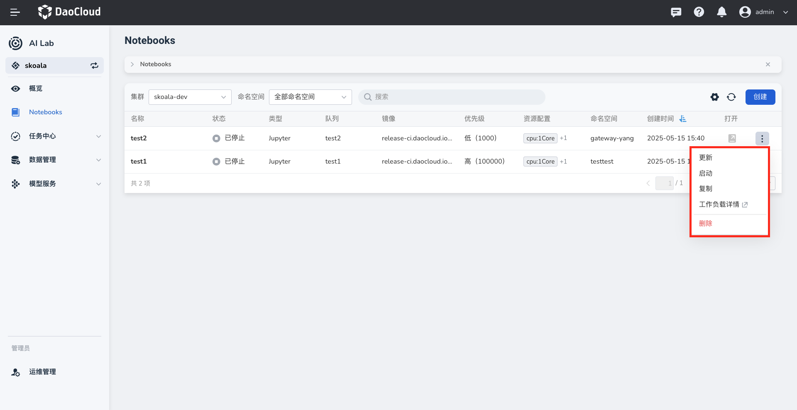

---
hide:
  - toc
---

# 启动和暂停 Notebook

Notebook 创建成功后，通常会有几个状态：

- 等待中
- 运行中
- 已停止

如果某个 Notebook 的状态为 **已停止** ，在列表右侧点击 **⋮** ，在弹出菜单中选择 **启动** 。

此 Notebook 将进入运行队列中，状态变为 **等待中** ，如果一切正常，片刻后其状态将变为 **运行中** 。

如果使用结束，可以从菜单中选择 **暂停** ，将其状态变为 **已停止** 。
