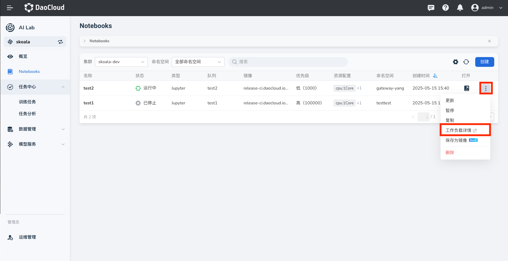
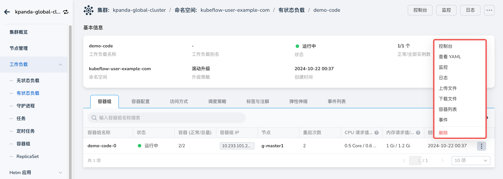

---
hide:
  - toc
---

# 查看 Notebook 工作负载

如果想要查看某个 Notebook 的工作负载，可以执行以下操作：

1. 在 Notebook 列表右侧点击 **⋮** ，在弹出菜单中选择 **工作负载详情** 。

    

1. 跳转到有状态工作负载（StatefulSet）列表，可以查看：

    - 容器组 Pod 的运行状态、IP、资源请求和使用情况
    - 容器配置信息
    - 访问方式：ClusterIP、NodePort
    - 调度策略：节点和工作负载的亲和性、反亲和性
    - 标签与注解：工作负载、Pod 的标签与注解键值对
    - 弹性伸缩：支持 HPA、CronHPA、VPA 等方式
    - 事件列表：警告、通知等消息

    

1. 在 StatefulSet 列表，点击右侧的 **⋮**，可以针对 Pod 执行更多操作。

    
