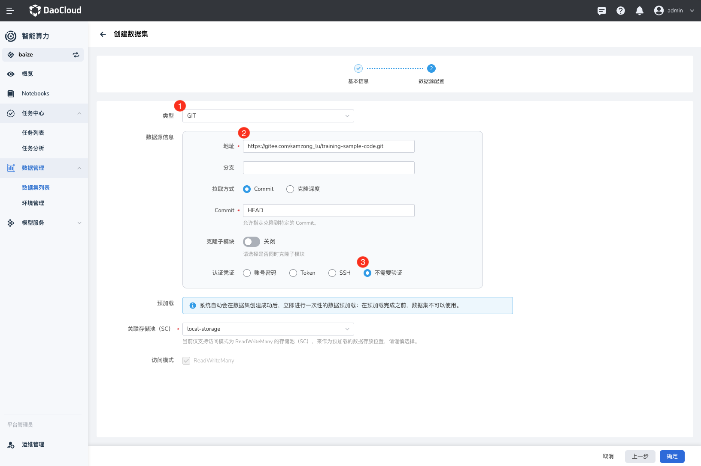
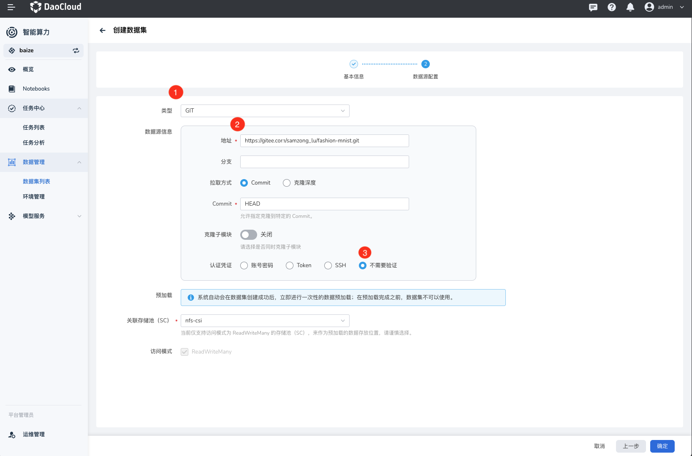
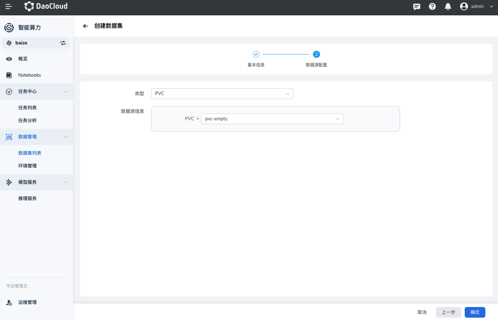
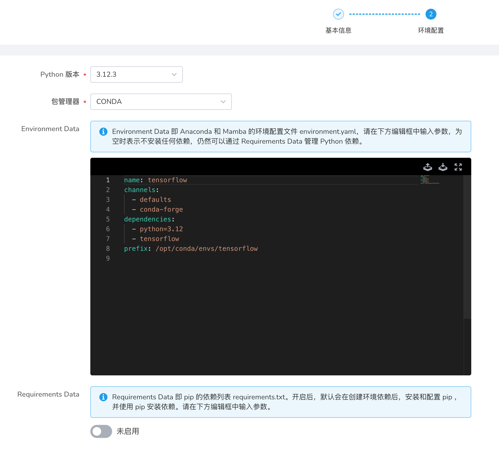
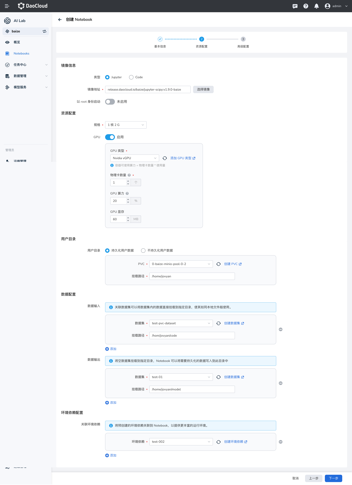
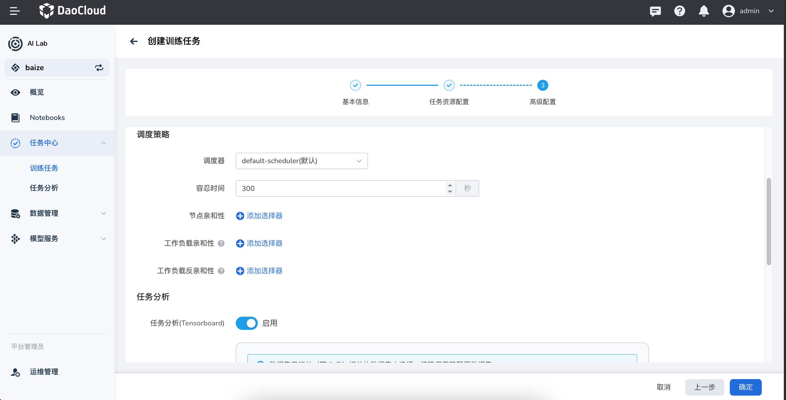
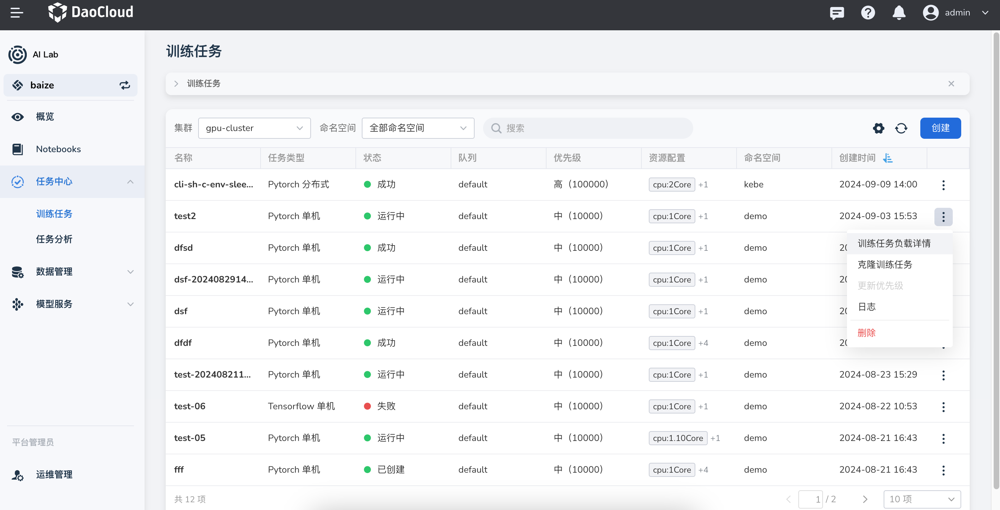
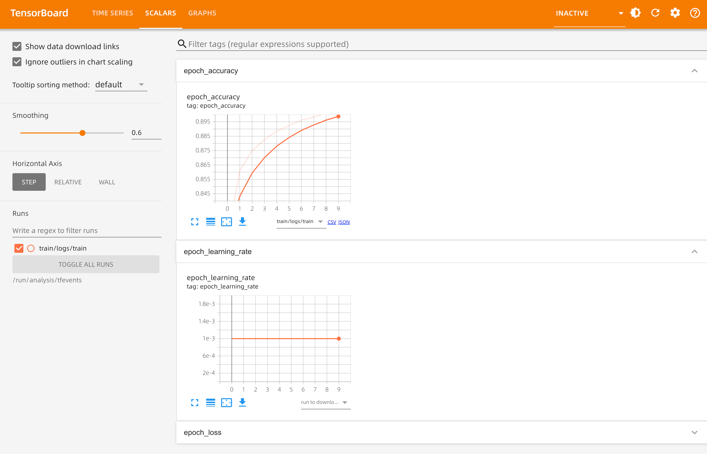

# 快速入门

本文提供了简单的操作手册以便用户使用 DCE 5.0 AI Lab 进行数据集、Notebook、任务训练的整个开发、训练流程。

## 准备数据集

点击 **数据管理** -> **数据集** ，选择 **创建** 按钮，分别创建以下三个数据集。

### 数据集：训练代码

- 代码数据源：[https://github.com/samzong/training-sample-code.git](https://github.com/samzong/training-sample-code.git)，主要是一个简单的 Tensorflow 代码。
- 如果是中国境内的用户，可以使用 Gitee 加速：[https://gitee.com/samzong_lu/training-sample-code.git](https://gitee.com/samzong_lu/training-sample-code.git)
- 代码路径为 `tensorflow/tf-fashion-mnist-sample`



!!! note

    目前仅支持读写模式为 `ReadWriteMany` 的 `StorageClass`，请使用 NFS 或者推荐的 [JuiceFS](https://juicefs.com/zh-cn/)。

### 数据集：训练数据

本次训练使用的数据为 [https://github.com/zalandoresearch/fashion-mnist.git](https://github.com/zalandoresearch/fashion-mnist.git)，
这是 Fashion-MNIST 数据集。

如果是中国境内的用户，可以使用 Gitee 加速：[https://gitee.com/samzong_lu/fashion-mnist.git](https://gitee.com/samzong_lu/fashion-mnist.git)



!!! note

    如果未创建训练数据的数据集，通过训练脚本也会自动下载；提前准备训练数据可以提高训练速度。

### 数据集：空数据集

AI Lab 支持将 `PVC` 作为数据集的数据源类型，所以创建一个空 PVC 绑定到数据集后，可将空数据集作为存放后续训练任务的输出数据集，存放模型和日志。



## 环境依赖: tensorflow

脚本在运行时，需要依赖 `Tensorflow` 的 Python 库，可以使用 AI Lab 的环境依赖管理功能，提前将需要的 Python 库下载和准备完成，无需依赖镜像构建

> 参考 [环境依赖](../developer/dataset/environments.md) 的操作方式，添加一个 `CONDA` 环境.

```yaml
name: tensorflow
channels:
  - defaults
  - conda-forge
dependencies:
  - python=3.12
  - tensorflow
prefix: /opt/conda/envs/tensorflow
```



!!! note

    等待环境预热成功后，只需要将此环境挂载到 Notebook、训练任务中，使用 AI Lab 提供的基础镜像就可以

## 使用 Notebook 调试脚本

准备开发环境，点击导航栏的 **Notebooks** ，点击 **创建** 。

- 将[准备好的三个数据集](#_2)进行关联，挂载路径请参照下图填写，注意将需要使用的空数据集在 输出数据集位置配置

    

- 选择并绑定[环境依赖包](#tensorflow)

    等待 Notebook 创建成功，点击列表中的访问地址，进入 Notebook。并在 Notebook 的终端中执行以下命令进行任务训练。

    

    !!! note

        脚本使用 Tensorflow，如果忘记关联依赖库，也可以临时用 `pip install tensorflow` 安装。

        ```shell
        python /home/jovyan/code/tensorflow/tf-fashion-mnist-sample/train.py
        ```

## 创建训练任务

1.  点击导航栏的 **任务中心** -> **训练任务** ，创建一个 `Tensorflow` 单机任务
1.  先填写基本参数后，点击 **下一步**
1.  在任务资源配置中，正确配置任务资源后，点击 **下一步**

    - 镜像：如果前序环境依赖包准备好了，使用默认镜像即可； 如果未准备，要确认镜像内有 `tensorflow` 的 Python 库
    - shell：使用 `bash` 即可
    - 启用命令：
    
        ```bash
        /home/jovyan/code/tensorflow/tf-fashion-mnist-sample/train.py
        ```

1.  在高级配置中，启用 **任务分析（Tensorboard）** ，点击 **确定** 。

    !!! note

        日志所在位置为输出数据集的 `/home/jovyan/model/train/logs/`

    

1.  返回训练任务列表，等到状态变为 **成功** 。点击列表右侧的 **┇** ，可以查看详情、克隆任务、更新优先级、查看日志和删除等操作。

    

1.  成功创建任务后，在左侧导航栏点击 **任务分析** ，可以查看任务状态并对任务训练进行调优。

    
