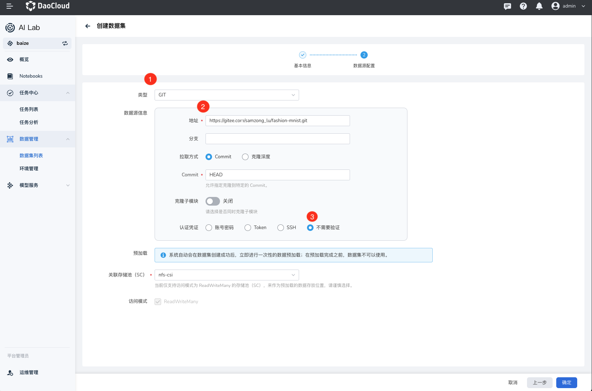
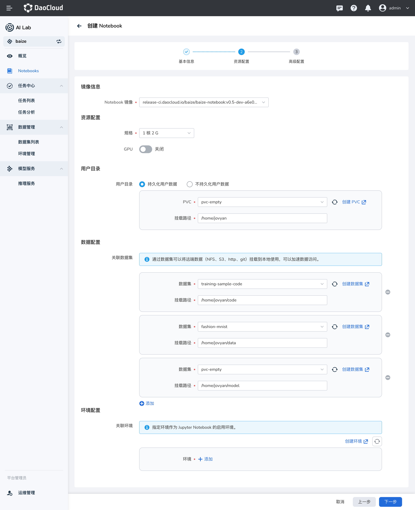

---
hide:
  - toc
---

# 快速入门

本文提供了简单的操作手册以便用户使用 DCE 5.0 智能算力进行数据集、Notebook、任务训练的整个开发、训练流程。

点击 **数据管理** -> **数据集列表** ，选择 **创建**，分别创建以下三个数据集：

## 准备数据集

### 数据集：训练代码

- 代码数据源：[https://github.com/d-run/drun-samples.git](https://github.com/d-run/drun-samples.git)，主要是一个简单的 Tensorflow 代码。
- 国内慢可以使用 gitee 加速：[https://gitee.com/samzong_lu/training-sample-code.git](https://gitee.com/samzong_lu/training-sample-code.git)
- 代码路径在 `tensorflow/tf-fashion-mnist-sample` 下。
   


!!! note

     目前仅支持读写模式为 `ReadWriteMany` 的 `StorageClass`，请使用 NFS 或者推荐使用 [JuiceFS](https://juicefs.com/zh-cn/)。

### 数据集：训练数据

- 数据集：训练使用的数据：[https://github.com/zalandoresearch/fashion-mnist.git](https://github.com/zalandoresearch/fashion-mnist.git)，Fashion-MNIST 数据集。
    - 国内慢可以使用 gitee 加速：[https://gitee.com/samzong_lu/fashion-mnist.git](https://gitee.com/samzong_lu/fashion-mnist.git)



### 数据集：空 PVC

智能算力支持将PVC 作为数据集的数据源类型，所以可以空数据集，用于存储训练结束的模型和日志。


## 使用 Notebook 在线调试

准备开发环境，点击导航栏的 **Notebooks** ，点击 **创建** 。将上一步中创建的三个数据集进行关联，挂载路径请参照下图填写：




等待 Notebook 创建成功，点击列表中的访问地址，进入 Notebook。并在 Notebook 的终端中执行以下命令进行任务训练。

!!! note
   
    脚本使用 Tensorflow，需要在 Notebook 中执行 `pip install -r requirements.txt` 安装。 


    ```shell
    python /home/jovyan/code/tensorflow/tf-fashion-mnist-sample/train.py
    ```

 


## 提交任务进行训练

点击导航栏的 **任务中心** -> **任务管理** ，创建一个 `Tensorflow` 单机任务，任务配置参考下图， 
并开启 **任务分析（Tersorboard）** 功能，点击 **创建** 后等待状态完成。

- 镜像地址填写：`release.daocloud.io/baize/jupyter-tensorflow-full:v1.8.0-baize`
- Command：`python`
- Arguments：`/home/jovyan/code/tensorflow/tf-fashion-mnist-sample/train.py`

   !!! note

       数据集或模型较大时，建议在第二步资源配置中开启 GPU 配置。


在上一步创建成功的任务，即可在任务分析中，点击对应任务分析中的访问查看，查看任务状态并对其进行任务训练的调优。

 
