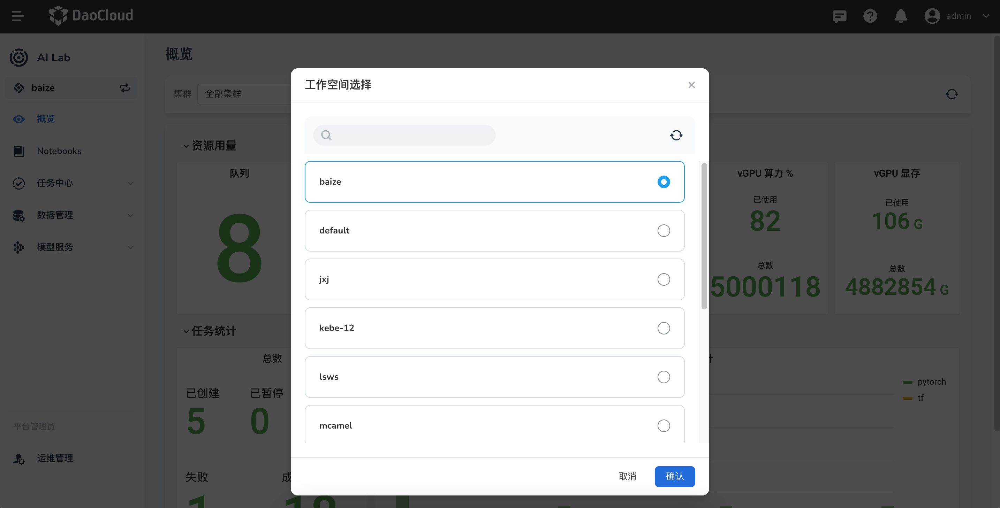
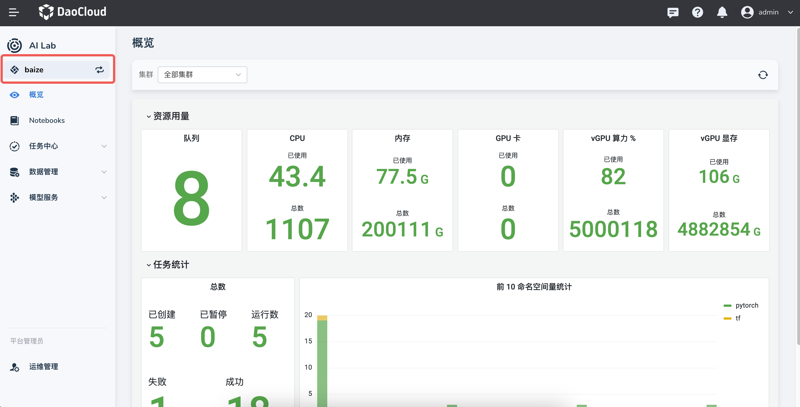
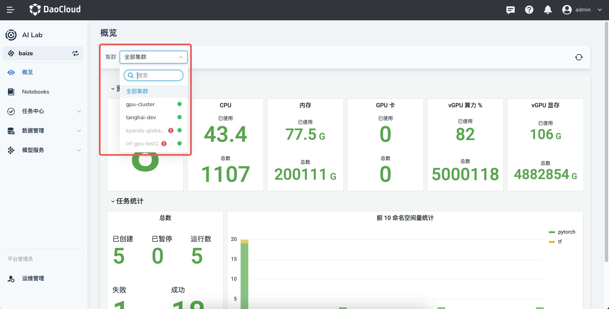

# 第一次使用

第一次进入 DCE 5.0 智算能力时，需要：

- [选择一个工作空间](#_2)
- [选择一个集群](#_3)
- [确定自己的角色](#_4)

## 选择工作空间

首次进入 DCE 5.0 智算能力时，首先必须选择一个[工作空间](../../ghippo/user-guide/workspace/workspace.md)。

如需更改当前所在的工作空间，可以在左侧边栏点击更换图标重新选择工作空间。

!!! note

    如果当前没有可选的工作空间，需要先联系管理员创建一个工作空间。

## 选择集群

您可以选择在哪个集群部署和执行智能算力相关的操作。

## 角色

DCE 5.0 智算能力提供了两种角色，可以点击左下角的菜单项切换两种管理员角色：

- 管理员 - 开发控制台：可以处理 Notebook、训练任务和数据集等
- 平台管理员 - 运维管理：可以管理 GPU 资源、队列等

每个角色都有一个概览页面，通过图形仪表展示当前可以处理的数据。

[下载 DCE 5.0](../../download/index.md){ .md-button .md-button--primary }
[安装 DCE 5.0](../../install/index.md){ .md-button .md-button--primary }
[申请社区免费体验](../../dce/license0.md){ .md-button .md-button--primary }
