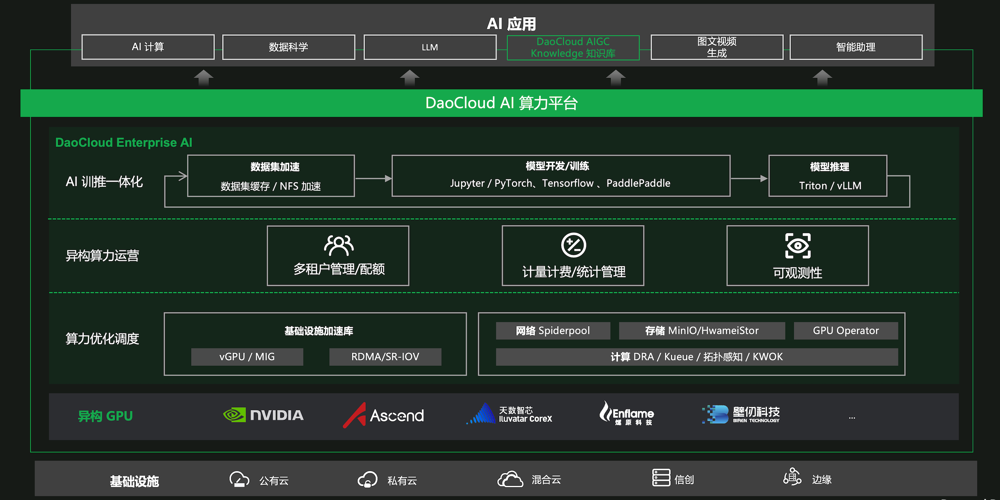

---
hide:
  - toc
---

# 什么是智能算力

智能算力是 DaoCloud 推出的基于云原生操作系统的 AI 算力平台（简称：DaoCloud AI 算力平台），DaoCloud AI 算力平台提供软硬一体的 AI 智算体验，整合异构算力，优化 GPU 性能，实现算力资源统一调度和运营，最大化算力效用并降低算力开销，并且还提供了优化的 AI 开发框架，简化 AI 开发和部署，加速推动各行业的 AI 应用场景落地。

**功能特性**

- 算力资源全托管

    依托于 DCE（DaoCloud Enterprise），提供强大的基础设施能力，支持超大规模算力集群、异构 GPU 等一站式托管，并提供一系列如 vGPU 等软硬一体加速方案。

- 数据编排

    支持模型开发过程中数据管理与编排能力，提供如数据集管理、多数据源接入、数据集预热等功能，从底层容器存储引擎进行优化，保证数据的高效与稳定。

- 开发环境管理

    满足 MLOps 和 LLMOps 工程师对开发环境的需求，提供多种开发环境，包括 JupyterLab、VSCode(进行中) 等，支持自定义开发环境，一键挂载各种 GPU、数据集等资源。

- 任务管理

    支持训练任务的全生命周期管理，提供多种快速创建任务的方式；支持 Pytorch、TensorFlow、PaddlePaddle 等主流任务框架，天然支持单机、分布式、多节点、多卡等多种类任务调度。

- GPU 管理

    可以查看全部的 GPU 资源和 GPU 使用情况，支持 GPU 中当前和历史运行的任务情况查看，方便进行 GPU 压力评估。

- 队列管理

    支持创建队列，并将队列与工作空间进行关联，保障在各个集群中的队列资源的统筹与隔离。

**产品逻辑架构**

[下载 DCE 5.0](../../download/index.md){ .md-button .md-button--primary }
[安装 DCE 5.0](../../install/index.md){ .md-button .md-button--primary }
[申请社区免费体验](../../dce/license0.md){ .md-button .md-button--primary }
