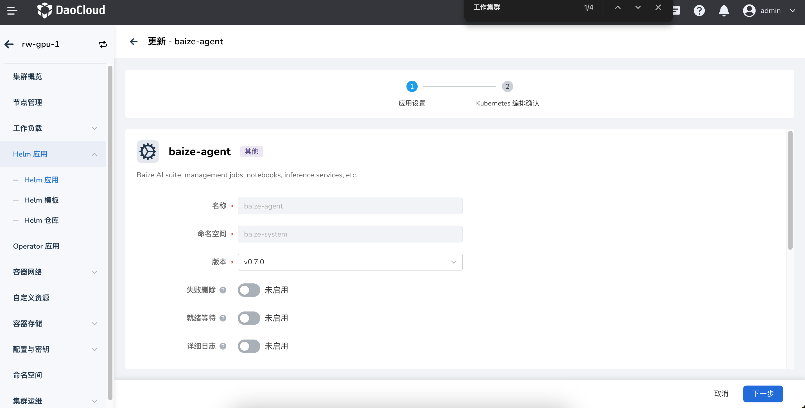

# 组件部署

在 DCE 5.0 的安装器 v0.17.0 之后商业版安装时可以同步安装 AI Lab 模块，
**无需自行安装** ；请联系交付支持团队获取商业版安装包。

## 全局服务集群

> AI Lab 模块仅需安装在[全局服务集群](../../kpanda/user-guide/clusters/cluster-role.md#_2)

打开全局服务集群，然后在 __Helm 应用__ -> __Helm 模板__ 找到 `baize` 执行安装步骤。

!!! note "注意事项"

    * 命名空间为 `baize-system`
    * 替换环境地址后打开 `<YOUR_DCE_HOST>/kpanda/clusters/kpanda-global-cluster/helm/charts/addon/baize`
    * `kpanda-global-cluster` 是全局服务集群名称

## baize-agent 工作集群

!!! warning

    如果在 AI Lab 中对应的集群无法选择或提示缺少 `baize-agent`，也就是该工作集群的组件并未成功部署。

在每个有算力资源的工作集群内，需要部署对应的基础组件，主要组件包含：

* `gpu-operator` 初始化集群中的 GPU 资源，**这部分会因 GPU 资源类型安装方式不同**，
  详情参考 [GPU 管理](../../kpanda/user-guide/gpu/index.md)
* `insight-agent` 可观测组件，用于采集集群的基础设施信息，包含日志、指标、事件
* `baize-agent` 包含了 AI Lab 的核心组件，调度、监控、Pytorch、Tensorflow 等算力组件
* 【可选】 `nfs` 存储服务，用于数据集的预热

!!! danger

    以上组件必须安装，否则会导致功能使用不正常。

### 界面化安装 baize-agent

> baize-agent 需要在工作集群部署。

按照下方提示，进入工作集群，然后在 __Helm 应用__ -> __Helm 模板__ 找到 `baize-agent` 执行安装步骤。

!!! note "注意事项"

    * 命名空间为 `baize-system`
    * 替换环境地址后打开 `<YOUR_DCE_HOST>/kpanda/clusters/<cluster_name>/helm/charts/addon/baize`
    * `cluster_name` 是对应工作集群的名称



YAML 示例：

```yaml
cluster-controller:
  image:
    registry: ''
    repository: baize/baize-cluster-controller
    tag: v0.4.1
global:
  cluster:
    schedulers: []
  config:
    cluster_name: ''
    dataset_job_spec: {}
    inference_config:
      triton_image: m.daocloud.io/nvcr.io/nvidia/tritonserver:24.01-py3
      triton_images_map:
        VLLM: m.daocloud.io/nvcr.io/nvidia/tritonserver:24.01-vllm-python-py3
  debug: false
  high_available: false
  imagePullPolicy: IfNotPresent
  imagePullSecrets: []
  imageRegistry: release.daocloud.io
  prod: baize-agent
  resources: {}
kubeRbacProxy:
  image:
    registry: ''
    repository: baize/kube-rbac-proxy
    tag: v0.8.0
kueue:
  enablePlainPod: false
  fullnameOverride: kueue
  image:
    registry: ''
    repository: baize/kueue
    tag: v0.6.2
loader:
  image:
    registry: ''
    repository: baize/baize-data-loader
    tag: v0.4.1
notebook:
  image:
    registry: ''
    repository: baize/baize-notebook
    tag: v0.4.1
notebook-controller:
  image:
    registry: ''
    repository: baize/notebook-controller
    tag: v1.8.0
priority:
  high:
    value: 100000
  low:
    value: 1000
  medium:
    value: 10000
training-operator:
  image:
    registry: ''
    repository: baize/training-operator
    tag: v1-5525468
```

### Helm 安装 baize-agent

确保全局服务集群内已经安装了 AI Lab 组件，可以通过在管理界面查看是否有 AI Lab 模块。

!!! info

    需要在一级导航栏有 `AI Lab` 入口，保障管理组件部署成功。

    ```bash
    # baize 是 AI Lab 组件的开发代号
    helm repo add baize https://release.daocloud.io/chartrepo/baize
    helm repo update baize
    helm search repo baize # 获取最新的版本编号
    export VERSION=<version> # 注意使用当前最新版本
    helm upgrade --install baize-agent baize/baize-agent \
        --create-namespace \
        -n baize-system \
        --set global.imageRegistry=release.daocloud.io \
        --version=${VERSION}
    ```

以上工作完成后，工作集群初始就成功了，可以在 AI Lab 模块，进行任务训练和模型开发。

### 预热组件介绍

AI Lab 模块提供的数据管理中，数据集的预热能力依赖存储服务，推荐使用 NFS 服务：

* 部署 NFS Server
    * 如果已存在 NFS 可以跳过此步骤
    * 如果不存在，可以参考最佳实践中的 [NFS 服务部署](../../baize/best-practice/deploy-nfs-in-worker.md)
* 部署 `nfs-driver-csi`
* 部署 `StorageClass`

## 结语

以上完成后，就可以在工作集群内正常体验 AI Lab 的全部功能了，祝你使用愉快！
