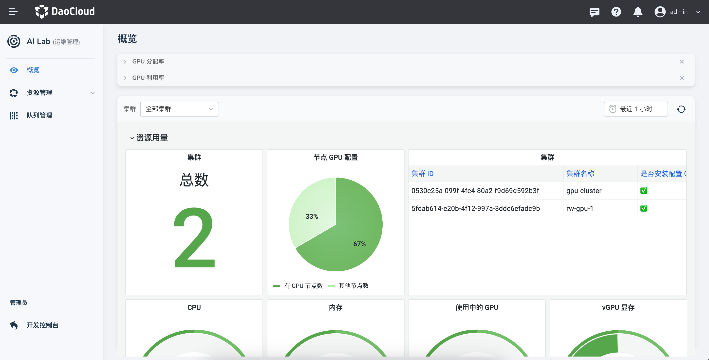

---
hide:
  - toc
---

# 运维管理

运维管理是 IT 运维人员日常监控、管理和优化 IT 资源与工作负载的重要空间。通过运维管理平台，管理员可以直观地掌握集群资源使用情况，监控关键硬件指标，并高效调度任务，从而保证系统稳定性和资源利用率。

为了满足不同运维场景的需求，运维管理模块设计了以下几个核心子页面：

- **概览**  
  提供集群总体视图，通过大屏展示关键指标，包括节点资源用量、GPU 使用情况、GPU 功率以及 GPU 设备温度等。运维人员可以快速识别集群瓶颈和资源异常，做出及时决策。

- **资源池**  
  用于定义集群中可用的计算资源对象，包括 CPU、内存和 GPU 等。通过资源池，可以将工作负载与特定节点类型绑定，实现精细化资源分配与管理，从而提高任务调度效率和集群整体性能。

- **队列管理**  
  用于管理和优化批处理工作负载，通过队列系统对任务进行调度。队列管理可以合理分配资源，平衡高优先级和低优先级任务的执行顺序，从而提高集群任务吞吐量，降低资源空闲率。

- **GPU 信息**  
  自动化汇总整个平台的 GPU 资源信息，提供详尽的 GPU 设备状态展示。管理员可以查看每块 GPU 的负载统计、功率使用情况、温度及正在运行的任务信息，支持 GPU 资源监控和优化调度。

## 常见术语

- **GPU 分配率**  
  表示当前集群内所有未完成任务对 GPU 资源的占用比例。它反映了资源的预占情况，帮助管理员判断资源是否紧张。

- **GPU 利用率**  
  表示当前集群中所有运行任务的 GPU 实际使用情况。它衡量资源的实际消耗效率，帮助管理员评估任务调度和 GPU 负载分布是否合理。

## 扩展功能与实践建议

1. **实时监控与告警**  
   配合概览页面，设置 GPU 温度、功率和利用率的阈值告警，可在异常情况下即时通知运维人员，避免硬件损耗和任务失败。

2. **资源池策略优化**  
   针对不同类型的任务（短作业、长作业、GPU 密集型任务等），合理划分资源池，提高资源复用率，减少任务排队等待时间。

3. **队列调度优化**  
   结合任务优先级、资源需求和历史运行时间，设计公平或加权调度策略，以提高任务完成率和集群整体吞吐量。

4. **GPU 资源分析**  
   定期分析 GPU 利用率与分配率数据，识别低效使用的资源，调整任务分配或迁移策略，实现 GPU 使用最大化。

5. **运维报表**  
   可生成定期报表，包括资源使用趋势、任务完成情况和 GPU 使用效率，为决策提供数据支撑。
