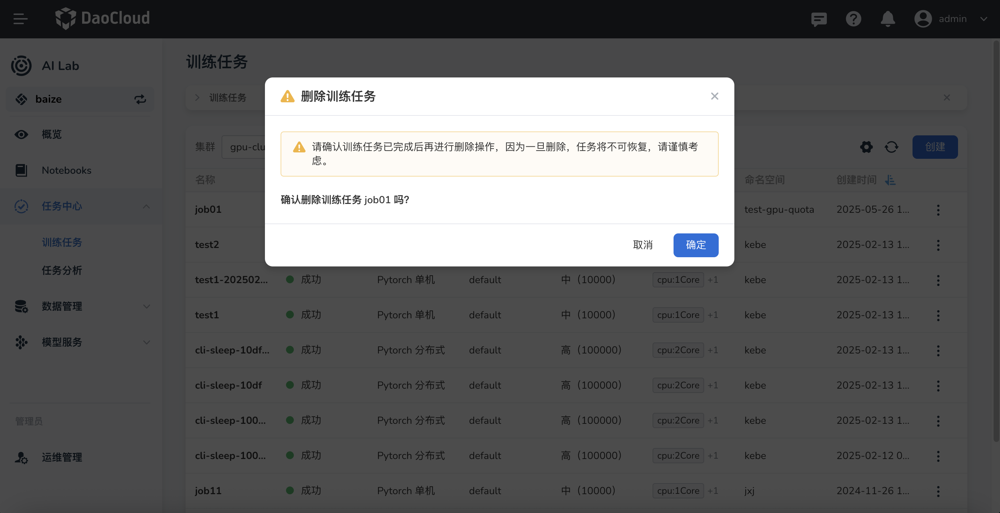

---
hide:
  - toc
---

# 删除队列

如果发现队列冗余、过期或因其他缘故不再需要，可以从队列列表中删除。

1. 在队列列表右侧点击 **⋮** ，在弹出菜单中选择 **删除** 。

    

1. 在弹窗中确认要删除的队列，输入队列名称后点击 **删除** 。

    

1. 屏幕提示删除成功，该队列从列表中消失。

!!! caution

    队列一旦删除将不可恢复，请谨慎操作。
