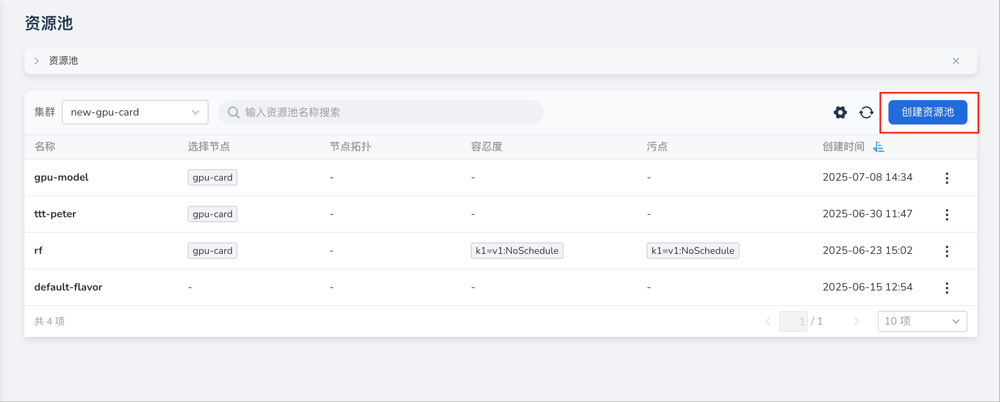
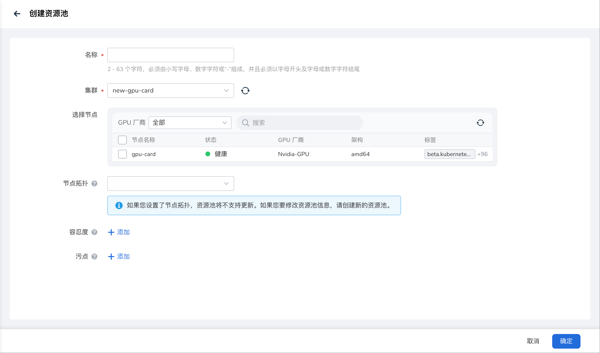
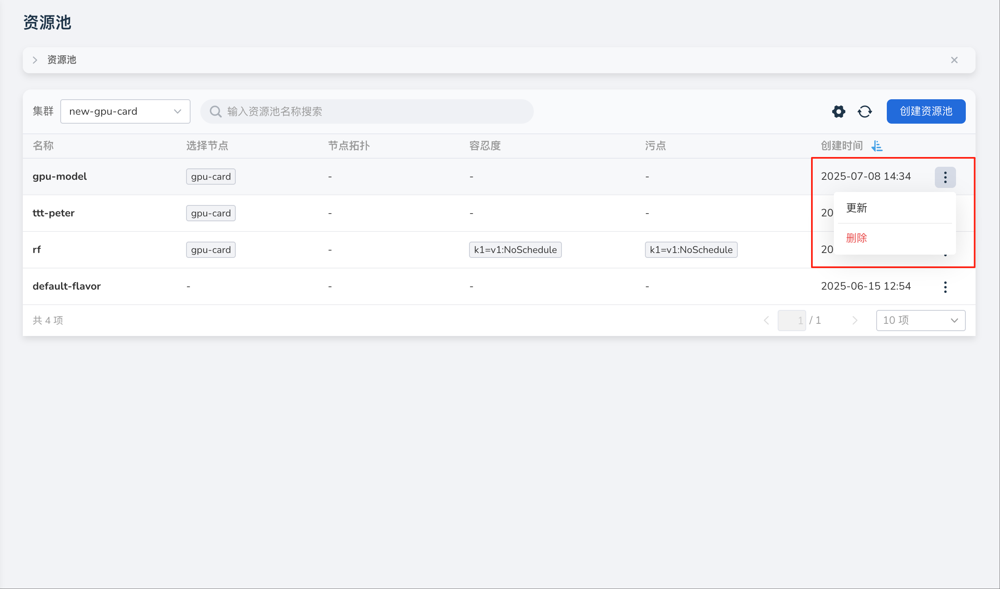

# 创建资源池

资源池用于定义集群中可用的计算资源，并通过将工作负载与特定节点类型关联，实现细粒度的资源管理。

本文介绍创建资源池操作步骤。

1. 进入 **运维管理** 视图，选择左侧菜单 **资源池**，点击资源池列表右上角的 **创建资源池** 按钮。

    

1. 根据需求，填写表单信息，然后点击 **确定** 。

    - 名称：2-63 个字符，必须由小写字母、数字字符或“-”组成，并且必须以字母开头及字母或数字字符结尾；
    - 集群：资源池节点所在集群；
    - 选择节点：可以根据 GPU 厂商或节点名称搜索节点；
    - 节点拓扑：描述了 Kubernetes 集群中节点在数据中心中的物理或逻辑层级结构，例如区块、机架或主机。通过定义拓扑，可以优化作业调度，确保 Pod 尽可能运行在最优网络通信链路的节点上，从而降低相关 Pod 间的网络延迟，适合 AI/ML 训练或高性能计算任务。
    - 容忍度：允许调度器调度带有对应污点的 Pod。
    - 污点：使节点能够排斥一类特定的 Pod。污点和容忍度相互配合，可以用来避免 Pod 被分配到不合适的节点上。

    

1. 屏幕提示创建成功，返回资源池管理列表。点击列表右侧的 **┇** ，可以执行更新、删除等更多操作。

    
