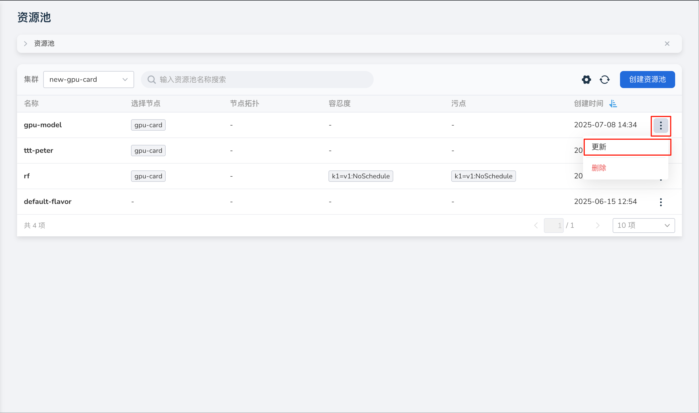
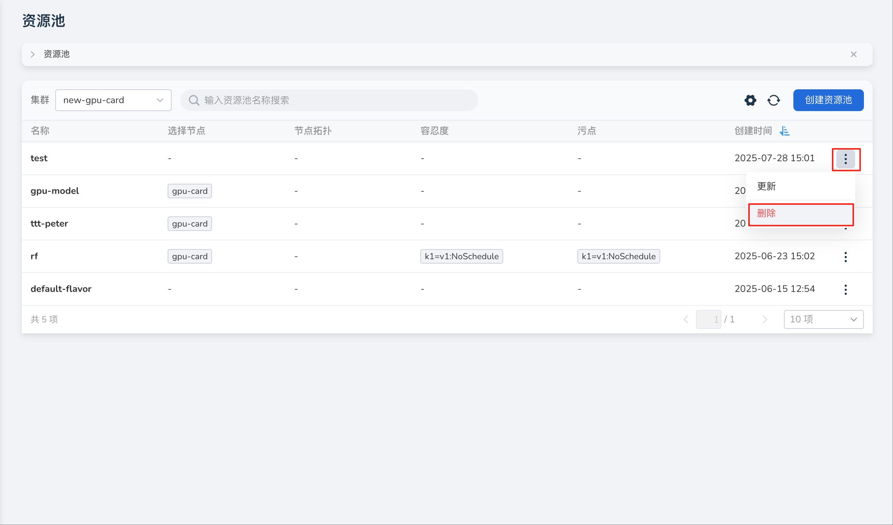
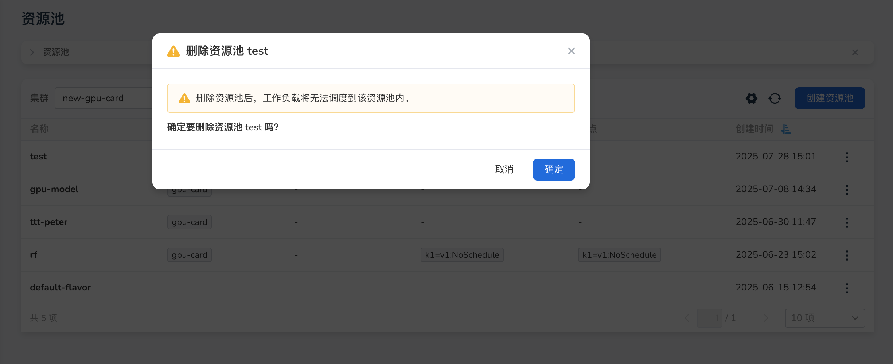

# 管理资源池

AI Lab 支持对资源池进行更新、删除操作。

## 更新

 !!! note
    
        如果资源池设置了节点拓扑，资源池将不支持更新。如果您要修改资源池信息，请创建新的资源池。

操作步骤如下：

1. 在资源池列表右侧点击 **┇** ，在弹出菜单中选择 **更新** 。

    

1. 在更新页面，修改配置参数，完成后点击 **确认** ，系统自动返回到资源池列表页面。

    

## 删除

!!! caution

    如果您当前的资源池绑定了队列，并且队列下有正在运行的工作负载，请谨慎此操作。

操作步骤如下：

1. 在资源池列表右侧点击 **┇** ，在弹出菜单中选择 **删除** 。

    

1. 在二次确认删除弹窗中点击 **删除** 。

    

1. 屏幕提示删除成功，该资源池从列表中消失。
