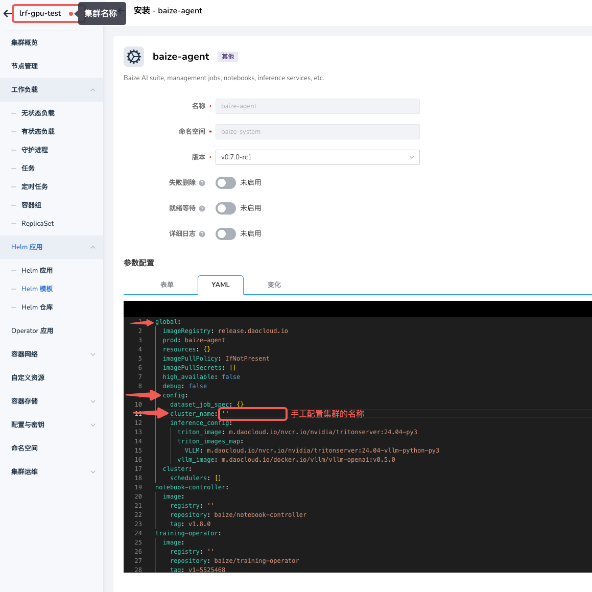

# 集群下拉列表中找不到集群

## 问题现象

在智能算力开发控制台、运维控制台，功能模块的集群搜索条件的下拉列表找不到想要的集群。

## 问题分析

在智能算力中，集群下拉列表如果缺少了想要的集群，可能是由于以下原因导致的：

- `baize-agent` 未安装或安装不成功，导致智能算力无法获取集群信息
- 安装 `baize-agent` 未配置集群名称，导致智能算力无法获取集群信息
- 工作集群内可观测组件异常，导致无法采集集群内的指标信息
  
### 解决办法

### `baize-agent` 未安装或安装不成功

智能算力有一些基础组件需要在每个工作集群内进行安装，如果工作集群内未安装 `baize-agent` 时，可以在界面上选择，可能会导致一些非预期的报错等问题。

所以，为了保障使用体验，可选择的集群范围仅包含了已经成功安装了 `baize-agent` 的集群。

如果是因为 `baize-agent` ，使用 `容器管理>集群管理>Helm 应用>Helm 模板`，找到 `baize-agent`并安装。

> 此地址快速跳转 https://<dce_host>/kpanda/clusters/<cluster_name>/helm/charts/addon/baize-agent
> 注意将 `<dce_host>` 替换为实际的 DCE 控制台地址，`<cluster_name>` 替换为实际的集群名称

### 安装 `baize-agent` 未配置集群名称

在安装 `baize-agent` 时，需要注意配置集群的名称，这个名称会用于可观测指标采集时使用，**默认为空，需手工配置**。

### 工作集群内可观测组件异常

如果集群内可观测组件异常，可能会导致智能算力无法获取集群信息，请检查平台的可观测服务是否正常运行及配置。

- 检查 `全局管理集群` 内可观测服务端组件是否正常运行
- 检查 `工作集群` 内可观测 Agent 端组件是否正常运行
