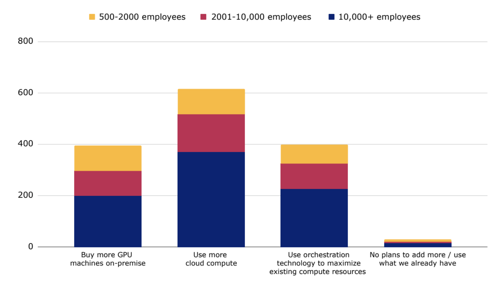
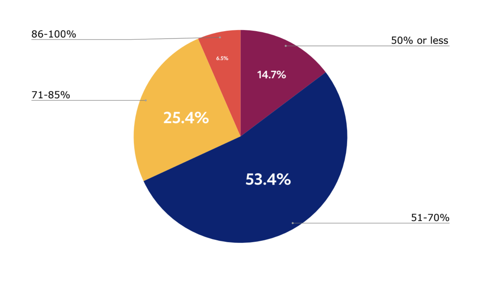

# 2024 年大规模 AI 基础设施形势调研

> 转载自 [clear.ml blog](https://clear.ml/blog/the-state-of-ai-infrastructure-at-scale-2024)

今年 3 月，ClearML 发布了与 FuriosaAI 和人工智能基础设施联盟（AIIA）进行的一项全球 AI 调研结果。
新报告《2024 年 AI 基础设施规模现状：揭示未来前景、关键见解和商业基准》包括北美、欧洲和亚太地区 1000 家不同规模企业的 AI/ML 和技术领导者的回应。
调查重点在于了解更多关于全球 AI 基础设施计划的信息，包括受访者的：

1. 算力基础设施增长计划；
2. 当前的调度和计算解决方案经验；
3. 2024 年模型和 AI 框架的使用和计划。

该报告深入探讨了受访者当前对 2024 - 2025 年训练和部署模型以及 AI 框架计划的调度、计算和 AI/ML 需求。

ClearML 北美首席营销官兼总经理 Noam Harel 表示：
“我们的研究表明，尽管大多数组织都在计划扩大其 AI 基础设施，但他们需要优先考虑合适的应用场景，否则难以快速大规模部署生成式 AI。”

“我们还探讨了各组织在当前 AI 工作负载中面临的无数挑战，以及他们如何制订雄心勃勃的未来计划以期寻求一些高性能、低本高效的方法来优化 GPU
利用率（或寻找 GPU 的替代品），并利用无缝的端到端 AI/ML 平台推动高效、自治的算力编排和调度，将利用率最大化。”

## 重要发现

1. **96% 的企业计划扩大其 AI 算力并加大投资，解决可用性、成本和基础设施方面的挑战。**

    几乎所有受访者（96%）都计划扩大他们的 AI 算力基础设施，其中 40% 偏向于本地部署，60% 偏向于云端部署，既考量灵活性，又看重速度。
    针对云计算最大的顾虑是浪费和闲置成本。

    当被问及 2024 年扩展 AI 的挑战时，算力受限（可用性和成本）位居榜首，其次是基础设施问题。受访者认为自己缺乏自动化工具，也没有合适的系统。

    部署生成式 AI 的最大担忧是行动过于仓促并且重要事项考虑不足（例如，让错误的商业应用场景优先）。第二个担忧是由于缺乏执行力而进展太慢。

    

    图 1：96% 的企业计划扩大其 AI 算力

2. **令人惊讶的是，74% 的企业对当前的作业调度工具不满意，经常面临资源分配限制，对 GPU 算力的按需和自治访问受限抑制了生产力。**

    作业调度能力各不相同，高管们普遍对调度工具不满意。他们认为，如果数据科学和机器学习（DSML）组成员能够提供自治的实时计算服务，那生产力将大幅提高。

    74% 的受访者认为，将算力和调度功能放到一个统一的 AI/ML 平台上是有价值的（而不是将一个个孤立单点方案拼凑成 AI 基础设施技术栈）。
    但只有 19% 的受访者真正拥有支持查看和管理队列中作业并有效优化 GPU 利用率的调度工具。

    

    图 2：74% 的受访者认为将算力和调度功能放到一个统一的的 AI/ML 平台上是有价值的

    受访者称，他们拥有不同级别的调度功能和特性，首先是配额管理（56%），其次是动态多实例 GPU 或 GPU 分区（42%）和节点池的创建（38%）。

    65% 的受访企业使用特定于供应商的解决方案，或借助云服务提供商来管理和安排其 AI/ML 工作。
    25% 的受访者使用 Slurm 或其他开源工具，9% 的受访者单独使用 Kubernetes，后者不支持调度功能。
    74% 的受访者表示对其目前的调度工具感到不满意或只是部分满意。

    DSML从业者独立自治算力资源和管理作业调度的能力徘徊在 22% 到 27%。
    然而，93% 的受访者认为，如果所有实时算力资源的需求方都能轻松地自治这些算力资源，那 AI 团队生产力将大幅提高。

3. **购买推理方案的关键因素是成本。**

    为了解决 GPU 缺乏的问题，约 52% 的受访者在 2024 年积极寻找低本高效的 GPU 替代品用于推理，而用于训练的这一比例为 27%，这标志着 AI 硬件使用的转变。
    另外，20% 的受访者表示对低本高效的 GPU 替代品感兴趣，但还找不到替代品。

    

    图 3：52% 的受访者表示在 2024 年积极寻找低本高效的 GPU 替代品用于推理

    这表明成本是购买推理方案的一个关键因素。
    我们预计，由于大多数企业尚未达到生成式AI的大规模生产，所以对低本高效推理计算的需求将增长。

4. **算力面临的最大挑战是延迟，其次是算力访问和功耗。**

    无论企业规模大小，无论在哪个地区，延迟、算力访问和功耗一直被列为亟需解决的三个难题。
    超过一半的受访者计划在 2024 年使用 LLM（LLama 模型和类 LLama 模型），其次是在 2024 年商业化部署嵌入式模型（BERT 和相关模型）（26%）。
    缓解算力挑战对于实现各自的愿望至关重要。

    

    图 4 ：超过一半的受访者计划在 2024 年使用 LLM（LLama 和类 LLama 模型）

5. **优化 GPU 利用率是 2024 到 2025 年的一个主要考量，大多数 GPU 在高峰期未得到充分利用**

    无论企业规模如何，40% 的受访者计划使用编排和调度技术最大限度地利用现有的算力基础设施。

    当被问及高峰期的 GPU 利用率时，有 15% 的受访者表示他们可用和已购买的 GPU 只有不到 50% 在使用。
    有 53% 认为 GPU 资源利用率在 51% 到 70%，只有 25% 认为他们的 GPU 利用率达到 85%。
    而仅有 7% 的企业认为他们的 GPU 基础设施在高峰期的利用率超过 85%。

    

    图 5：15% 的受访者表示可用和已购买的 GPU 中只有不到 50% 在使用

    当被问及当前管理 GPU 使用的方法时，受访者表示使用队列管理和作业调度（67%）、多实例 GPU（39%）和配额（34%）。
    优化用户之间 GPU 分配的方法包括开源解决方案（24%）、HPC 解决方案（27%）和供应商特定解决方案（34%）。
    另有 11% 的人使用 Excel，5% 的人使用自制的解决方案。只有 1% 的受访者未尝试最大化 GPU 利用率，也没有做优化。

6. **开源AI解决方案和模型定制是首要任务，96% 的企业主要专注于定制开源模型。**

    几乎所有高管（95%）都表示，拥有和使用外部开源技术解决方案对他们的组织很重要。

    

    图 6：96% 的受访企业目前或计划在 2024 年定制开源模型

    此外，96% 的受访企业目前正在或计划在 2024 年定制开源模型，其中开源框架在全球的采用率最高。
    PyTorch 是定制化开源模型的领先框架，有 61% 的受访者使用 PyTorch，43% 使用 TensorFlow，16% 使用 Jax。
    大约三分之一的受访者目前使用或计划使用 CUDA 进行模型定制。

## 关于调研报告出具方

AI Infrastructure Alliance 致力于汇集当今和未来 AI 应用的基石。
更多信息请访问 https://ai-infrastructure.org

FuriosaAI 是一家半导体企业，旨在设计大幅提升功效的高性能数据中心 AI 加速器。
更多信息请访问 https://www.furiosa.ai/comingsoon

ClearML 提供领先的开源、端到端解决方案，助力企业释放 AI 潜力。
逾 1600 家企业客户选择使用 ClearML，以打造高度可重复的流程，覆盖从产品功能探索到模型部署和监控的整个 AI 模型生命周期。
更多信息请访问 https://clear.ml
