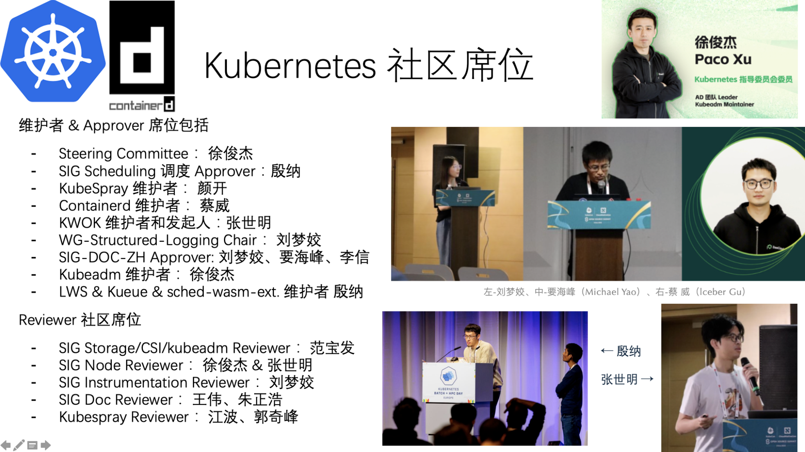
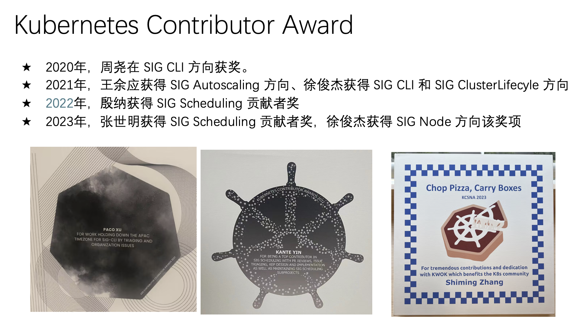
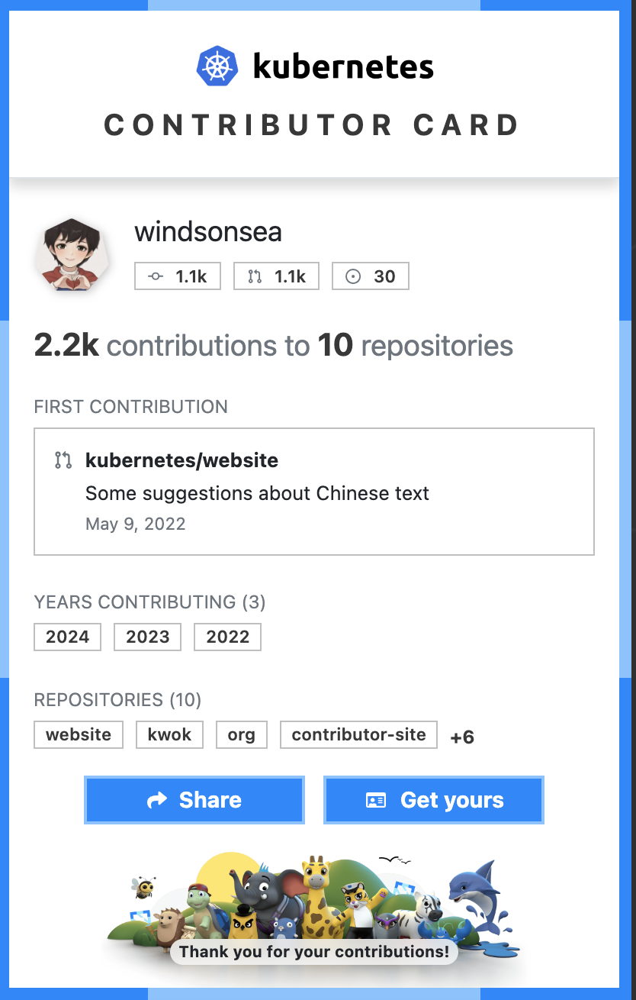

# Kubernetes 十周年，DaoCloud 风雨同行

> 英文原版来自 [k8s 社区](https://kubernetes.io/blog/2024/06/06/10-years-of-kubernetes/)

<div class="responsive-video-container">
<video controls src="https://harbor-test2.cn-sh2.ufileos.com/docs/videos/10birth.mov" preload="metadata" poster="images/10birth.jpg"></video>
</div>

十年前，也就是 2014 年 6 月 6 日，Kubernetes
的[第一次提交](https://github.com/kubernetes/kubernetes/commit/2c4b3a562ce34cddc3f8218a2c4d11c7310e6d56)被推送到 GitHub。
第一次提交包含了 250 个文件和 47,501 行的 Go、Bash 和 Markdown 代码，标志着大众今天所瞩目的 Kubernetes 社区之始。
当时又谁能预见到十年后，Kubernetes 会成长为迄今为止全球最大的开源项目之一，迄今拥有
[88,000 多名贡献者](https://k8s.devstats.cncf.io/d/24/overall-project-statistics?orgId=1)，
这些贡献者来自 44 个国家的 [8,000 多家公司](https://www.cncf.io/reports/kubernetes-project-journey-report/)。


巧合的是，2014 年不仅是容器化浪潮初露锋芒的一年，也是 DaoCloud 的诞生之年。Roby、Kay 及几位业内志同道合的人士敏锐地捕捉到了这一趋势，
并在上海杨浦浓厚的学术氛围中，创立了道客网络科技有限公司，即云原生社区知名的 DaoCloud 群体。

!!! tip "陈奕迅 十年改版"

    ```yaml
    十年之前
    我不认识你 你不属于我
    我们还是一样
    挣扎在一个个泥潭
    
    十年之后
    我认识了你 你属于了我
    我们已不再一样
    有了熟悉的工作流
    
    轻松应对千万倍的负载
    庞大社区支持左右
    共同成长追逐时代洪流
    迎接 AI 未来挑战
    ```

十年生日这是一个重要的里程碑，这个里程碑不仅属于 Kubernetes 项目，也属于由它孕育出的 CNCF 云原生生态社区。
目前 CNCF 有近 [200 个项目](https://all.devstats.cncf.io/d/18/overall-project-statistics-table?orgId=1)，
[240,000 多名个人贡献者](https://all.devstats.cncf.io/d/18/overall-project-statistics-table?orgId=1)。
如果没有 [700 多万开发者](https://www.cncf.io/blog/2022/05/18/slashdata-cloud-native-continues-to-grow-with-more-than-7-million-developers-worldwide/)的参与和使用，
Kubernetes 就不可能达到今天的成就。

在过去的十年里，中国贡献者的力量同样不容小觑：


## Kubernetes 源于技术的融合

Kubernetes 的理念早在第一次提交或甚至第一个原型
（[出现在 2013 年](https://kubernetes.io/blog/2018/07/20/the-history-of-kubernetes-the-community-behind-it/)）之前就已经存在。
2000 年代初，摩尔定律依然有效。计算硬件以惊人的速度变得越来越强大。相应地，应用也变得越来越复杂。
这种硬件商品化和应用复杂性的结合表明需要进一步将软件与硬件抽象开来，为此开始出现各种解决方案。

像当时的许多公司一样，谷歌正在快速发展，其工程师对在 Linux 内核中创建一种隔离形式的想法很感兴趣。
谷歌工程师 Rohit Seth 在 [2006 年邮件中](https://lwn.net/Articles/199643/)描述了这个概念：

!!! quote

    我们使用“容器”这个术语来表示一种结构，通过它我们可以跟踪和审计系统资源的使用情况，例如内存、任务等，用于某个工作负载。

谷歌的 Borg 系统在 2000 年中期采用了 Linux 容器来管理大规模应用编排。从那时起，
谷歌还开始研发一个叫做 “Omega” 的新系统。熟悉 Borg 和 Omega 系统的谷歌工程师看到了由 Docker 所推动的容器化技术的流行。
正如 Brendan Burns 在 [K8s 历史及其社区](https://kubernetes.io/blog/2018/07/20/the-history-of-kubernetes-the-community-behind-it/)中所述，
开发者们不仅认识到开源容器编排系统的需求，还认识到它的“必然性”。
2013 年秋天，这个认识激励了一个小团队开始研发一个后来成为 **Kubernetes** 的项目。该团队包括
Joe Beda、Brendan Burns、Craig McLuckie、Ville Aikas、Tim Hockin、Dawn Chen、Brian Grant 和 Daniel Smith。


2013 年 3 月，在 PyCon 会议上，Solomon Hykes 作了一个 5 分钟的闪电演讲
[“Linux 容器的未来”](https://youtu.be/wW9CAH9nSLs?si=VtK_VFQHymOT7BIB)，介绍了一个即将推出的开源工具 “Docker”，
用于创建和使用 Linux 容器。Docker 为 Linux 容器引入了一个可用性级别，使其比以往任何时候都更容易被用户接受，
随着 Docker 的流行，Linux 容器的流行也随之飙升。Docker 使 Linux 容器的抽象变得对所有人都可访问，
运行应用变得更加便携和可重复，但规模问题依然存在。

## Kubernetes 的十年


Kubernetes 的历史始于 2014 年 6 月 6 日的那次历史性提交，以及随后在 2014 年 6 月 10 日由谷歌工程师
Eric Brewer 在 DockerCon 2014 上的[主题演讲](https://youtu.be/YrxnVKZeqK8?si=Q_wYBFn7dsS9H3k3)
（以及对应的[谷歌博客](https://cloudplatform.googleblog.com/2014/06/an-update-on-container-support-on-google-cloud-platform.html)）中宣布了该项目。

在接下来的一年中，谷歌和红帽成立了一个专门的[贡献者小社区](https://k8s.devstats.cncf.io/d/9/companies-table?orgId=1&var-period_name=Before%20joining%20CNCF&var-metric=contributors)致力于
Kubernetes 相关的研发工作，最终在 2015 年 7 月 21 日发布了
[Kubernetes v1.0](https://cloudplatform.googleblog.com/2015/07/Kubernetes-V1-Released.html)。
同时谷歌宣布 Kubernetes 将被捐赠给一个新成立的 Linux 基金会分支机构，
名为[云原生计算基金会（CNCF）](https://www.cncf.io/announcements/2015/06/21/new-cloud-native-computing-foundation-to-drive-alignment-among-container-technologies/)。

尽管 Kubernetes 达到了 v1.0，但这个项目仍然非常难以使用和理解。Kubernetes 贡献者 Kelsey Hightower
特别注意到了项目在易用性方面的不足，并在 2016 年 7 月 7 日推送了他著名的 “Kubernetes the Hard Way”
指南的[第一次提交](https://github.com/kelseyhightower/kubernetes-the-hard-way/commit/9d7ace8b186f6ebd2e93e08265f3530ec2fba81c)。

自从 v1.0 发布以来，Kubernetes 项目发生了许多重大变更，例如

- [v1.16 中自定义资源定义（CRD）成为 GA](https://kubernetes.io/blog/2019/09/18/kubernetes-1-16-release-announcement/)
- [v1.23 中全双栈支持发布](https://kubernetes.io/blog/2021/12/08/dual-stack-networking-ga/)
- [v1.22 版本中删除广泛使用的 Beta API](https://kubernetes.io/blog/2021/07/14/upcoming-changes-in-kubernetes-1-22/)
- [弃用 Dockershim](https://kubernetes.io/blog/2020/12/02/dockershim-faq/)后的社区“经验教训”。

自 v1.0 以来的一些显著更新、里程碑和事件还包括：

- 2016 年 12 月：[Kubernetes 1.5](https://kubernetes.io/blog/2016/12/kubernetes-1-5-supporting-production-workloads/)
  引入了初始 CRI 支持和 Alpha Windows 节点支持的运行时可插拔性。OpenAPI 也首次出现，为客户端能够发现扩展 API 铺平了道路。
    - 此版本还在 Beta 中引入了 StatefulSets 和 PodDisruptionBudgets。
- 2017 年 4 月：引入了[基于角色的访问控制（RBAC）](https://kubernetes.io/blog/2017/04/rbac-support-in-kubernetes/)。
- 2017 年 6 月：在 [Kubernetes 1.7](https://kubernetes.io/blog/2017/06/kubernetes-1-7-security-hardening-stateful-application-extensibility-updates/)
  中，第三方资源（TPR）被自定义资源定义（CRD）取代。
- 2017 年 12 月：[Kubernetes 1.9](https://kubernetes.io/blog/2017/12/kubernetes-19-workloads-expanded-ecosystem/) 中，
  工作负载 API 成为 GA（一般可用）。发布博客指出：“Deployment 和 ReplicaSet 是 Kubernetes 中最常用的两个对象，在超过一年的实际使用和反馈后，现在已经稳定。”
- 2018 年 12 月：在 v1.13 中，容器存储接口（CSI）达到 GA，kubeadm 工具达到 GA，用于引导最小可行集群，CoreDNS 成为默认 DNS 服务器。
- 2019 年 9 月：[自定义资源定义在 Kubernetes 1.16 中成为 GA](https://kubernetes.io/blog/2019/09/18/kubernetes-1-16-release-announcement/)。
- 2020 年 8 月：[Kubernetes 1.19](https://kubernetes.io/blog/2016/12/kubernetes-1-5-supporting-production-workloads/)将发布支持窗口延长至 1 年。
- 2020 年 12 月：[Dockershim 在 1.20 中被弃用](https://kubernetes.io/blog/2020/12/18/kubernetes-1.20-pod-impersonation-short-lived-volumes-in-csi/)。
- 2021 年 4 月：[Kubernetes 发布节奏改变](https://blog/2021/07/20/new-kubernetes-release-cadence/)从每年 4 次发布改为每年 3 次发布。
- 2021 年 7 月：广泛使用的 Beta API 在 Kubernetes 1.22 中被[删除](https://kubernetes.io/blog/2021/07/14/upcoming-changes-in-kubernetes-1-22/)。
- 2022 年 5 月：在 v1.24 中，Beta API 默认被禁用，以减少升级冲突，并删除 [Dockershim](/dockershim)，
  导致[用户广泛困惑](https://www.youtube.com/watch?v=a03Hh1kd6KE)
  （我们已经[改进了我们的沟通](https://github.com/kubernetes/community/tree/master/communication/contributor-comms)！）。
- 2022 年 12 月：在 v1.26 中，进行了重大批处理和[作业 API 大修](https://kubernetes.io/blog/2022/12/29/scalable-job-tracking-ga/)，
  为更好地支持 AI、ML、批处理负载铺平了道路。

Kubernetes 在这十年所提供的扩展特性很难数得清。最初设计时只与 Docker 配合使用，现在你可以插入任何符合 CRI 标准的容器运行时。
还有其他类似的接口：用于存储的 CSI 和用于网络的 CNI。而这远非你能做的全部。在过去的十年中，出现了全新的模式，
例如使用[自定义资源定义 CRD](https://kubernetes.io/docs/concepts/extend-kubernetes/api-extension/custom-resources/)（CRD）
支持第三方控制器，CRD 现已成为 Kubernetes 生态社区的重要组成部分。

在过去的十年中，构建 Kubernetes 项目的伴随社区也在快速发展。你可以使用
[DevStats](https://k8s.devstats.cncf.io/d/24/overall-project-statistics?orgId=1)，
查看过去十年中令人难以置信的贡献量，这也使 Kubernetes
成为[世界第二大开源项目](https://www.cncf.io/reports/kubernetes-project-journey-report/)：

- **88,474** 名贡献者
- **15,121** 名代码提交者
- **4,228,347** 次贡献
- **158,530** 个 Issue
- **311,787** 个 PR

## DaoCloud 社区贡献

这十年来，DaoCloud 深度参与 Kubernetes 和 containerd 社区建设：

- DaoCloud 有 100 多人参与过 Kubernetes 社区贡献

    

    

- DaoCloud 有 10 多个维护者和 Approver 席位

    

- DaoCloud 每年都有多位员工获得 Kubernetes Contributor Award 奖项

    

- DaoCloud 捐献的项目中有 [6 个已加入 CNCF Sandbox](https://docs.daocloud.io/community/)

## 今天的 Kubernetes


十年来，Kubernetes 项目在技术能力、被企业使用的频次和贡献方面都经历了巨大的增长。

在即将发布的 v1.31 中，Kubernetes 项目将庆祝一个重要的长期项目的完成：移除内置的云提供商代码。
在这次[历史上最大的迁移](https://kubernetes.io/blog/2024/05/20/completing-cloud-provider-migration/)中，大约 150 万行代码被移除，
核心组件的可执行文件大小减少了约 40%。在项目的早期阶段，显而易见的是，可扩展性将是成功的关键。然而，并不总是清楚这种可扩展性应该如何实现。
这次迁移移除了核心 Kubernetes 代码库中的各种提供商特定功能。提供商特定功能现在可以更好地通过其他可插拔扩展功能或模式来实现，
例如[自定义资源定义（CRD）](https://kubernetes.io/docs/concepts/extend-kubernetes/api-extension/custom-resources/)或 API
标准如[网关 API](https://gateway-api.sigs.k8s.io/)。Kubernetes 还面临着为其庞大用户群服务的新挑战，社区也在相应地适应。
例如，镜像托管迁移到新的社区拥有的 registry.k8s.io。提供用户消费的预编译可执行镜像的出口带宽和成本变得巨大。
这个新的镜像仓库变化使社区能够以更低成本、更高性能的方式继续提供这些便捷的镜像。
参阅[博文：更快、更便宜且正式发布 registry.k8s.io](https://kubernetes.io/blog/2022/11/28/registry-k8s-io-faster-cheaper-ga/)！

## Kubernetes 的未来


十年之后，Kubernetes 的未来依然光明。社区优先考虑的问题是：既改善用户体验，又增强项目的可持续性。
应用开发的世界在不断演变，Kubernetes 也将随之变化。

在 2024 年，AI 的出现将曾经的小众工作负载类型变成了重要的工作负载类型。分布式计算和工作负载调度一直与人工智能、
机器学习和高性能计算工作负载的资源密集需求密切相关。贡献者密切关注新开发的工作负载的需求以及 Kubernetes 如何最好地服务它们。
新的[服务工作组](https://github.com/kubernetes/community/tree/master/wg-serving)是社区如何组织以应对这些工作负载需求的一个例子。
未来几年可能会看到 Kubernetes 在管理各种硬件和管理大规模批量工作负载调度方面的改进，这些工作负载分块运行在硬件上。

围绕 Kubernetes 的生态社区将继续增长和演变。未来，保持项目可持续性的举措，例如内置提供商代码的迁移和镜像仓库的变化，将变得越来越重要。

Kubernetes 的下一个十年将由其用户和生态社区引导，但最重要的是，由那些为其做出贡献的人引导。

来看看你、你认识的大咖、知名人物对社区所做的贡献吧：
[contribcard.clotributor.dev](https://contribcard.clotributor.dev/)



我们期待与你一起构建 Kubernetes 的未来！


