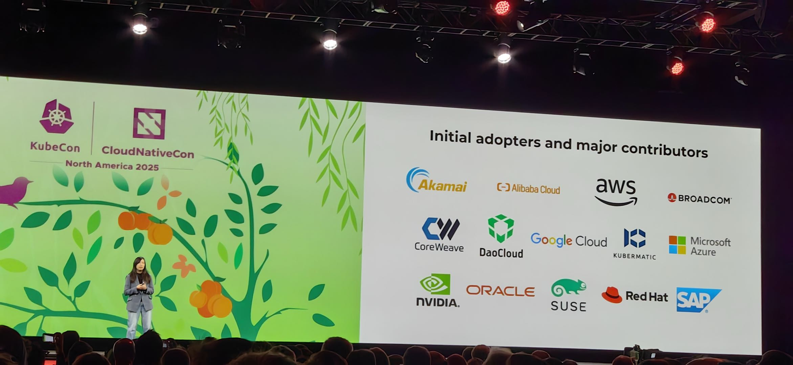
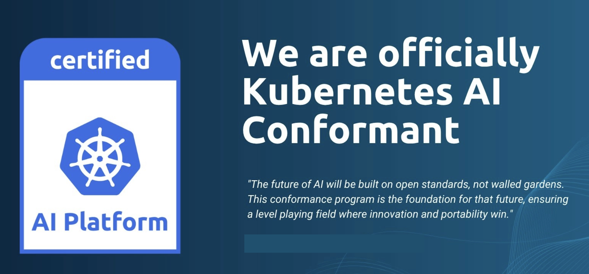
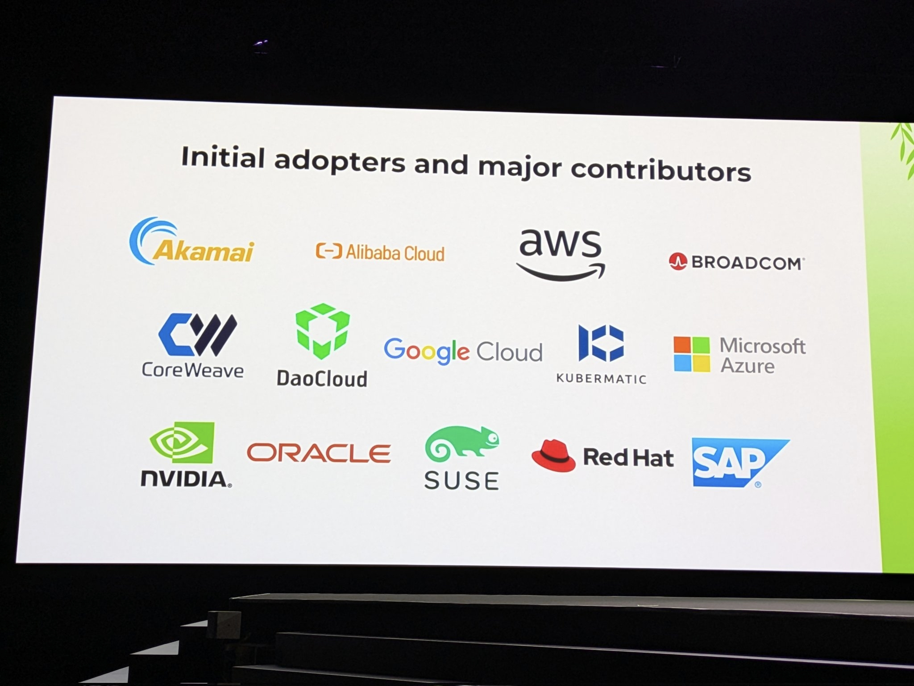

# DaoCloud 首批通过 CNCF Kubernetes AI 合规认证

随着 AI/ML 工作负载对计算资源和硬件加速的需求爆发式增长，CNCF 推出
[Kubernetes AI Conformance](https://github.com/cncf/ai-conformance) 认证标准，在基础
[Kubernetes Conformance](https://github.com/cncf/k8s-conformance) 认证之上，定义了
AI 场景专属的功能、API 和配置要求，为 AI 工作负载的跨环境移植、高效运行提供统一基准。

!!! note

    值得注意的是，各企业的 Kubernetes 定制化平台或发行版想要证明其在 AI/ML 场景下的能力和可靠性，
    必须先获得 Kubernetes 合规认证，才能再申请 AI 合规认证。

作为国内开源事业的领军企业，DaoCloud 紧跟云原生 AI 发展潮流。在社区推出 Kubernetes AI Conformance
合规标准后，率先针对目前广泛使用的 Kubernetes v1.33 启动 [DCE 5.0](https://docs.daocloud.io/) 平台的
AI 合规测试，并于 2025 年 10 月[成功通过认证](https://github.com/cncf/ai-conformance/pull/13)，
成为国内首个在该版本获得认证的企业级 AI/ML 平台。

[DCE 5.0](https://daocloud.io/products/index.html) 是一款高性能、可扩展的云原生 AI 操作系统，
可在任意基础设施和环境中提供一致、稳定的体验，支持异构云、边缘云与多云编排。
平台集成服务网格与微服务技术，实现全链路流量可追踪，并通过智能监控和动态可视化仪表盘，让集群、节点、应用与服务的健康状态清晰可见；
原生支持 DevOps 和 GitOps 模式，实现应用交付标准化与自动化，并内置精选数据库与中间件，使运维更高效智能。

DCE 5.0 模块化设计确保各功能独立解耦、灵活升级无影响，同时可与丰富 AI 生态产品对接，提供完整解决方案。经过近千家客户生产环境验证，
构建了可靠的数字底座，助力企业释放 AI 生产力，迈向智能化、AI 驱动的数字未来。

## AI 合规项说明

AI 合规认证项分为 MUST（必需）和 SHOULD（建议）两类，全面覆盖 AI 工作负载关键需求：

- **MUST 必需项:** 聚焦加速器资源分配、AI 推理网络入口、Gang 调度、自动扩缩容、性能监控、安全访问等核心能力，确保平台能稳定支撑 AI 训练与推理基础场景。
- **SHOULD 建议项:** 延伸至 GPU 共享、高性能存储、拓扑感知调度、机密计算等进阶功能，助力平台实现 AI 场景的优化升级。

### MUST 必需项

| 类别 | 项目 | 功能要求 | 测试要求 |
| ---- | ---- | ---- | ---- |
| 加速器 | 加速器资源暴露与分配 | 支持动态资源分配 (DRA) API，以便实现比简单计数更灵活、精细的资源请求 | 验证所有 `resource.k8s.io/v1` DRA API 资源是否启用 |
| 网络 | AI 推理高级入口 | 支持 Kubernetes Gateway API，并实现推理服务的高级流量管理 | 验证所有 `gateway.networking.k8s.io/v1` Gateway API 资源是否启用 |
| 调度与编排 | Gang 调度 | 平台必须允许安装并成功运行至少一个 Gang 调度方案 | 供应商需证明其平台可以成功运行至少一个 Gang 调度方案 |
| | AI 工作负载有效自动扩缩 | 集群自动扩缩器必须支持基于加速器类型扩缩节点组 | 配置节点池并创建 (A*N)+1 个请求加速器的 Pod，验证自动扩缩行为 |
| | | 支持 HorizontalPodAutoscaler，对使用加速器的 Pod 正确扩缩 | 配置自定义指标管道、Deployment 和 HPA，施加负载验证扩缩 |
| 可观测性与遥测 | 加速器性能指标 | 支持安装至少一个加速器指标方案，暴露精细性能指标 | 抓取 Prometheus 兼容指标端点并验证每个加速器指标 |
| | AI 作业与推理服务指标 | 提供监控系统收集标准格式指标 | 部署应用，生成流量，验证监控系统收集关键指标 |
| 安全 | 安全加速器访问 | 确保容器内访问加速器隔离性与受控性 | 部署 Pod 验证未授权访问被拒绝 |
| AI 框架与 Operator 支持 | 稳健的 CRD 与控制器操作 | 支持至少一个复杂 AI Operator 可安装并可靠运行 | 部署 Operator，验证 Pod、Webhook 和 CRD 正确运行 |

### SHOULD 建议项

| 类别 | 项目 | 功能要求 |
| ---- | ---- | ---- |
| 加速器 | 加速器驱动与运行时管理 | 提供可验证机制，确保兼容的加速器驱动及对应容器运行时配置正确安装和维护 |
| | | 广告已安装加速器驱动版本，并通过 DRA 属性暴露 |
| | GPU 共享 | 若支持 GPU 共享，提供明确机制提升未使用完整 GPU 的工作负载利用率 |
| | 虚拟化加速器 | 若平台支持虚拟化加速器（如 vGPU），应通过 DRA 暴露并可管理 |
| | 硬件拓扑感知 | 节点硬件拓扑信息（加速器与高性能网卡的物理布局）应可发现，并通过 DRA 属性暴露 |
| 存储 | 高性能存储 | 高 IOPS/吞吐量的块/文件存储应通过 `StorageClass` 暴露 |
| | | 至少提供一个支持 `ReadWriteMany` 的高性能 CSI 驱动 `StorageClass` |
| | 镜像拉取优化 | 支持大容器镜像快速拉取机制，如镜像缓存、镜像流式传输等 |
| | AI 工作负载数据缓存 | 提供机制在计算节点附近缓存频繁访问的数据 |
| 网络 | 高性能 Pod 间通信 | 利用 DRA 将 Pod 附加到多个网络接口，使高性能网络特性可发现 |
| | AI 推理高级入口 | 支持 Gateway API 推理扩展，实现模型托管、LLM 服务及高级路由 |
| | 网络策略执行 | 支持已安装并激活的 Network Policy 提供器，默认执行用户定义的 `NetworkPolicy` |
| 调度与编排 | 批处理作业增强管理 | 支持通过 JobSet API 管理紧密依赖的 Kubernetes Job |
| | | 支持队列、资源公平共享和 Gang 调度的 Kueue API |
| | AI 工作负载有效自动扩缩 | 支持异构节点组管理，允许工作负载表达亲和性/反亲和性或污点/容忍度 |
| | 加速器拓扑感知调度 | 若加速器互联可发现，调度框架应支持拓扑感知调度 |
| 安全 | 安全工作负载认证 | 提供可验证机制确保 AI 工作负载安全访问服务，无需长期静态凭证 |
| | AI 机密计算 | 支持在硬件可信执行环境 (TEE) 内部署机密容器 |
| | AI 软件与模型供应链安全 | 确保 Admission Control 可结合 Sigstore/Cosign 和策略引擎实施安全策略 |
| | 不可信代码沙箱化 | 提供强隔离的沙箱运行机制，保护进程、内存和网络 |
| 维护与修复 | 故障设备检测 | 提供检测故障设备并可选自动修复的机制 |
| | 早期维护通知 | 提供提前计划的维护通知机制 |
| | 高度互联节点的 Gang 维护 | 支持高度互联节点的 Gang 维护，最小化影响 |

!!! note

    上述合规项及分类可能会随行业发展、标准更新和版本迭代而调整，仅供参考，不构成最终版本。
    具体请参阅 [cncf/ai-conformance README](https://github.com/cncf/ai-conformance)。

通过认证的平台可获得 CNCF 官方授权使用 AI 合规徽章，成为行业认可的 AI 友好型 Kubernetes 发行版。

## DaoCloud 领跑国内，跻身全球首批认证阵营

在 Kubernetes v1.33 中，率先通过认证的企业仅寥寥数家，
[DaoCloud DCE 平台](https://daocloud.io/products/platinum-edition/index.html)与
Red Hat Openshift、SUSE RKE2 等国际知名平台共同入选，彰显了中国企业在云原生 AI 领域的技术实力：

- **DaoCloud 的 DCE 平台**
- NeoNephos Foundation 的 Gardener
- Giant Swarm 自有平台
- Red Hat 的 Openshift 容器平台
- SUSE 的 RKE2
- Sidero Labs 的 Talos Linux

DCE 5.0 此次通过认证，意味着其能为企业提供兼容标准、可移植、高可靠的 AI 运行环境，无论是大规模模型训练、高性能推理还是
MLOps 流水线部署，都能实现高效承载与灵活扩展。未来，DaoCloud 将持续深耕云原生 AI 生态，为企业 AI 数字化转型提供更坚实的技术底座。

更多细节参阅 CNCF 公众号文章：[CNCF 推出认证 Kubernetes AI 合规计划，统一 Kubernetes 上的 AI 工作负载标准](https://mp.weixin.qq.com/s/ro-ro46SguuirDIv54IO1w)。
