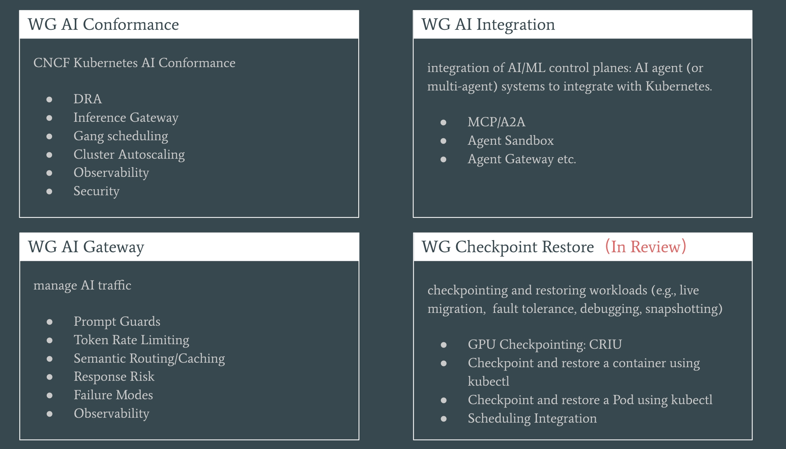
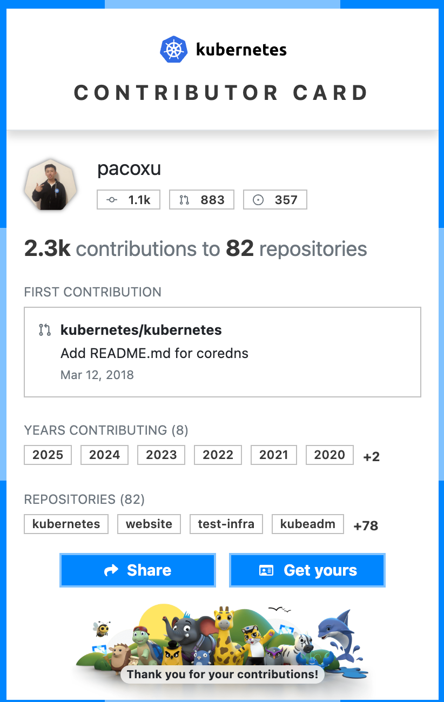
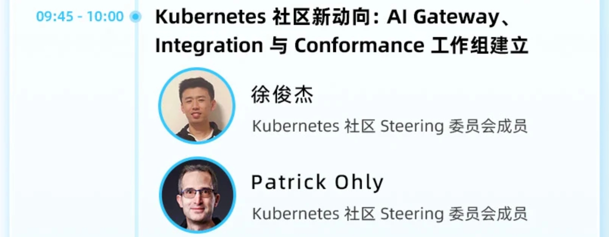
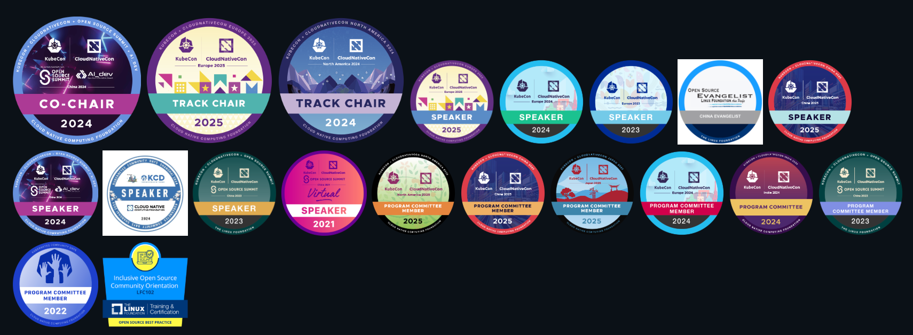

# Paco Xu 再次入选 K8s 指导委员会

> 副标题：与社区共建 AI 时代云原生基座

在当今数字化浪潮中，人工智能（AI）正以前所未有的速度重塑各行各业，而这一切创新的背后，离不开稳定、高效的底层技术支撑。
**Kubernetes（简称 K8s）作为云原生领域的事实标准，早已成为 AI 基础设施的核心底座** 。

从互联网巨头的 AI 实验室到初创企业的智能应用开发，K8s 正在成为连接 AI 算法与实际业务场景的关键桥梁，而负责引领
K8s 项目发展方向的指导委员会，其决策与治理也直接影响着 AI 底层技术生态的繁荣与演进。

## 2025 Kubernetes 指导委员会选举结果

Kubernetes 指导委员会（Steering Committee）作为 Kubernetes 项目的最高治理机构，不仅是云原生社区的 “掌舵人”，更是
AI 底层技术生态的重要推动者。指导委员会负责就项目章程、各下属组织以及财务规划等事项进行决策与监督。
同时，指导委员会还负责界定项目的价值观与组织结构。
2025 年度指导委员会选举已圆满结束。
Kubernetes 指导委员会共设 7 个席位，其中 4 个席位 在 2025 年参与改选。
新当选委员的任期为两年，所有委员均由 Kubernetes 社区 投票产生。

本次经社区选举出的 4 个席位（任期 2027 年结束）为：

- Kat Cosgrove, ([@katcosgrove](https://github.com/katcosgrove)), Minimus
- **Paco Xu, ([@pacoxu](https://github.com/pacoxu)), DaoCloud**
- Rita Zhang, ([@ritazh](https://github.com/ritazh)), 微软
- Maciej Szulik, ([@soltysh](https://github.com/soltysh)), Defense Unicorns

继续任期的 3 个席位（任期 2026 年结束）为：

- Antonio Ojea, ([@aojea](https://github.com/aojea)), 谷歌
- Benjamin Elder, ([@BenTheElder](https://github.com/bentheelder)), 谷歌
- Sascha Grunert, ([@saschagrunert](https://github.com/saschagrunert)), 红帽

其中 Maciej Szulik 和 Paco Xu 曾于 2023 年经选举进入指导委员会，这是他们第二次进入该委员会。
Paco Xu 也是唯一进入该委员会的中国人。

### 聚焦 AI：Kubernetes 社区工作组最新进展

为了进一步推进 Kubernetes 与 AI 等新兴技术的融合，社区在 2025 年 陆续发起/运作了以下工作组与计划：

- [WG AI Conformance](https://github.com/kubernetes/community/tree/master/wg-ai-conformance)：面向 AI 工作负载的一致性与能力基线，围绕“在 Kubernetes 上跑 AI 应该具备哪些‘合规/一致’能力”进行分解与落地。
- [WG AI Gateway](https://github.com/kubernetes/community/tree/master/wg-ai-gateway)：在 Gateway API 生态中探索适配推理流量的路由、策略与观测等网络治理能力，并与 Gateway API Inference Extension（GAIE） 推理扩展等项目协同。
- [WG AI Integration](https://github.com/kubernetes/community/tree/master/wg-ai-integration)：面向 AI 系统与 Kubernetes 的集成实践，汇聚各类落地经验与规范提案。

**如何参与:** 所有工作组均在社区官网的
[Community Groups 页面](https://www.kubernetes.dev/community/community-groups/)列出，包含
Slack 频道、邮件列表及双周会议等信息。欢迎具备实践经验或对标准/实现感兴趣的同学加入。

## 了解关注 Paco

Paco 是 DaoCloud 开源战队队长，负责洞察社区前沿开源技术，引领并转化为可落地的产品能力。

他精力充沛，热爱踢足球，是利物浦和瓦伦西亚的铁杆球迷。笔者刚入职时，对他的签名记忆犹新：“踢球喊我 ⚽️”。

自 2012 年起，Paco 开始在 GitHub 贡献代码，总计参与 133 个仓库。在过去十年里，他对 Kubernetes 的贡献累计达到 [15,769](https://k8s.devstats.cncf.io/d/13/developer-activity-counts-by-repository-group?orgId=1)。

这是最近几年他在 Kubernetes 相关仓库提交合并的 PR：

<figure markdown="span">
  { width="800" }
</figure>

Paco 个人的 Kubernetes 贡献者卡片：

<figure markdown="span">
  { width="400" }
</figure>

!!! tip

    只需简单修改 URL，每个人都可以查询自己的 Kubernetes 贡献情况：
    <https://contribcard.clotributor.dev/pacoxu>

Paco 积极组织并参与 KubeCon、KCD 等线下演讲活动，除了 Speaker 之外还担任过：

- KubeCon China 2024 Co-Chair
- Track Chair of KubeCon 北美 2024
- Track Chair of KubeCon 欧洲 2025

11 月 15 日，欢迎在 KCD 杭州 2025 见面。Paco 将带来主题演讲，概览 Kubernetes 社区近期进展；Patrick Ohly(前指导委员会成员，DRA 核心开发) 将分享 DRA 最新动态。我们也会解读今年新增的 WG AI Gateway、AI Integration、AI Conformance 的最新进展。更多议程与报名，请关注 [KCD 杭州](https://community.cncf.io/events/details/cncf-kcd-hangzhou-presents-kcd-hangzhou-openinfra-days-china-2025/)官方渠道。

获得了许多徽章：

活跃于各个 SIG 和 WG 评审代码：

- [CNCF TAG Workloads](https://github.com/cncf/tag-workloads/) Chair
- [Kubernetes/Kubeadm](https://github.com/kubernetes/kubeadm/) Maintainer
- [LFAPAC Evangelist](https://evangelists.linuxfoundation.cn/evangelists)

欢迎关注 Paco：

- [GitHub @pacoxu](https://github.com/pacoxu)
- [Twitter 或 X @xu_paco](https://x.com/xu_paco)
- [LinkedIn @pacoxu2020](https://www.linkedin.com/in/pacoxu2020/)
- [WordPress 个人博客](https://pacoxu.wordpress.com/)
