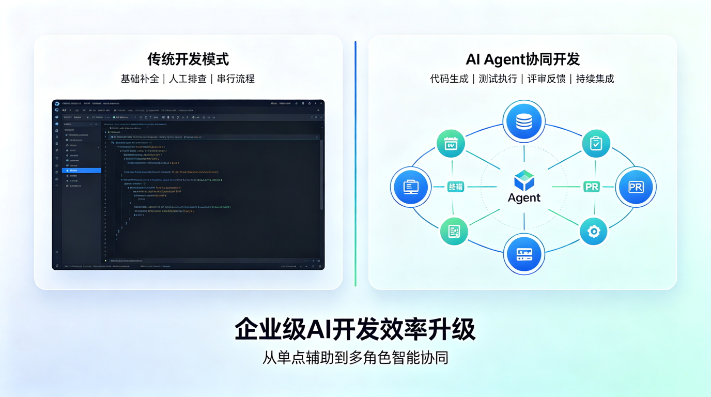
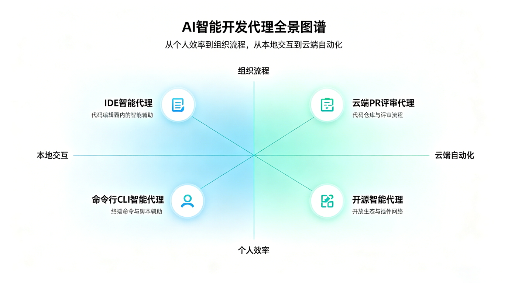
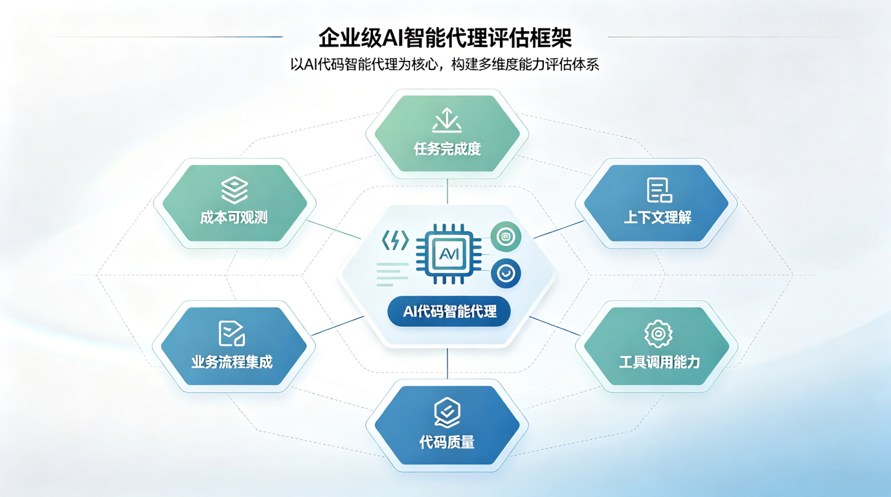
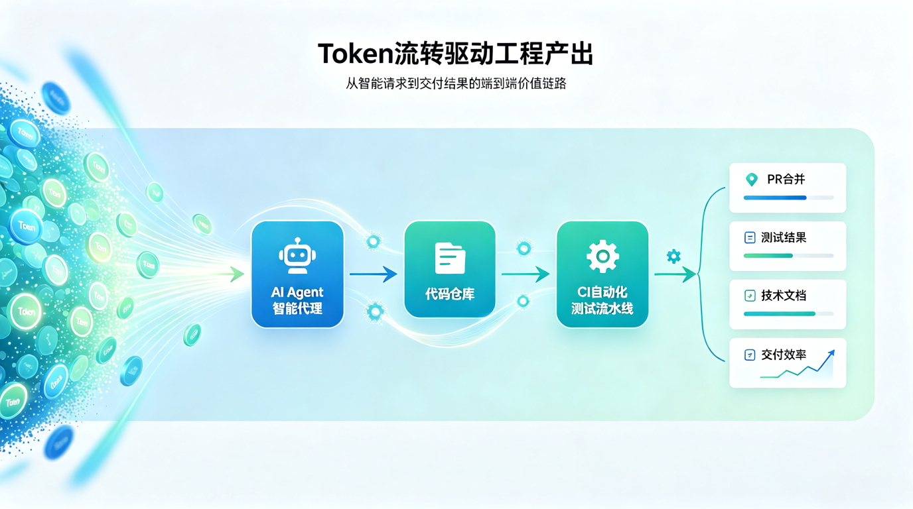
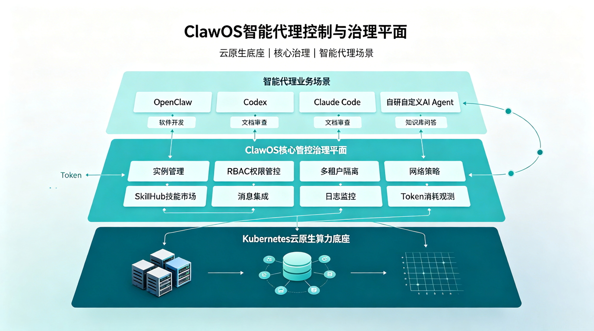

# 从 Copilot 到 Claude Code：如何评估 AI 编程智能体的真实生产力？

过去几年，AI 编程工具的主角一直是“代码补全”。

开发者写一半，AI 补一半；开发者描述一个函数，AI 生成一段代码。这个阶段，企业评估 AI 工具，往往看的是：补全准不准、响应快不快、开发者爱不爱用。

但从 GitHub Copilot、Cursor 到 Claude Code、Codex、Devin，AI 编程正在进入一个新的阶段：
**智能体不再只是写代码，而是开始完成任务。**

它可以阅读代码库、理解 Issue、制定计划、修改多个文件、运行测试、修复失败、提交变更，甚至自动创建 Pull Request。

这意味着，企业评估 AI 编程智能体，不能再只问一句：“它代码写得好不好？”

更重要的问题变成了：
**它能不能稳定地把 Token、模型能力和工具调用，转化为真实的工程产出？**

## AI 编程工具正在从“助手”变成“智能体”

早期 AI 编程工具更像一个贴身助手：它响应开发者的输入，在局部上下文中完成代码生成、解释、补全和简单修改。

而现在的 AI 编程智能体，已经开始具备更完整的任务闭环能力：

| 阶段 | 典型能力 | 企业关注点 |
|---|---|---|
| 代码补全 | 根据上下文补全函数、变量、注释 | 提升编码速度 |
| 对话助手 | 解释代码、生成片段、回答技术问题 | 降低理解和搜索成本 |
| IDE Agent | 在项目中跨文件修改、运行命令、修复报错 | 提升单人开发效率 |
| 云端 Agent | 根据 Issue 或任务创建分支、修改代码、发起 PR | 提升团队任务吞吐 |
| 组织级 Agent | 接入权限、规范、流水线、度量和审计 | 形成可治理的 AI 研发生产力 |

从这个演进路径可以看到，AI 编程智能体的价值，已经不只体现在“生成了多少代码”，而是体现在它能否进入真实的软件工程流程。

## 常见 AI 编程智能体：各有自己的主战场

目前市场上的 AI 编程智能体，大致可以分为 IDE 型、终端型、云端 PR 型、全流程工程师型和开源自托管型。

| 工具/智能体 | 主要形态 | 更适合的场景 |
|---|---|---|
| GitHub Copilot| IDE + GitHub 云端 Agent | GitHub Issue 到 PR、代码补全、团队协作 |
| Cursor Agent | AI 原生 IDE | 高频编码、前端开发、项目内快速迭代 |
| Claude Code | CLI/IDE/Web/Desktop Agent | 复杂代码理解、重构、长上下文任务、终端工作流 |
| OpenAI Codex | CLI/云端/桌面 Agent | 多文件修改、自动化任务、代码库理解、工具调用 |
| Devin | 云端 AI 软件工程师 | 较完整的软件开发任务、Backlog 自动处理 |
| Windsurf/Cascade | AI IDE Agent | 项目级代码修改、开发者实时协作 |
| OpenCode/Aider/Cline/Roo Code | 开源或半开源 Agent | 自托管、内部模型接入、企业实验平台 |

这些工具并不是简单的强弱关系，而是适合不同的组织工作流。

- 如果团队已经围绕 GitHub Issues、Pull Request 和 Actions 运转，Copilot Agent 会更容易嵌入流程。
- 如果开发者强调本地 IDE 体验，Cursor、Windsurf 这类 AI IDE 会更自然。
- 如果工程师习惯终端、脚本和复杂仓库操作，Claude Code、Codex 这类 Agent 会更有发挥空间。
- 如果企业强调可控性、自托管和内部模型，则开源 Agent 生态更值得关注。

## 评估智能体，不能只看 Benchmark

[SWE-bench](https://www.swebench.com/)、[Terminal-Bench](https://www.tbench.ai/) 等公开基准，已经成为评估 AI 编程智能体的重要参考。

[SWE-bench](https://www.swebench.com/) 更关注智能体解决真实 GitHub Issue 的能力；
[Terminal-Bench](https://www.tbench.ai/) 则测试智能体在终端环境中完成系统管理、数据处理、安全、编码等任务的能力。

这些基准很有价值，因为它们把 AI 从“回答问题”推进到了“完成任务”。

但对企业来说，公开 Benchmark 只能回答一部分问题。真实生产环境还会遇到更多复杂因素：

- 企业代码库可能更大、更旧、更复杂
- 内部框架和平台工具并不在公开训练数据中
- 任务依赖权限、网络、制品库、流水线和环境变量
- 代码修改必须符合团队规范和安全要求
- 最终产出要经过 Review、测试、合规和上线流程
- 成本不是单次调用，而是持续 Token 消耗和模型账单

所以，企业评估 AI 编程智能体，不能只看“某个榜单上谁第一”，而要建立自己的评估框架。

## 企业评估 AI 编程智能体的六个维度

一个真正能进入企业生产环境的 AI 编程智能体，至少要经得起六个维度的评估。

| 评估维度 | 关键问题 | 为什么重要 |
|---|---|---|
| 任务完成率 | 它能否从需求描述走到可运行、可测试、可 Review 的结果？ | 决定智能体是否真的能承担工程任务 |
| 上下文理解 | 它能否理解大型代码库、内部规范、历史决策和跨模块依赖？ | 决定复杂项目中的可用性 |
| 工具调用能力 | 它能否安全地运行命令、测试、构建、搜索、调试和调用内部工具？ | 决定它是否能完成闭环，而不是只生成代码 |
| 质量与安全 | 它生成的代码是否可靠、可维护、符合安全要求？ | 决定企业是否敢把它接入核心项目 |
| 流程集成 | 它能否进入 Issue、PR、CI/CD、Code Review 和发布流程？ | 决定它是否能成为团队生产力，而非个人玩具 |
| 成本与可观测 | 它消耗了多少 Token、多少费用，带来了多少产出？ | 决定 AI 使用是否可运营、可优化、可规模化 |

这六个维度背后，其实是一句话：
**企业要评估的不是“智能体会不会写代码”，而是“智能体能不能稳定参与软件交付”。**

## Token 数量不是生产力，Token 转化率才是

当企业大规模接入 Codex、Claude Code、Cursor、Copilot 等工具后，一个新的问题会出现：如何衡量 AI 编程的真实使用效果？

最容易拿到的数据，是 Token。

Token 可以反映 AI 工具的使用深度、成本投入和活跃程度。但 Token 本身并不等于生产力。

一个员工消耗了很多 Token，可能是在高效完成复杂重构，也可能是在反复试错、重复提问、提交无效上下文。
一个团队 Token 消耗较少，也不一定代表 AI 使用不足，可能是提示词质量更高、任务拆分更清晰、上下文管理更有效。

因此，企业真正应该关注的是 **Token 转化率**。

| Token 数据 | 结合工程数据 | 可以回答的问题 |
|---|---|---|
| Token 消耗 | PR 创建数/合并数 | AI 是否转化为真实代码变更？ |
| Token 消耗 | 测试通过率 | AI 生成的代码是否可靠？ |
| Token 消耗 | Review 修改次数 | AI 产出是否减少返工？ |
| Token 消耗 | 需求交付周期 | AI 是否缩短交付时间？ |
| Token 消耗 | 缺陷率 | AI 是否影响代码质量？ |
| Token 消耗 | 文档和测试覆盖率 | AI 是否改善工程资产沉淀？ |

这类度量的价值，不是为了简单统计“谁用了最多 Token”，而是让 AI 编程从个人体验变成组织可观察、可比较、可优化的生产过程。

## 从工具采购，到 Agent 生产力运营

很多企业在引入 AI 编程工具时，容易把问题简化为采购决策：买 Copilot、买 Cursor、买 Claude Code，或者接入某个模型。

但真正的挑战，不在采购，而在运营。

AI 编程智能体进入企业后，会带来一系列新问题：

- 谁可以使用哪些智能体？
- 哪些代码库允许智能体访问？
- 哪些命令可以自动执行，哪些必须人工确认？
- 生成代码是否必须经过安全扫描？
- AI 生成 PR 如何标识、审计和追踪？
- Token 成本如何按团队、项目、业务线归因？
- 哪些高效实践可以沉淀成组织模板？
- 哪些低效消耗需要优化或限制？

这说明，企业需要的不只是 AI 编程工具，而是一套 **Agent 生产力运营体系** 。

| 运营能力 | 具体内容 | 企业价值 |
|---|---|---|
| 账号与权限 | 控制用户、代码库、工具和环境访问范围 | 降低安全和合规风险 |
| 规则与上下文 | 沉淀编码规范、架构原则、Review 要求和项目知识 | 提升智能体输出稳定性 |
| 工具链集成 | 接入 Git、CI/CD、测试、安全扫描、知识库和工单系统 | 让智能体进入真实研发流程 |
| 成本计量 | 统计 Token、费用、调用频率和任务维度消耗 | 支撑 AI 成本治理 |
| 效果评估 | 关联 PR、测试、交付周期、缺陷和文档等指标 | 衡量 AI 是否带来真实产出 |
| 最佳实践 | 沉淀 Prompt、Skills、Agent 模板和任务拆分方法 | 把个人经验变成组织能力 |

AI 编程智能体的价值，不会自动发生。
只有当它被纳入组织流程、工程规范和数据度量之后，才会真正从“好用的工具”变成“可运营的生产力”。

## ClawOS：让智能体从个人工具变成企业可运营资产

当 AI 编程智能体进入企业环境后，问题很快会从“某个 Agent 好不好用”，变成“企业如何规模化运行和治理一组 Agent”。

一个团队可能会同时使用 Codex、Claude Code、Cursor、OpenClaw 等不同形态的智能体：有的负责代码理解，有的负责 Bug 定位，有的负责 PR Review，有的负责文档审查，有的进入飞书或 Teams 群聊处理日常任务。

如果这些 Agent 都由个人自行配置、自行接入模型、自行管理 API Key 和工具权限，企业很快就会遇到新的治理问题：权限不可控、成本不可见、日志不可查、网络边界不清、Skill 难以复用、异常无人排查。

这正是 [ClawOS](../../clawos/intro/index.md) 要解决的问题。

ClawOS 是 DaoCloud 面向企业的多智能体运行和治理平台，可以理解为企业内部运行 AI Agent 的控制面和治理面。它不是简单的 Agent 列表管理平台，而是帮助企业把 Agent 安全、稳定、可控地运行起来，并纳入已有的权限、网络、协作、审计和运维体系。

| 企业问题 | ClawOS 能力 | 对 Agent 生产力的价值 |
|---|---|---|
| Agent 实例分散，缺少统一管理 | 实例生命周期管理 | 统一创建、查看、编辑、删除 OpenClaw 实例，让 Agent 运行状态可管理 |
| 多团队共用 Agent，权限边界不清 | 权限与多租户隔离 | 按普通用户、租户管理员、平台管理员划分能力边界，避免 Agent 成为不可控黑盒 |
| Agent 能访问系统和网络，风险难控 | 网络策略治理 | 管理 Agent 可访问的内网服务、API 和默认网络策略，明确能力边界 |
| 高价值能力散落在个人配置中 | Skill 管理与分发 | 将可复用 Skill 审核、上架、分发、授权和下架，沉淀为企业能力资产 |
| Agent 只存在于控制台，难进入工作流 | 消息渠道集成 | 对接飞书、Teams 等企业消息渠道，让 Agent 进入员工日常协作场景 |
| 成本、日志、失败率不可见 | 可观测、日志与运维 | 提供实例状态、运行日志、Session transcript、Trajectory log、Token 用量、调用次数、错误率和告警等信息 |

从这个角度看，ClawOS 解决的不是“哪个 Agent 比 Copilot、Claude Code、Codex 或 Cursor 更好用”，而是企业规模化使用 Agent 时更底层的问题：

- 我们有多少 Agent 在运行？
- 它们分别服务哪些团队？
- 哪些 Agent 正常，哪些异常？
- 哪些用户和实例消耗最多 Token？
- 哪些 Skill 被频繁使用？
- 哪些模型成本最高？
- 哪些任务失败率异常？
- 哪些操作需要审计和回放？
- 哪些网络访问存在风险？

这也是企业级 AI 编程进入下一阶段的关键：智能体不再只是工程师个人的效率工具，而会逐渐成为组织的数字员工和自动化执行单元。

ClawOS 的价值，就是把这些分散的 Agent 运行起来、管起来、看起来、审起来，让 Agent 从“个人工具”变成“企业可运营资产”。

## 结语：企业需要的不是“最强 Agent”，而是“可运营的 Agent 体系”

从 Copilot 到 Claude Code，从 Cursor 到 Codex，从 Devin 到开源 Agent，AI 编程智能体正在快速演进。

但对企业来说，真正的问题不是“哪个 Agent 最强”，而是：

- **哪个 Agent 更适合我们的工作流？**
- **哪些任务适合交给 Agent？**
- **如何保证质量、安全和合规？**
- **如何衡量 Token 是否转化为真实产出？**
- **如何把个人使用经验沉淀为组织能力？**

AI 编程的下一个阶段，不会只是工具之争，而是运营体系之争。

谁能更早建立智能体的使用度量、成本治理、流程集成和生产力评估体系，谁就更有机会把 AI 从“个人效率工具”升级为“组织级工程能力”。

在这个意义上，企业需要的不只是 Copilot、Claude Code 或 Codex。
企业真正需要的，是一座能够持续运转的 **Agent 工厂**：让智能体被正确使用，让 Token 被有效转化，让 AI 真正进入软件工程的生产流程。

## 参考资料

- [SWE-bench 排行榜](https://www.swebench.com/)
- [Terminal-Bench](https://www.tbench.ai/)
- [GitHub Copilot Cloud Agent 文档](https://docs.github.com/en/copilot/concepts/agents/cloud-agent/about-cloud-agent)
- [Claude Code 文档](https://code.claude.com/docs/en/overview)
- [DaoCloud ClawOS 文档](https://docs.daocloud.io/clawos/intro/)
- arXiv 论文：[AI 编码智能体对比：基于任务分层的 PR 接受率分析](https://arxiv.org/abs/2602.08915)
- arXiv 论文：[Agentic AI 编码工具配置：一项探索性研究](https://arxiv.org/abs/2602.14690)
