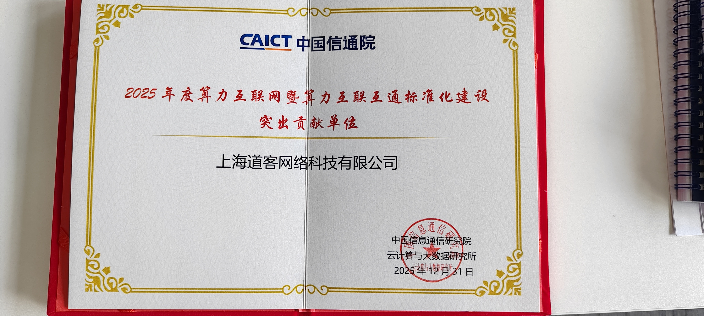
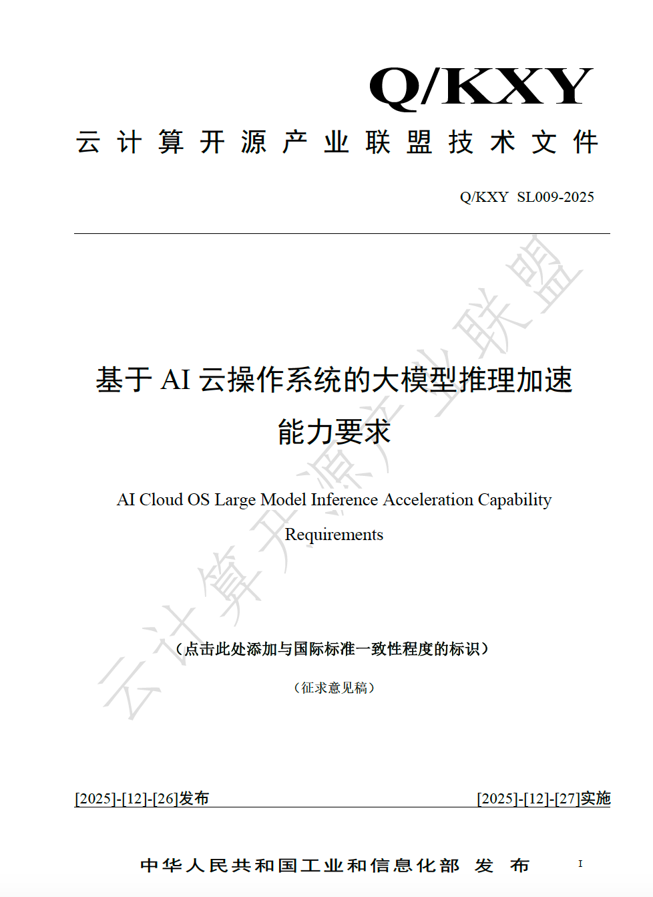
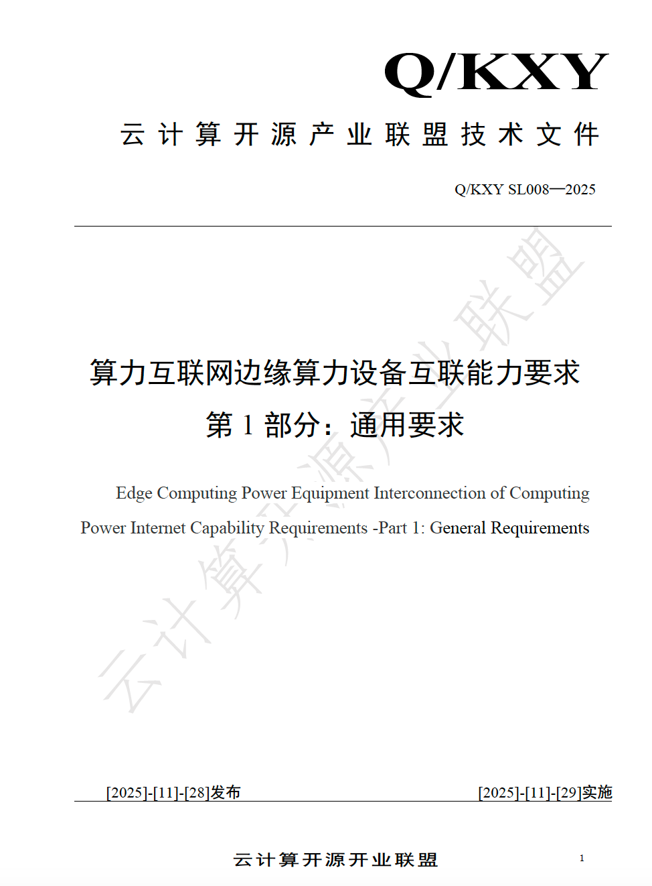
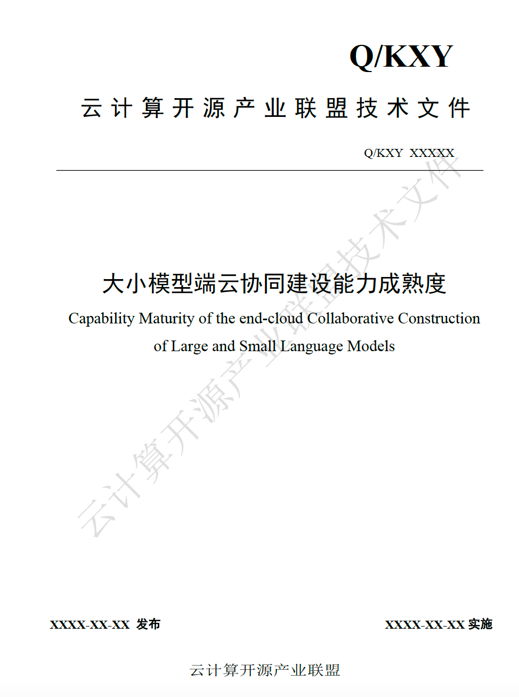
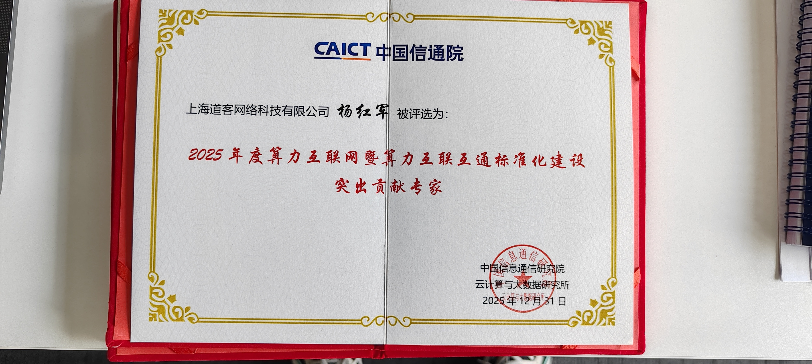
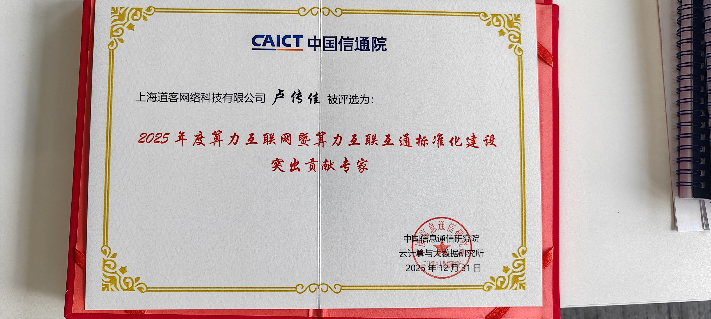
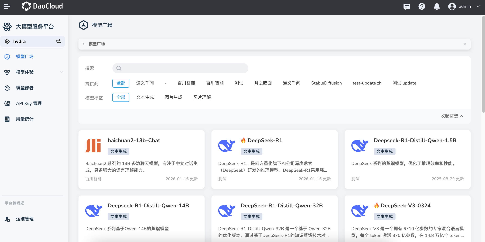

# DaoCloud 助力中国信通院制定大模型推理加速等国家标准

喜讯！上海道客网络科技有限公司（DaoCloud）凭借在 **云原生、AI 建设、大模型推理等开源技术** 的领先实力，以及在算力互联网和算力互联互通标准化建设中的卓越贡献，荣获 **2025 年度算力互联网暨算力互联互通标准化建设突出贡献单位**。

在此背景下，DaoCloud 深度参与并协助中国信通院（CAICT），为 **中国云计算开源产业联盟** 编撰了多本 **大模型推理加速及算力互联互通相关标准文件**，系统性梳理并规范了大模型推理、算力调度及互联互通等关键技术能力，为我国人工智能技术的规模化落地和产业发展提供了重要的技术规范与参考依据。

## DaoCloud 参与编撰的核心标准文件

这几份技术标准文件归属于中国云计算开源产业联盟：

- 《基于 AI 云操作系统的大模型推理加速能力要求》，编号 Q/KXY SL009-2025

    本文件规定了 AI 云操作系统在大模型推理加速场景的基本框架，包括 AI 云操作系统大模型推理加速核心能力、可观测性、推理加速性能、稳定性、安全性、兼容性等方面的能力要求。

    本文件适用于 AI 云操作系统的研发与评估、大模型推理平台的设计与部署、异构计算资源池的统一纳管与调度优化、推理加速框架的选型与性能测试。旨在为云计算服务商、人工智能企业、科研机构等提供统一技术规范，实现跨资源池的算力调度与推理加速标准化，促进大模型技术的高效落地应用。

    

- 《算力互联网边缘算力设备互联能力要求》，编号 Q/KXY SL008-2025

    本文件规定了算力互联网边缘算力设备互联的通用要求，包括其总体架构、功能要求和安全要求，涵盖组网结构、接口规范、统一标识注册、边端协同调度等核心内容，明确了不同层次资源与服务之间的互联能力要求。

    本文件适用于端侧算力设备、边侧算力设备两类边缘算力设备形态，适用于设备选型与部署、互联设计与实施、能力评估与验证等场景，为构建统一架构、低时延、高效能、固移融合、边端协同的算力互联网边缘算力设备互联体系提供依据。

    

- 《大小模型端云协同建设能力成熟度》

    本文件规定了在实际人工智能应用场景中，开展大模型与小模型、大模型与专业领域模型、大模型与专有算法等相关大小模型端云协同建设的规范流程及相关能力要求，从基础设施、资源管理、任务调度、协同执行、应用服务、综合保障等能力域对人工智能应用建设所涉及的相关技术及服务能力要求进行规范。

    本文件主要面向大模型解决方案厂商、云服务商、系统集成商、央国企数科公司及开展各类人工智能应用建设及运营的企事业单位，对于建设需求方，可针对人工智能工程化项目在大小模型协同建设方面的成效进行量化评价，指导开展各类人工智能应用建设；对于技术供应方，可提供在大小模型协同建设解决方案方面的科学量度及理论参考。

    本文件可供其他行业或组织机构进行参考，也可作为第三方权威机构衡量与评价人工智能技术与应用交付供应商在开展相关项目活动的技术服务能力的标准依据。

    

## 突出贡献专家

在标准制定过程中，创新申报专家 **杨红军老师** 和产品经理 **卢传佳（船长）** 荣获 **2025 年度算力互联网暨算力互联互通标准化建设突出贡献专家** 称号，为国家大模型推理加速产业发展作出了卓越贡献。

## DaoCloud 大模型服务平台

DaoCloud 能够参与大模型推理加速国家标准的制定并作出突出贡献，源于多年来对大模型技术的深入研究与积累。其技术实力，可以从 DaoCloud 大模型服务平台的各项功能特性中一窥究竟。

[DaoCloud 大模型服务平台](https://docs.daocloud.io/hydra/intro/)是专为企业级用户打造的 **一站式大模型管理与服务平台**，帮助企业快速接入、部署和管理各类大模型服务，解决模型选择难、部署复杂、运行稳定性和安全性等核心痛点，加速 AI 应用落地与数字化转型。

该平台提供一站式全生命周期管理能力，支持从模型入库、部署、实时推理、流量治理、监控与审计到计费统计等全流程服务。核心特性包括：

- **一键部署与简化运维**：提供图形化界面与 API 双模式操作，支持主流大模型分钟级部署上线，并具备动态扩缩容和多地域部署能力。  
- **高可用的流量治理与稳定性保障**：通过智能流量策略引擎及多层限流机制，实现 API Key 级别、租户级别等精细化控制，提升服务稳定性和可用性。  
- **分布式推理能力**：支持多机多卡部署和异构 GPU（如 NVIDIA、昇腾等），并通过负载均衡策略提升推理性能与资源利用效率。  
- **精准计费与统计**：提供 Token 级精确计量及多维度调用数据统计支持，方便企业把控成本与业务指标。  
- **多模态模型统一管理**：通过“模型广场”等模块集中展示文本、图像等模型，并支持模型对比、试用和接入示例，使企业能根据业务需求灵活选择和体验模型。  

同时，平台具备完善的安全审计功能，对模型管理、部署模板、API 密钥等关键操作进行全面日志记录，保障合规性和可追溯性。

凭借这些能力，DaoCloud 大模型服务平台让企业在构建 AI 应用和运营大模型服务时更加高效、安全、稳定，显著提升智能化业务创新效率。
