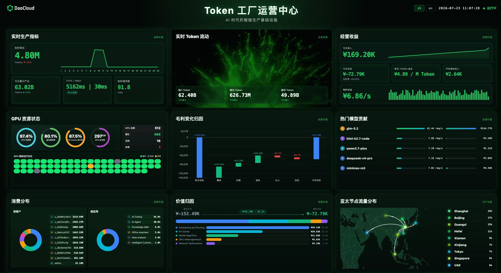
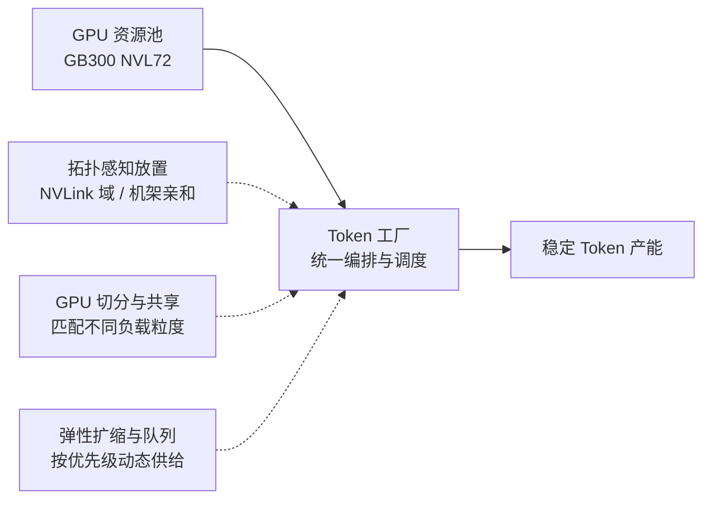
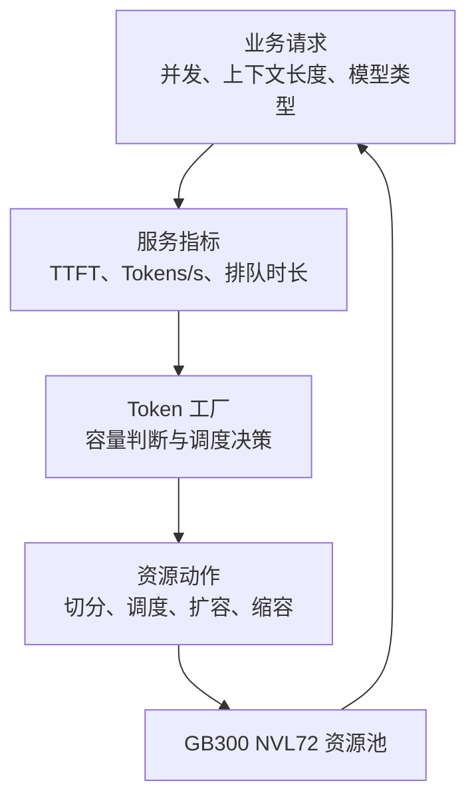

# 从 GPU 利用率到 Token 产能：DaoCloud 的 GB300 NVL72 编排实践

[GB300 NVL72](https://www.nvidia.com/en-us/data-center/gb300-nvl72/) 的到来，
让单个 AI 机架拥有前所未有的算力密度与互联带宽。但对企业而言，挑战从来不只是“拥有更多 GPU”，
而是如何让这些 GPU 持续、稳定地转化为业务所需的 Token 产能。

如果仍以“申请几张卡、运行一个任务”的方式使用算力，高价值 GPU 很容易陷入两种低效状态：
一边是小模型或低并发服务独占整卡，造成显存与计算资源闲置；
另一边是分布式任务被随机分散到不同节点甚至不同机架，通信开销吞噬了硬件互联带来的性能优势。

GB300 NVL72 的价值，正需要通过云原生的资源编排能力释放出来：将硬件的高带宽和高密度，转化为可度量、可运营的 Token 产能。

## NVL72 不是 72 张卡的简单相加

对于大模型训练和推理，GPU 数量只是资源供给的一部分。模型并行、KV Cache 传输、专家并行和分布式通信，都对算力位置与网络路径高度敏感。

在 NVL72 这类强互联系统中，机架内 NVLink 域提供极高带宽；当工作负载跨越 NVLink 域、机架或网络层级时，
延迟和带宽特征都会发生明显变化。因此，决定实际效率的不只是 GPU 数量，更是任务是否命中合适的 NVLink
域、网络路径与资源组合。随机调度虽然能让任务“跑起来”，却未必能让系统跑在应有的效率区间。

[NVIDIA 在 Kubernetes 推理实践](https://developer.nvidia.com/blog/streamline-complex-ai-inference-on-kubernetes-with-nvidia-grove/)中也强调了拓扑感知放置、协同调度和高速数据路径的重要性：
对于多角色推理工作负载，应尽可能让存在高频数据交换的组件保持在合适的拓扑范围内。

Token 工厂要做的，正是将底层硬件拓扑转化为上层可理解、可调度的资源约束：
让需要紧密协作的任务优先获得相邻的计算与通信资源，让高价值互联不被无效的数据搬运消耗掉。

## 从“分配 GPU”走向“匹配工作负载”

不同 AI 任务对 GPU 的需求并不相同。

在线推理更看重首 Token 时延、并发能力和稳定性；离线批量推理追求吞吐；训练与微调通常需要整组
GPU、稳定的网络路径和协同启动。若所有任务都按整卡、静态、同一优先级的方式分配，不仅容易形成资源碎片，也会让高优先级业务在资源紧张时缺乏保障。

Token 工厂以统一资源池承接 GB300 NVL72 算力，并依据工作负载的资源需求和业务优先级进行编排：

- 对轻量、弹性或多租户任务，根据工作负载特征提供适配的 GPU 资源切分、共享与隔离策略，减少整卡闲置。
- 对需要强通信的分布式任务，采用整组资源申请与协同调度，避免任务只启动了一部分、其余资源长期等待。
- 对高优先级在线业务，提供配额、队列与优先级控制，在资源紧张时优先保障核心服务。
- 对可中断或批处理任务，利用空闲窗口运行，让低优先级负载吸收碎片资源，而不影响关键业务体验。

这使 GPU 不再只是被“分出去”的固定资产，而成为可被持续调度、按需供给的生产资源。

不同工作负载所需的资源组合和衡量方式也不同。Token 工厂并非只按 GPU 数量分配资源，而是让调度策略与业务目标对应：

| 工作负载 | 关注重点 | 编排策略 | 结果指标 |
| --- | --- | --- | --- |
| 在线推理 | TTFT、并发与稳定性 | 优先级控制、拓扑亲和、弹性副本 | 首 Token 时延、Tokens/s |
| 批量推理 | 吞吐与成本 | 队列调度、空闲资源回收 | 任务完成时间、单位 Token 成本 |
| 训练与微调 | 协同启动与通信效率 | 整组资源申请、拓扑感知放置 | GPU 利用率、训练吞吐 |

## 让扩缩容跟着 Token 需求走

传统 GPU 运维常以“卡的数量”衡量规模：有多少 GPU、分配了多少 GPU、GPU 平均利用率是多少。
但对推理业务而言，真正需要回答的问题是：当前集群能稳定交付多少 Token？用户体验是否达标？成本是否可控？

因此，Token 工厂的调度对象不应止于 GPU 卡数，还应面向 Token 产能建立反馈闭环：
识别负载特征，匹配合适的 GPU 与拓扑资源，根据服务指标执行调度与扩缩容，再将资源动作反馈给业务请求。

当请求增长、首 Token 时延逼近目标阈值或队列持续积压时，系统应能够扩展相应的推理能力；
当负载回落时，则回收闲置资源并交还给其他业务。对于不同模型、不同上下文长度和不同并发模式，也应以实际产能而非静态 GPU 数量来评估资源是否足够。

这种模式把容量管理从“预留多少卡”升级为“按需要交付多少 Token”，让算力投入与业务结果建立更直接的联系。

## 云原生编排，是 AI 基础设施的运营能力

GB300 NVL72 提供了高密度算力和高速互联的硬件基础，但硬件能力不会自动转化为业务效率。
要把 NVL72 跑满，需要把 GPU、网络、拓扑、队列、优先级和弹性能力纳入同一套云原生控制体系。

DaoCloud Token 工厂面向的正是这一过程：以统一编排承接异构 AI 工作负载，以拓扑感知提升强通信任务效率，
以资源切分与共享提升整体利用率，并通过弹性机制将算力供给与 Token 需求动态对齐。

从 GPU 利用率到 Token 产能，变化的不只是一个指标，而是 AI 算力运营方式的升级：
不再以“拥有多少卡”衡量能力，而是以“能够稳定、高效、可预测地交付多少智能服务”定义价值。
Token 工厂的目标，不是让 GPU 被分配，而是让每一份算力以可衡量、可运营的方式持续产出 Token；
面向 GB300 NVL72，DaoCloud 将持续探索更高效的云原生 AI 算力编排路径。

延伸阅读：[NVIDIA 关于 Kubernetes 上解耦式 LLM 推理、协同调度与拓扑感知放置的实践](https://developer.nvidia.com/blog/deploying-disaggregated-llm-inference-workloads-on-kubernetes/)
