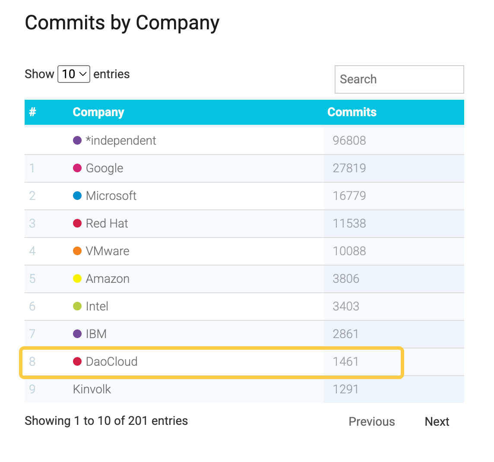

# Kubernetes v1.36 抢先一览

> 原英文博客位于 [k8s.io/blog/](https://kubernetes.io/blog/2026/03/30/kubernetes-v1-36-sneak-peek/)

Kubernetes v1.36 预计将于 2026 年 4 月底发布。
本次版本不仅包含若干移除与弃用项，还带来了数量可观的功能增强。
本文将带你快速了解这一发布周期中最值得关注的变化。

需要注意的是，本文基于 v1.36 当前开发状态整理，最终发布内容仍可能发生调整。

## Kubernetes API 的移除与弃用流程

Kubernetes 为 API 和功能提供了一套完善的[弃用策略](https://kubernetes.io/zh-cn/docs/reference/using-api/deprecation-policy/)。
该策略的核心原则包括：

- 只有在存在稳定替代版本时，稳定版（GA）API 才会被弃用
- 每个 API 生命周期阶段都有最短支持周期
- 被弃用的 API 会提前标记，并在未来版本中移除

在弃用阶段：

- API 仍可继续使用（自弃用起至少一年）
- 使用时会产生告警提示

一旦 API 被移除，则在当前版本中将不可用，必须迁移至替代方案。

具体规则如下：

- GA API：可被弃用，但不会在同一主版本中移除
- Beta API：弃用后至少继续支持 3 个版本
- Alpha API：可在任意版本移除，无需提前通知（某些情况下也可能直接撤回）

无论 API 被移除是因为成功升级，还是未能推进到更高稳定级别，这一过程都严格遵循上述策略。
每次 API 移除时，[弃用指南](https://kubernetes.io/zh-cn/docs/reference/using-api/deprecation-guide/)都会提供明确的迁移路径。

一个近期的典型案例是 ingress-nginx 项目的退役（由 SIG-Security 于 2026 年 3 月 24 日宣布）。
随着维护权的变化，社区被鼓励评估更符合当前安全与维护最佳实践的 Ingress 控制器实现。

这一过渡体现了 Kubernetes 一贯的生命周期管理原则：
在持续演进的同时，尽量避免对用户造成突发性影响。

## Ingress NGINX 退役

为优先保障生态系统安全，Kubernetes SIG Network 与安全响应委员会（Security Response Committee）
已于 2026 年 3 月 24 日正式退役 Ingress NGINX。

自该日期起：

- 不再发布新版本
- 不再修复缺陷
- 不再响应新的安全漏洞

不过：

- 现有部署仍可继续运行
- Helm Chart 和容器镜像等安装制品仍然可用

更多信息请参阅[官方退役公告](https://kubernetes.io/blog/2025/11/11/ingress-nginx-retirement/)。

## Kubernetes v1.36 的弃用项和移除项

### 弃用 Service 中的 `.spec.externalIPs`

Service `spec.externalIPs` 字段已被正式标记为弃用。
这意味着，通过该字段将任意外部 IP 路由到 Service 的方式将逐步退出历史舞台。

该字段长期存在安全隐患，可能导致中间人攻击风险（如 [CVE-2020-8554](https://github.com/kubernetes/kubernetes/issues/970760)）。
从 v1.36 开始：

- 使用该字段将触发弃用告警
- 计划在 v1.43 中彻底移除

替代方案建议：

- 使用 **LoadBalancer** 类型 Service 处理云环境入口
- 使用 **NodePort** 实现基础端口暴露
- 使用 **Gateway API** 构建更灵活、安全的流量管理方案

详见 [KEP-5707：弃用 service.spec.externalIPs](https://kep.k8s.io/5707)

### 移除 `gitRepo` 卷驱动

`gitRepo` 卷类型自 v1.11 起即被弃用。
在 Kubernetes v1.36 中，该卷插件将被 **永久禁用，且无法重新启用** 。

这一变更的核心原因是安全风险：
`gitRepo` 可能被利用，使攻击者以 root 权限在节点上执行代码。

虽然该功能早已不推荐使用，并已有替代方案，但此前版本中仍“技术上可用”。
从 v1.36 起，这一历史路径将被彻底关闭。

迁移建议：

- 使用 **init 容器** 拉取代码
- 使用类似 **git-sync** 的外部工具

详见 [KEP-5040：移除 gitRepo 卷驱动](https://kep.k8s.io/5040)

## Kubernetes v1.36 的重点增强功能

以下功能很可能包含在 v1.36 中（但最终仍以正式发布为准）。

### 卷的 SELinux 标签提速（GA）

Kubernetes v1.36 将 SELinux 卷挂载优化提升为正式可用（GA）。

核心变化：

- 使用 `mount -o context=XYZ`
- 替代传统的递归文件重标记

带来的收益：

- 更稳定的性能表现
- 显著降低 Pod 启动延迟（特别是在启用 SELinux 强制模式时）

演进路径：

- v1.28：以 Beta 形式引入（适用于 `ReadWriteOncePod`）
- v1.32：新增指标与回退选项
- v1.36：正式 GA，并扩展为默认行为

启用方式：

- Pod 或 CSIDriver 可通过 `spec.SELinuxMount` 显式控制

⚠️ 注意：
该功能在某些场景下仍可能带来兼容性风险，尤其是混合特权与非特权 Pod 使用共享卷时。

开发者需要：

- 正确设置 `seLinuxChangePolicy`
- 明确管理卷的 SELinux 标签

否则可能导致权限冲突或运行异常。

详见 [KEP-1710：加快递归 SELinux 标签变更](https://kep.k8s.io/1710)

### ServiceAccount Token 的外部签名

该功能允许将 ServiceAccount Token 的签名过程委托给外部系统，
目前为 Beta，预计在 v1.36 升级为 GA。

能力提升包括：

- 支持对接外部密钥管理系统（如云 KMS）
- 支持硬件安全模块（HSM）
- 减少对集群内置密钥的依赖

实现方式：

- `kube-apiserver` 将签名请求委托给外部服务

带来的价值：

- 提升整体安全性
- 简化密钥管理体系
- 更适合企业级集中签名架构

详见 [KEP-740：支持服务账户令牌的外部签名](https://kep.k8s.io/740)

### DRA 驱动对设备污点和容忍度的支持

该功能最初在 v1.33 引入，并在 v1.36 升级为 Beta（默认开启）。

核心能力：

- 为设备引入类似节点的“污点（Taint）机制”
- 控制哪些工作负载可以使用特定设备

使用方式：

- DRA 驱动可直接为设备添加污点
- 管理员可通过 `DeviceTaintRule` 批量标记设备

带来的改进：

- 更精细的调度控制
- 防止通用工作负载误用专用硬件

详见：

- [污点和容忍度](https://kubernetes.io/zh-cn/docs/concepts/scheduling-eviction/taint-and-toleration/)
- [KEP-5055：DRA：设备污点和容忍度](https://kep.k8s.io/5055)

### DRA 对可分区设备的支持 {#dra-support-for-partitionable-devices}

v1.36 引入对 **可分区设备** 的支持，进一步增强 DRA 能力。

核心思路：

- 将单个物理设备拆分为多个逻辑单元
- 支持多个工作负载共享同一设备

典型场景：

- GPU 等高价值资源

优势：

- 提升资源利用率
- 避免整卡独占带来的浪费
- 在隔离与共享之间取得平衡

这使平台团队可以：

- 按需分配资源
- 提升整体集群效率
- 最大化基础设施价值

详见 [KEP-4815：DRA 可分区设备](https://kep.k8s.io/4815)

## 了解更多

Kubernetes 发布说明会同步提供所有新功能与弃用信息。
完整内容将在 CHANGELOG 中正式发布：

- [Kubernetes v1.36](https://github.com/kubernetes/kubernetes/blob/master/CHANGELOG/CHANGELOG-1.36.md)

预计发布时间：**2026 年 4 月 22 日（周三）**

你也可以参考历史版本：

- [Kubernetes v1.35](https://github.com/kubernetes/kubernetes/blob/master/CHANGELOG/CHANGELOG-1.35.md)
- [Kubernetes v1.34](https://github.com/kubernetes/kubernetes/blob/master/CHANGELOG/CHANGELOG-1.34.md)
- [Kubernetes v1.33](https://github.com/kubernetes/kubernetes/blob/master/CHANGELOG/CHANGELOG-1.33.md)
- [Kubernetes v1.32](https://github.com/kubernetes/kubernetes/blob/master/CHANGELOG/CHANGELOG-1.32.md)
- [Kubernetes v1.31](https://github.com/kubernetes/kubernetes/blob/master/CHANGELOG/CHANGELOG-1.31.md)
- [Kubernetes v1.30](https://github.com/kubernetes/kubernetes/blob/master/CHANGELOG/CHANGELOG-1.30.md)

目前 DaoCloud 的开发者在 Kubernetes 生态体系中的代码贡献量全球排名第 8：

> 贡献数据来源：[www.stackalytics.io](https://www.stackalytics.io/unaffiliated?project_type=kubernetes-group&date=all)
