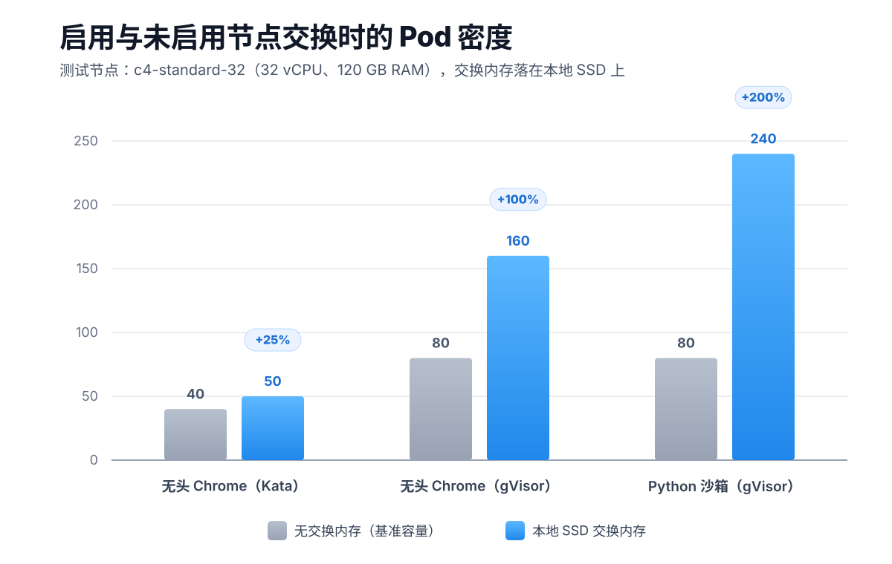

# Kubernetes 节点交换：AI 工作负载的 Pod 密度最多可提升 3 倍

> 原英文博客位于 [k8s.io](https://kubernetes.io/blog/2026/10/05/scaling-kubernetes-workloads-with-node-swap/)

内存往往是 Kubernetes 集群最先撞上的硬性上限。节点耗尽 RAM 的时间，远早于耗尽 CPU 的时间。
而新一波智能体 AI 工作负载让这件事变得更紧张：它们需要很大的内存占用来启动、并运行不受信任的代码，
随后就闲置下来等待下一次提示。这部分"闲置却常驻"的内存既昂贵，又直接压住了单节点能装下的 Pod 数量。

Kubernetes 对启用交换内存的节点的支持已在 v1.34 正式发布（GA）。
把交换内存放到高速 NVMe 本地 SSD 上，节点就能把休眠的内存换出，从而装入多得多的 Pod。

本文基于三类工作负载做了基准测试——CI/CD 内核构建、沙箱化的无头浏览器、隔离的 Python 运行时，
实测密度最多提升 3 倍，而且往往延迟代价很小甚至没有。

## 节点密度问题：硬件内存的硬上限

Kubernetes 生态已经触达一个根本性的物理资源约束：硬件内存的严格上限，
与智能体时代对动态、突发性工作负载日益增长的需求之间的矛盾。

从历史上看，为内存密集型工作负载做资源规划的管理员始终面临一个两难：

- 把内存上限设得太高，就会在闲置的 RAM 上浪费昂贵的基础设施；
- 设得太低，又要冒因内存不足（Out-Of-Memory，OOM）而被终止的风险。

当使用 [`agent-sandbox`](https://github.com/kubernetes-sigs/agent-sandbox) 这类安全执行环境
来部署自主 AI 智能体时，这种冲突会被进一步放大。
这些智能体 Pod 需要很大的内存占用来初始化和执行不受信任的代码。
然而在活动爆发之后，它们通常会进入长尾的闲置阶段，等待用户提示。
把这种闲置状态一直留在物理 RAM 中会限制集群密度，并使 AI 基础设施的运行成本居高不下。

## 解决方案：为什么现在可以用节点交换

随着 Kubernetes 引入对启用交换内存的节点的支持（该支持已在 v1.34 正式发布），这一范式发生了转变。
通过让 Linux 内核把匿名内存换出到磁盘， **节点交换** 可以在流量高峰或内存严重超额订阅期间充当缓冲器。

历史上，Kubernetes 中有两条理由不鼓励使用交换内存：

1. **内存核算**

    在 cgroup v1 下，相关控制把内存和交换内存视为一个合并的限额，
    而不是让运维人员为磁盘交换单独设置限额。由于没有独立跟踪机制，
    进程可以把大量匿名内存换出到磁盘，这使容器的实际内存用量变得不可预测、难以隔离。
    Kubernetes 的交换内存支持通过依赖 cgroup v2 解决了这个问题——
    cgroup v2 有独立的交换内存核算，会自行跟踪磁盘交换。

2. **换页延迟**

    换页到慢速机械磁盘的延迟代价很高，而高速 NVMe 本地 SSD 基本消除了这一代价。

两者结合，使得在不牺牲集群稳定性的前提下提高 Pod 密度、缓冲内存峰值变得切实可行。

## 基准测试：三类工作负载，密度最多提升 3 倍

为了量化由本地 SSD 承载的节点交换在性能边界和成本节约上的潜力，
本项分析覆盖三类不同的工作负载：面向 CI/CD 流水线的传统构建工作负载、
高密度浏览器沙箱，以及隔离的 Python 沙箱。

| 工作负载类型 | 基准容量（无交换内存） | 本地 SSD 交换内存容量 | 密度提升 |
| --- | --- | --- | --- |
| **Linux CI/CD 内核构建** | 600 MB RAM 限额 | 300 MB RAM 限额 | **RAM 占用 -50%** |
| **无头 Chrome（Kata）** | 40 个并发 Pod | 50 个并发 Pod | **Pod 密度 +25%** |
| **无头 Chrome（gVisor）** | 80 个并发 Pod | 160 个并发 Pod | **Pod 密度 +100%** |
| **Python 沙箱（gVisor）** | 80 个并发 Pod | 240 个并发 Pod | **Pod 密度 +200%** |

### 1. 传统工作负载：Linux 内核构建

在探索专门的智能体架构之前，我们通过完整构建一个
[Linux 6.1.1 内核](https://git.kernel.org/pub/scm/linux/kernel/git/stable/linux-stable.git/tag/?h=v6.1.1)
来验证交换内存在经典批处理工作负载上的表现。
内核编译过程会利用并发的工作线程，为保存编译出的目标文件而让内存膨胀，
并在短暂的链接阶段需要一次大幅的内存峰值。

这类工作负载与企业 CI/CD 流水线的内存行为相似。
由于流水线推进过程中，先前编译完成的目标文件在内存中处于非活跃状态，
CI/CD 作业常常囤积着未使用的物理 RAM，因此非常适合借助节点交换进行压缩。

在未启用交换内存的基准节点上，防止编译期间因 OOM 崩溃所需的最低内存限额为 600 MB。
把交换内存指向本地 SSD 后，容器内存限额降低了 50%、降至 300 MB，
且执行速度没有任何下降（实际上干净地跑完只用了 374 秒，而基准是 433 秒）。
不过，作为明确的取舍，把限额进一步压缩到 200 MB 会迫使活跃工作集进入交换内存，
导致漫长的 I/O 等待，执行时间增加超过 40%。这再次说明：
**交换内存是针对突发内存需求的保险策略，而不是活跃 RAM 的替代品。**

### 2. 高密度智能体工作负载：无头浏览器运行时

AI 智能体工作负载经常需要通过 Chromium 操控无头浏览器。
然而，要放心地执行外部代码，往往需要比标准 Linux 命名空间更严格的安全隔离。
本次基准测试交叉评估了多种容器运行时环境。
默认运行时的原始日志和测试方法可在
[Agent Sandbox GKE Swap 目录](https://github.com/kubernetes-sigs/agent-sandbox/tree/main/examples/gke-swap)中查看。

- **未加沙箱的基准限额（`runc`）：**

    为了在不受安全运行时开销影响的情况下测试环境上限，
    我们在 c4-standard-32 节点（32 vCPU、120 GB RAM）上对普通 runc 容器进行了扫描测试。
    在未启用交换内存时，节点耗尽物理内存，超过 512 个 Pod 后即失败。
    启用本地 SSD 交换内存后，该节点可以支撑 768 个并发 Pod。
- **高级安全运行时（例如 gVisor、Kata Containers）：**

    启用严格的安全沙箱会增加内存开销，
    通常还会降低 Pod 密度。然而，内存交换会自然地吸收这部分开销代价。
    在未启用交换内存时，gVisor 环境在 80 个 Pod 处触达硬性上限。
    本地 SSD 交换内存让该容量翻倍，从而在单个节点上支撑 160 个并发 gVisor Pod。
    类似地，Kata Containers 的 microVM 在未启用交换内存时，
    40 个并发 Pod 就会耗尽物理 RAM，而使用 GCP 本地 SSD 交换内存后，
    在 CPU 饱和之前可扩展到 50 个稳定的 Kata microVM。

在这些最大密度下，每个 Pod 延迟的增加主要来自 Pod 争抢 CPU，而不是来自交换内存的 I/O。
如果运维人员要针对某个特定的延迟目标做调优，其运行的密度会低于这里的峰值数字，
因而延迟代价也会按比例减小。

关于 gVisor 和 Kata 的完整架构解析与密度指标，请参阅
[Agent Sandbox GKE Swap Runtimes 目录](https://github.com/kubernetes-sigs/agent-sandbox/tree/main/examples/gke-swap/runtimes)。

### 3. 不只是浏览器：沙箱化的 Python 运行时

节点交换的优势同样延伸到不受信任的隔离代码执行环境。
本次扫描测试同时部署了多个 Python 沙箱会话，用于分析来自 MovieLens 20M 数据集的 500 万行数据，
每次执行需要约 375 MiB 的常驻内存占用。本次扫描的详细扩展结果和部署代码可在
[Agent Sandbox GKE Swap Python Density 目录](https://github.com/kubernetes-sigs/agent-sandbox/tree/main/examples/gke-swap/python-density)中查阅。

在未启用交换内存时，密集的并发突发会耗尽物理内存，
使节点触达 RAM 硬性上限并在 80 个并发会话时失败。
启用本地 SSD 交换内存后，休眠的匿名内存被卸载出去，释放了物理 RAM，并保住了节点的页缓存。
这使节点能够扩展到 240 个并发隔离的 Python 沙箱——密度提升 3 倍。
与浏览器工作负载一样，峰值密度下延迟的上升主要来自沙箱之间争抢 CPU，而不是来自交换内存本身。



## 如何启用

如果你负责管理面向开发者环境、浏览器测试集群、JVM 应用或 AI 执行运行时的 Kubernetes 基础设施，
利用本地 SSD 交换内存可以让你的密度效率成倍提升。

在 Kubernetes v1.34 及更高版本中，节点交换已正式发布（GA）。你可以通过 kubelet 配置启用它：

```yaml
kind: KubeletConfiguration
apiVersion: kubelet.config.k8s.io/v1beta1
failSwapOn: false
memorySwap:
  swapBehavior: LimitedSwap
```

将这一上游配置与云服务供应商的高速本地磁盘搭配使用，即可获得动态内存平衡。
例如，Google Kubernetes Engine 通过在 Local SSD 上配置的
[Node Memory Swap](https://docs.cloud.google.com/kubernetes-engine/docs/how-to/node-memory-swap)
原生支持该能力。

要获得这些好处，请将工作负载配置为 Burstable QoS：把容器的内存限额设置得高于其内存请求。
节点会根据应用的空闲内存用量自动分配快速交换空间，同时让活跃进程保持响应。

## 落地提示：先确认 cgroup 版本和本地盘

节点交换依赖 cgroup v2 的独立交换内存核算，这是它能被 Kubernetes 官方重新接纳的前提，
也意味着它对节点操作系统是有门槛的。DaoCloud 的[升级说明](../../install/upgrade-notes.md)已经把
**Swap、LimitedSwap** 与 MemoryQoS、CPU 硬封顶等一起列为 cgroup v1 上缺失的能力——
如果节点还停留在 cgroup v1，即便 kubelet 配置写对了，也拿不到节点交换。

另外，DaoCloud 的[安装检查表](../../install/commercial/prepare.md)里有一项「swap 关闭」，
那是针对 **主机层面** 的检查项，担心的是慢盘换页引发 I/O 飙升、拖死容器运行时，
与这里的节点交换不是同一件事：前者是把整个主机的交换关掉，后者是让 kubelet 按容器粒度、
有节制地使用交换空间（`LimitedSwap`）。

所以节点交换要落地，真正的前提是两个：

- **节点操作系统已迁移到 cgroup v2** ，否则 `LimitedSwap` 不生效；
- **机器上有高速本地盘（NVMe SSD）** ，否则把活跃工作集换出去的代价仍然很高。

如果只有普通云盘，那就更适合保持「关闭 swap、提高内存请求」的老做法。

## 小结

随着 Kubernetes 生态迈入智能体时代，
管理员面临着硬件内存的有限上限与 AI 工作负载突发行为之间日益加剧的冲突。
像 Agent Sandbox 这样的框架提供了运行不受信任的智能体所需的安全隔离，
但这种隔离传统上要求大量闲置内存开销。

通过把 kubelet 配置为 `LimitedSwap` 并将其指向本地 SSD，你可以缓解这一冲突。
快速交换内存会卸载空闲智能体的休眠状态，
让你可以在同一套基础设施上提高 Pod 密度和节点利用率，而不损害安全边界。

一句话：
**交换内存不是活跃 RAM 的替代品，而是为突发内存准备的保险。**
